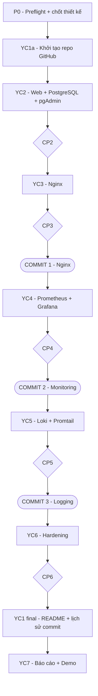
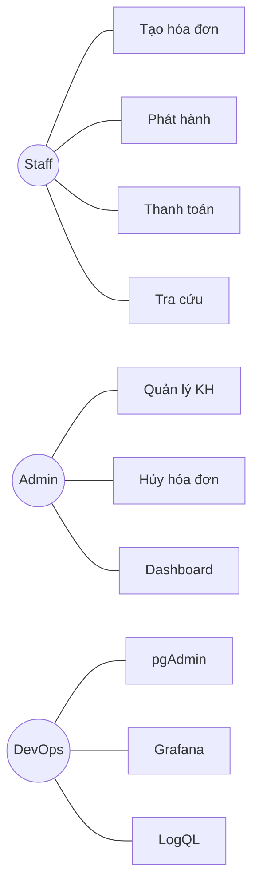
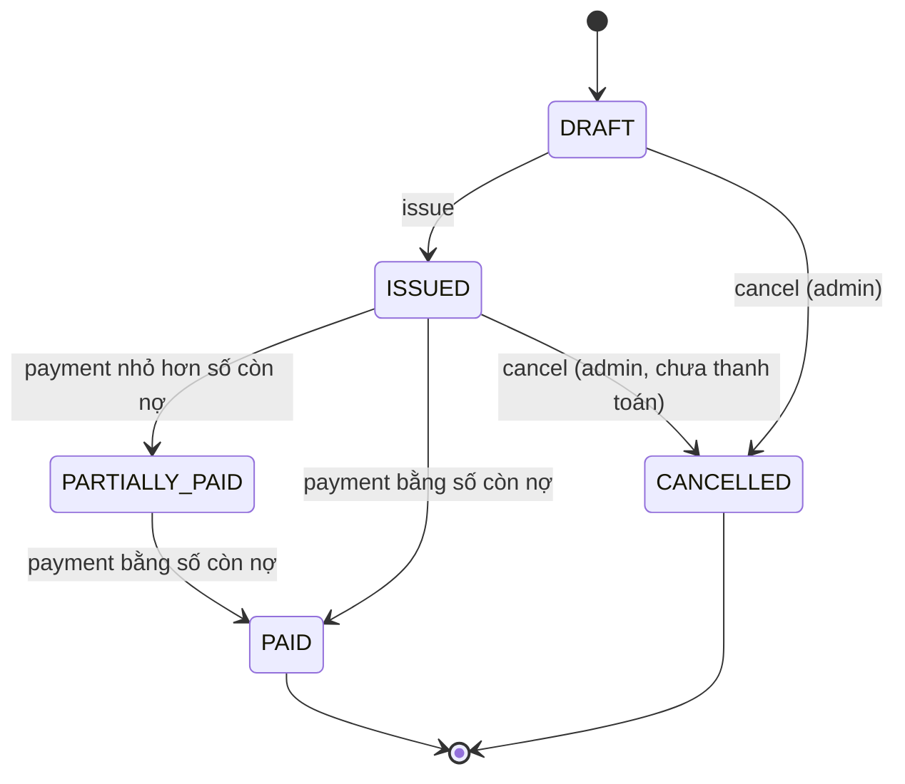
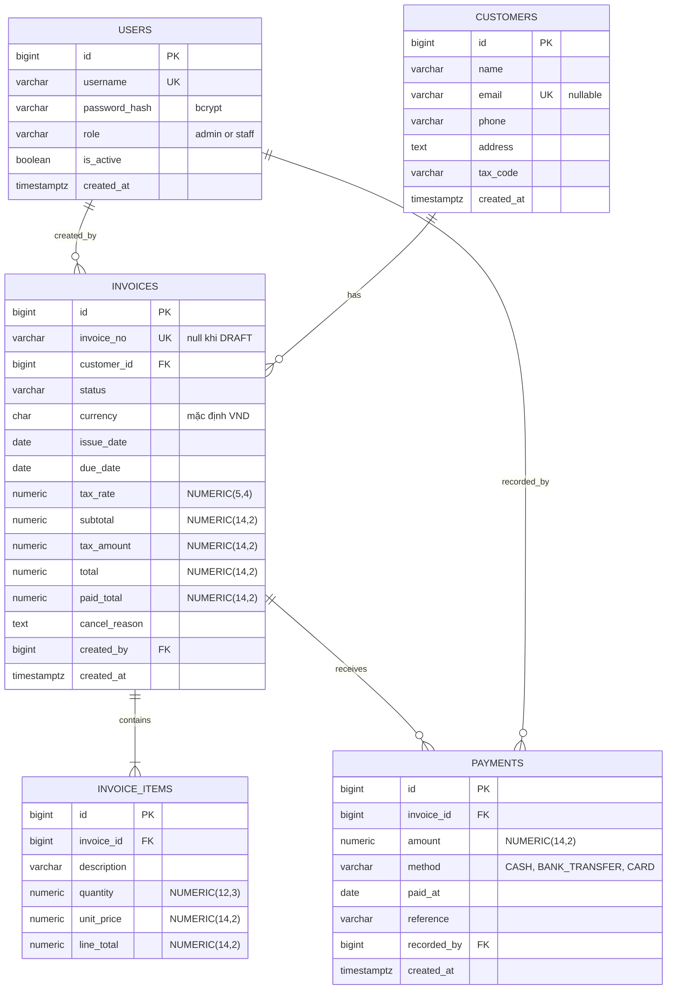
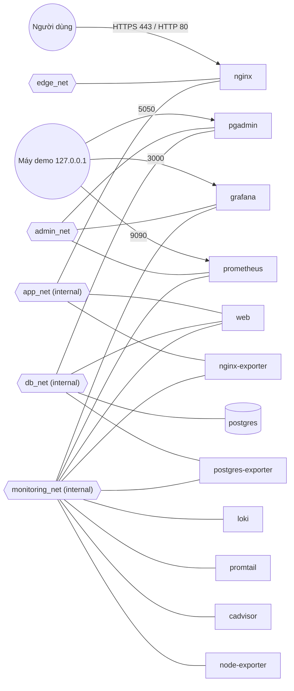
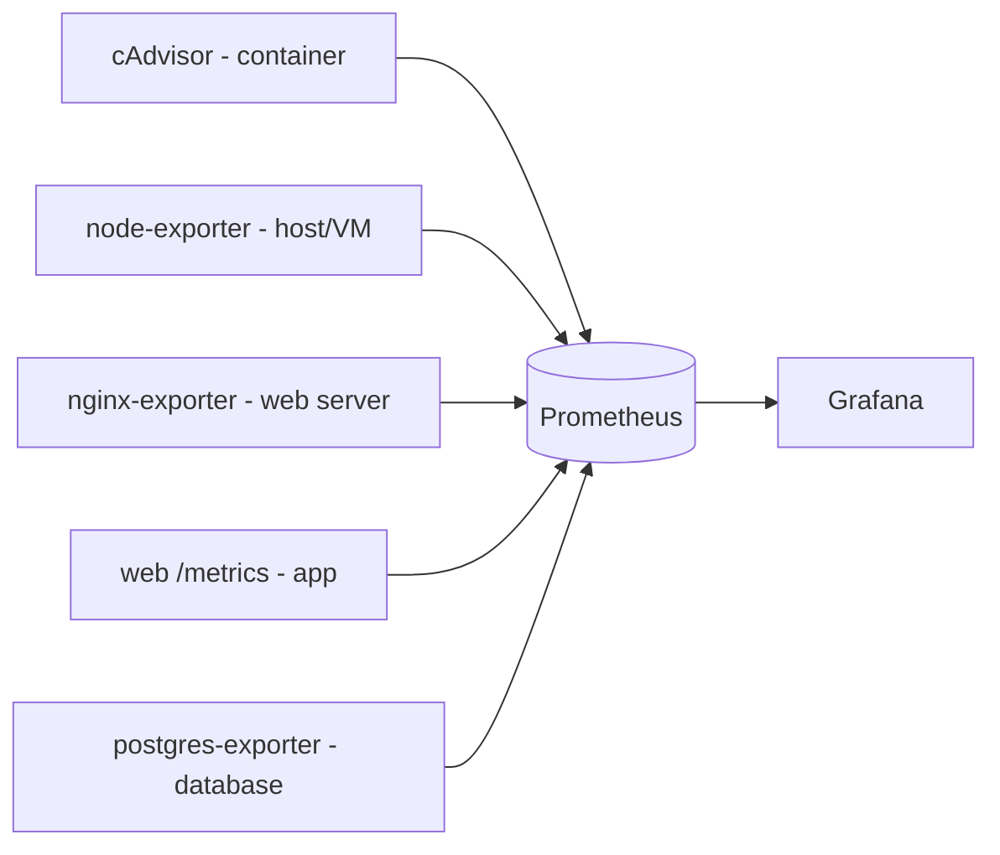
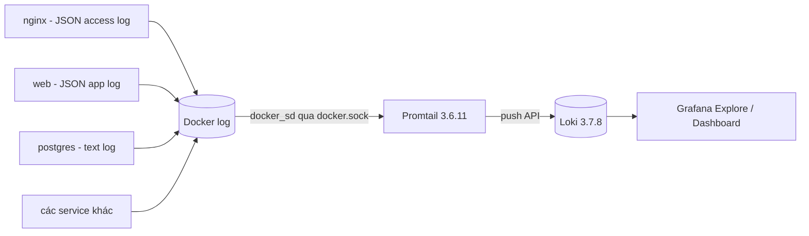

# PHƯƠNG HƯỚNG TRIỂN KHAI — Đề 18: Hệ thống Quản lý Hóa đơn / Billing

> **Phiên bản:** DESIGN FREEZE — CP0, CP1a, YC2/CP2, YC3/CP3, YC4/CP4 kỹ thuật và YC5/CP5 PASS; Commit 2/tag `commit-2-monitoring`=`7502aa7`; Commit 3/tag `commit-3-logging`=`3ff709cee127ce763ee45fa7477e3b8372d8318a` đóng YC5; current HEAD sau sync là docs-only support commit theo sau Commit 3; không push.
> **Vai trò:** Senior Software Architect + DevOps Engineer
> **Phạm vi tài liệu:** phân tích, thiết kế, roadmap và evidence gate. YC2–YC5 source/config/Compose đã được triển khai; trạng thái checkpoint được ghi tại các mục CP2–CP5 và execution history.
> **Căn cứ:** 3 ảnh đề bài (Yêu cầu chung, Tiêu chí đánh giá, Đề 18) và phiên bản phân tích trước.
> **Quy ước:** ⚠️ **CẦN XÁC MINH** = chưa kiểm chứng được trên máy thật. Các mục này phải được kiểm tra ở CP0 hoặc ở checkpoint ghi kèm, không được coi là đã chạy.
>
> **TRẠNG THÁI HIỆN TẠI — 2026-10-06**
> - CP0 = PASS; CP1a = PASS; YC2/CP2 = PASS; YC3/CP3 = PASS; YC4/CP4 kỹ thuật = PASS; YC5/CP5 = **PASS**.
> - HEAD trước documentation sync = `3ff709cee127ce763ee45fa7477e3b8372d8318a`; current HEAD sau sync là docs-only support commit theo sau Commit 3. Commit 3/tag không thay đổi.
> - `base-app` = `aa0d39222eddec12c41e7379550952ee83085a5e`; `commit-1-nginx` = `d179090de811925ee6b505311edb5c956fea4b98`.
> - Commit 2 = `7502aa7f067f99f6b976bc553bdc021b79561f48`; tag `commit-2-monitoring` vẫn trỏ chính xác tới Commit 2.
> - Historical support commit sau Commit 2 = `5743031f9c39a3960a87d40e92cb7eef5d9e40eb`; historical docs reconciliation trước Commit 3 = `25944eae9dd7546c31c2083f1e3b0400d43919f8`. Cả hai không phải HEAD hiện tại.
> - Commit 3/tag `commit-3-logging` hoàn tất YC5 và chưa push. CP6/YC6 và CP7/YC7 chưa thực hiện.
> - CP4 kỹ thuật PASS không đồng nghĩa Final Evidence YC4 hoàn tất: còn thiếu screenshot Grafana RQ4-02, RQ4-03 và RQ4-04.

---

# PHẦN 0 — ĐỐI CHIẾU ĐỀ, RUBRIC VÀ RÀ SOÁT BẢN TRƯỚC

## 0.1 Đề 18 (nguyên văn đã chuẩn hóa)

| Mục | Nội dung |
|---|---|
| Phần mềm | Website tạo và quản lý **hóa đơn, khách hàng, thanh toán** |
| Cơ sở dữ liệu | **PostgreSQL + pgAdmin** |
| Yêu cầu kỹ thuật | Giống yêu cầu chung: GitHub, Nginx reverse proxy, Prometheus + Grafana, Loki + LogQL, Hardening |
| Stack gợi ý | Node.js/Python + PostgreSQL + pgAdmin + Nginx + Prometheus + Grafana + Loki |
| Lưu ý chung | **Tất cả dịch vụ triển khai bằng Docker Compose**; có repo GitHub; có README hướng dẫn chạy; demo đủ các thành phần (website, DB tool, Grafana, LogQL, hardening) |

## 0.2 Xác nhận 7 yêu cầu và rubric

| YC | Đề yêu cầu | Rubric chấm | Điểm |
|---|---|---|---|
| 1 | Toàn bộ mã nguồn + cấu hình trên GitHub, commit rõ ràng, có README. **Tài khoản đặt theo MSSV** | Repo đủ source + cấu hình, **đủ 03 commit có ý nghĩa**, README hướng dẫn chạy rõ ràng | 1.5 |
| 2 | Web hóa đơn/khách hàng/thanh toán + DB + công cụ quản lý DB | Ứng dụng chạy ổn định, **kết nối DB thành công**, **pgAdmin hoạt động** | 1.5 |
| 3 | Nginx reverse proxy, HTTPS tự ký **hoặc** security headers → **Commit 1** | Reverse proxy đúng, **truy cập website qua Nginx** | 1.5 |
| 4 | Prometheus + Grafana giám sát container, web server, database → **Commit 2** | Prometheus thu thập metrics, Grafana có dashboard **container / web / DB** | 1.5 |
| 5 | Loki + Promtail, LogQL ≥ 2–3 query → **Commit 3** | Loki + Promtail hoạt động, truy vấn được bằng LogQL (≥ 2–3 query cơ bản) | 1.5 |
| 6 | Hardening: non-root, network isolation, mật khẩu mạnh, hạn chế quyền, security headers… | **≥ 3–4 biện pháp** | 1.5 |
| 7 | Báo cáo ≥ 10 trang: bìa chuẩn (thông tin SV + chủ đề), cấu trúc hệ thống, cách hoạt động, kết quả 6 bước, có hình | Chạy hoàn chỉnh bằng docker-compose, demo rõ, có screenshot, **chắc kiến thức, hiểu bài** | 1.0 |
| | | **Tổng** | **10.0** |

## 0.3 Rà soát phiên bản trước

### ✅ Đúng, giữ nguyên
- Bộ stack: Node.js/Express + `pg` + `prom-client`, frontend thuần, PostgreSQL + pgAdmin, Nginx unprivileged, Prometheus/Grafana/cAdvisor/node-exporter/postgres-exporter/nginx-exporter, Loki + Promtail, một file Compose.
- Phân tích 7 YC và các lỗi thường gặp khiến mất điểm.
- Thứ tự triển khai P0 → YC1a → YC2 → … → YC7, tách YC1 thành hai nửa.
- 5 bảng nghiệp vụ, đa số Business Rules, use case, frontend modules.
- Commit plan theo Phương án A, quy tắc không commit `.env`.
- Ý tưởng checkpoint dạng cổng chặn, evidence plan và final checklist.

### ➕ Thừa nhưng vẫn giữ (có lợi khi demo hoặc chấm)
- Làm **cả** HTTPS tự ký **và** security headers (đề chỉ cần một trong hai).
- Business metrics (số hóa đơn tạo, tổng tiền thanh toán).
- Nhiều hơn 3 query LogQL, nhiều hơn 4 biện pháp hardening.
- node-exporter: không thuộc 3 nhóm bắt buộc. Giữ làm panel phụ, **không chặn CP4** nếu bị giới hạn trên Docker Desktop.

### ❌ Sai hoặc cần sửa (đã sửa trong bản này)

| # | Vấn đề ở bản trước | Sửa thành |
|---|---|---|
| S1 | cAdvisor ghi `gcr.io/cadvisor`, không có phiên bản | `ghcr.io/google/cadvisor:v0.60.6`. Registry `gcr.io` chỉ dành cho bản < v0.53.0 |
| S2 | Promtail chỉ ghi "đang bảo trì" | Promtail **đã EOL từ 02/03/2026** theo tài liệu chính thức của Loki. Vẫn giữ vì đề bắt buộc; ghi rõ đây là rủi ro |
| S3 | Image chỉ ghi tên, không ghim phiên bản | Ghim tag dự kiến cho **12 upstream/base images** (mục 0.5); ngoài ra Compose build một project-built image cho service web từ Node base image |
| S4 | FR-05 "sinh số hóa đơn **liên tục**" nhưng lại dùng sequence | Số hóa đơn **duy nhất, tăng dần, có thể có khoảng trống**; giải thích lý do (BR-01) |
| S5 | `admin_net` chỉ là ghi chú | Chốt **5 network**, có bảng thành viên và sơ đồ |
| S6 | Auth chưa chốt (ghi "phiên/JWT") | Chốt **session phía server lưu trong PostgreSQL**, cookie HttpOnly/SameSite và Secure điều khiển bằng `SESSION_COOKIE_SECURE` theo giai đoạn, bcrypt |
| S7 | Ghi "req/s + status code **Nginx**" lấy từ nginx-exporter | `stub_status` **không có status code**. Status code và latency lấy từ `/metrics` của app; status code ở tầng Nginx lấy bằng LogQL |
| S8 | CSP `'self'` nhưng chưa ràng buộc frontend | Thêm quy tắc: không inline script, inline event handler hay inline style; không dùng CDN/Google Fonts |
| S9 | NFR-01 "≤ 3 phút" như một cam kết | "Mục tiêu ≤ 3 phút **khi image đã có sẵn trong cache**" |
| S10 | Hardening đặt mục tiêu ≥ 8 biện pháp và áp `cap_drop`/`read_only` hàng loạt | **6 biện pháp bắt buộc** chắc chắn kiểm chứng được, các biện pháp khác là tuỳ chọn, chỉ áp cho service đã kiểm thử |
| S11 | Kiểm tra cổng DB bằng `Test-NetConnection localhost -Port 5432` | Ghi chú preflight trước có PostgreSQL cục bộ tại 5432; trạng thái hiện tại ⚠️ cần kiểm tra lại ở CP0. Dù cổng host mở cũng không chứng minh container DB được publish. Dùng port mapping từ `docker ps`/`docker compose ps` làm bằng chứng |
| S12 | Ở YC2 (trước Nginx) chưa có cách truy cập web để test | Ở giai đoạn YC2, web tạm publish `127.0.0.1:8000`; **Commit 1 gỡ bỏ** |
| S13 | Tiền tính ở Node có nguy cơ sai số dấu phẩy động | Tổng tiền tính bằng `NUMERIC` **trong PostgreSQL** (trong transaction); Node không cộng tiền bằng `Number` |
| S14 | `pg_hba.conf` giới hạn theo subnet `db_net` | Bỏ, vì phải cố định subnet, phức tạp mà không thêm điểm. Network isolation đã đảm nhiệm; giữ `scram-sha-256` mặc định |
| S15 | Thiếu chống double-payment khi có request đồng thời | Khóa dòng hóa đơn (`SELECT … FOR UPDATE`) trong transaction thanh toán |
| S16 | `/metrics` và `stub_status` làm trong commit base/Nginx | Chuyển hoàn toàn vào **Commit 2**; YC2/Commit 1 không triển khai metrics hay `stub_status` |

### ⛔ Thiếu so với rubric hoặc đề (đã bổ sung)
- Thiết kế README đầy đủ (mục 3.17).
- Healthcheck và thứ tự khởi động cho từng service (mục 3.12).
- API có input, output và lỗi chính (mục 3.8).
- Bảng hardening đủ 6 cột, có danh sách ngoại lệ được chấp nhận (mục 3.16).
- Phân loại evidence **bắt buộc** và **tuỳ chọn** (Phần 7).
- Final Architecture Review (Phần 10).

## 0.4 Quyết định kiến trúc đã chốt

| Hạng mục | Quyết định | Lý do ngắn |
|---|---|---|
| Backend | Node.js 24 LTS + Express + `pg` + `prom-client` | Đúng gợi ý đề; một ngôn ngữ cho cả backend và frontend |
| Frontend | HTML/CSS/JS thuần, SPA nhẹ (hash routing), do chính container `web` phục vụ | Không thêm build tool hay container; hash routing không cần cấu hình fallback |
| Auth | Session phía server (express-session + store PostgreSQL), bcrypt; `SESSION_COOKIE_SECURE` chuyển theo giai đoạn | YC2 kiểm thử HTTP; sau Commit 1 chỉ chạy HTTPS qua Nginx (mục 3.7) |
| DB | PostgreSQL 16 + pgAdmin 4 | Đúng đề; PG16 còn được hỗ trợ dài hạn |
| Reverse proxy | `nginxinc/nginx-unprivileged` (nhánh stable) | Non-root sẵn, thỏa cả YC3 và YC6 |
| Monitoring | Prometheus + Grafana + cAdvisor + node-exporter + nginx-exporter + postgres-exporter + `/metrics` của app | Phủ đủ Container / Web / DB |
| Logging | Loki + **Promtail** | Đề ghi rõ Promtail (xem rủi ro R2) |
| Công cụ quản trị | pgAdmin, Grafana, Prometheus **chỉ bind `127.0.0.1`**, không đi qua Nginx | Website dành cho người dùng đi qua Nginx; công cụ quản trị chỉ dùng trên máy demo. Không cần cấu hình sub-path phức tạp |
| Triển khai | **Một** `docker-compose.yml`, `name: billing` | Đúng lưu ý của đề; tên project cố định giúp tên container và label log ổn định |

## 0.5 Phiên bản image đã ghim

> Các tag dưới đây là phiên bản đã chọn; **12 upstream/base images đã pull thành công ở CP0 ngày 05/10/2026**. Digest pull được ghi trong kết quả CP0. `node:24.21.0-alpine` là base để build service `web`; project-built image của `web` đã được build và chạy từ YC2. Không dùng `latest`.

| Service | Image:tag | Ghi chú |
|---|---|---|
| web — Node base image | `node:24.21.0-alpine` | Node 24 LTS; upstream/base image dùng để build image riêng của service `web` |
| postgres | `postgres:16.15-trixie` | Ghim cả bản Debian để tag không bị trôi; YC2/CP2 và YC4/CP4 runtime PASS |
| pgadmin | `dpage/pgadmin4:9.18.0` | Pull PASS; auto-import, runtime credential và UI/DB integration PASS tại CP2; runtime service vẫn chạy ở CP4 |
| nginx | `nginxinc/nginx-unprivileged:1.30.5-alpine` | Nhánh stable 1.30 |
| prometheus | `prom/prometheus:v3.15.0` | Pull PASS; `/bin/wget` observed; readiness và cả 6 scrape targets UP tại CP4 |
| grafana | `grafana/grafana:13.2.3` | Pull PASS; health, datasource/dashboard provisioning và 15-panel Billing Monitoring dashboard PASS tại CP4; `admin/admin` bị từ chối |
| loki | `grafana/loki:3.7.8` | Pull PASS; Promtail push/query probe PASS; `/ready` 503 trong probe config mặc định ngắn, project readiness chờ CP5 |
| promtail | `grafana/promtail:3.6.11` | **EOL**; pull PASS; push/query tới Loki 3.7.8 probe PASS; tiếp tục cần kiểm tra config project ở CP5 |
| cadvisor | `ghcr.io/google/cadvisor:v0.60.6` | Pull PASS; healthcheck healthy, `/metrics` sample-label probe PASS trên Docker Desktop Linux VM |
| node-exporter | `prom/node-exporter:v1.12.1` | |
| postgres-exporter | `prometheuscommunity/postgres-exporter:v0.20.1` | |
| nginx-exporter | `nginx/nginx-prometheus-exporter:1.5.3` | Tag không có tiền tố `v` |

> Bảng có **12 upstream/base images**. Image `web` được Compose build riêng từ Node base image tại YC2; đây là project-built image, không phải upstream image thứ 13.

- **Ghim theo digest:** không bắt buộc. CP0 đã ghi lại digest của 12 upstream/base images trong bảng evidence tại Phần 5 để chứng minh tag đã pull; không đưa digest vào compose để tránh rối.

---

# PHẦN 1 — PHÂN TÍCH 7 YÊU CẦU

## YC1 — GitHub
- **Thực sự muốn gì:** repo **đầy đủ** (source + compose + cấu hình Nginx/Prometheus/Grafana/Loki/Promtail), **3 commit mốc có ý nghĩa**, README chạy được. **Tài khoản đặt theo MSSV.**
- **Thành phần liên quan:** toàn repo, `.gitignore`, `.env.example`, README, tag.
- **Chuẩn bị trước:** tài khoản GitHub theo MSSV, quy ước Conventional Commits, cây thư mục.
- **Đầu ra:** URL repo, 3 commit mốc có tag, README hoàn chỉnh, clone sạch chạy được.
- **Lỗi hay mất điểm:** commit `.env`; message vô nghĩa ("update", "fix"); gộp một commit lớn; sai thứ tự Nginx → Monitoring → Loki; README sơ sài; tên tài khoản không theo MSSV.

## YC2 — Web + PostgreSQL + pgAdmin
- **Thực sự muốn gì:** website quản lý **hóa đơn, khách hàng, thanh toán** chạy ổn định, **ghi và đọc DB thật**; **pgAdmin xem được dữ liệu do app tạo**.
- **Thành phần:** `web`, `postgres`, `pgadmin`, volume, script khởi tạo DB (schema, role, seed).
- **Chuẩn bị trước:** Phần 3 đã duyệt, Docker hoạt động, `.env`.
- **Đầu ra:** web, DB và pgAdmin sẵn sàng theo health/readiness đã xác minh; luồng KH → hóa đơn → phát hành → thanh toán chạy được; pgAdmin thấy dữ liệu.
- **Lỗi hay mất điểm:** app khởi động trước DB; không có volume; pgAdmin chưa đăng ký sẵn server; trang tĩnh không có DB thật; publish cổng 5432.

## YC3 — Nginx → Commit 1
- **Thực sự muốn gì:** website **chỉ** truy cập được qua Nginx; có HTTPS tự ký và/hoặc security headers.
- **Thành phần:** `nginx`, chứng chỉ self-signed, cấu hình proxy, headers, rate limit, JSON access log.
- **Chuẩn bị trước:** YC2 đạt; OpenSSL 3.5.7 và SAN certificate probe đã PASS ở CP0. Script certificate của project vẫn phải được viết và kiểm thử trong YC3.
- **Đầu ra:** `https://localhost` hiển thị web; HTTP → 301 → HTTPS; đủ headers; không còn đường vào trực tiếp `web`.
- **Lỗi hay mất điểm:** vẫn vào được app trực tiếp; thiếu `X-Forwarded-*`; lộ version Nginx; CSP làm vỡ giao diện rồi bị tắt; Commit 1 lẫn monitoring.

## YC4 — Prometheus + Grafana → Commit 2
- **Thực sự muốn gì:** metrics thật, dashboard thể hiện đủ **Container / Web / DB**.
- **Thành phần:** prometheus, grafana, cadvisor, node-exporter, nginx-exporter, postgres-exporter, `/metrics` của app, `stub_status` của Nginx, provisioning.
- **Chuẩn bị trước:** YC3 đạt; role DB `exporter`; script tạo traffic.
- **Đầu ra:** Targets quan trọng **UP**; dashboard 3 row có số liệu; dashboard và datasource provision bằng file.
- **Lỗi hay mất điểm:** target DOWN vì sai network; dashboard "No data"; dashboard tạo tay trên UI; thiếu một trong 3 nhóm; cAdvisor không có label tên container trên Docker Desktop (rủi ro R1).

## YC5 — Loki + Promtail → Commit 3
- **Thực sự muốn gì:** log tập trung, truy vấn trong Grafana Explore bằng **≥ 2–3 LogQL có ý nghĩa**.
- **Thành phần:** loki, promtail, datasource Loki, log JSON của web và nginx.
- **Chuẩn bị trước:** định dạng log đã chốt (mục 3.15); Grafana đã chạy (YC4).
- **Đầu ra:** Loki ready, Promtail đang đọc log, ≥ 3 query có kết quả (chuẩn bị 6).
- **Lỗi hay mất điểm:** Promtail không đọc được log; label vô nghĩa hoặc cardinality cao; query sai cú pháp; query chỉ có selector, không lọc.

## YC6 — Hardening
- **Thực sự muốn gì:** **≥ 3–4 biện pháp có bằng chứng**. Mục tiêu: **6 biện pháp chắc chắn kiểm chứng được**.
- **Thành phần:** Dockerfile, compose, Nginx, role PostgreSQL, `.env`.
- **Chuẩn bị trước:** baseline đã áp dụng từ YC2 (Phần 2); YC2–YC5 chạy ổn để kiểm thử hồi quy.
- **Đầu ra:** bảng biện pháp kèm cách kiểm tra và ảnh; hệ thống không bị hồi quy.
- **Lỗi hay mất điểm:** nói non-root nhưng `uid=0`; còn mật khẩu mặc định; hardening làm hỏng service; network "tách trên giấy"; không giải thích được ngoại lệ (cAdvisor, Promtail).

## YC7 — Báo cáo và demo
- **Thực sự muốn gì:** báo cáo ≥ 10 trang, bìa chuẩn (thông tin SV, chủ đề), kiến trúc, cách hoạt động, kết quả 6 bước có hình; demo rõ ràng; hiểu bài.
- **Chuẩn bị trước:** chụp ảnh **ngay khi** từng checkpoint đạt.
- **Đầu ra:** `.docx` + `.pdf`, kịch bản demo, bộ câu hỏi và trả lời.
- **Lỗi hay mất điểm:** thiếu MSSV hoặc tên đề tài trên bìa; ảnh mờ; chỉ dán ảnh không giải thích; đủ trang nhờ ảnh to; không trả lời được câu hỏi "vì sao".

---

# PHẦN 2 — THỨ TỰ TRIỂN KHAI

## 2.1 Luồng chuẩn



## 2.2 Vì sao khác thứ tự đánh số của đề

| Khác biệt | Lý do |
|---|---|
| Thêm **P0** | Kiểm tra trước các rủi ro "phát hiện muộn sẽ phải làm lại": image pull được, cAdvisor trên Docker Desktop, Promtail 3.6 đẩy log vào Loki 3.7, công cụ có sẵn cho healthcheck, `openssl` |
| **YC1 tách đôi** | Repo phải có trước mọi commit; còn README và lịch sử commit chỉ chốt được khi hệ thống đã hoàn chỉnh |
| YC2 → YC3 | Nginx cần upstream để proxy |
| YC3 → YC4 | Commit 1 hoàn tất Nginx độc lập; Commit 2 mới thêm `stub_status`, exporter và app `/metrics` để monitoring |
| YC4 → YC5 | Loki dùng Grafana làm giao diện truy vấn |
| **Thiết kế sớm, triển khai đúng commit** | Định dạng log được thiết kế trước; app `/metrics` và Nginx `stub_status` chỉ được triển khai ở YC4/Commit 2. YC2 không cài `prom-client` và không có endpoint `/metrics`; Commit 1 không có `/metrics` app hay `stub_status` |
| **Hardening chia hai lớp** | *Baseline* áp dụng ngay từ đầu: `.env`, mật khẩu mạnh, network riêng, non-root, không publish cổng DB. Làm vậy để khỏi phải sửa lớn về sau (quyền volume, network). *YC6* là rà soát, bổ sung, kiểm thử hồi quy và chụp bằng chứng |
| YC7 cuối, ảnh chụp song song | Ảnh phải chụp lúc checkpoint vừa đạt |

## 2.3 Ma trận phụ thuộc

| Cần có | Tạo ở | Dùng ở |
|---|---|---|
| Repo + cây thư mục | YC1a | tất cả |
| Schema, role DB (gồm `exporter`) | YC2 | YC4, YC6 |
| Log JSON của app | YC2 | YC5 |
| Nginx + JSON access log, web không còn publish | YC3 | YC4, YC5, YC6 |
| `/metrics` app + `stub_status` + `monitoring_net` | YC4 / Commit 2 | Prometheus/Grafana, YC5, YC6 |
| Datasource Loki | YC5 | YC7 |
| Toàn bộ ảnh | YC1–YC6 | YC7 |

---

# PHẦN 3 — THIẾT KẾ TRƯỚC KHI CODE

## 3.1 Functional Requirements

| ID | Mô tả | Ưu tiên |
|---|---|---|
| FR-01 | Đăng nhập/đăng xuất; vai trò `admin`, `staff` | Must |
| FR-02 | Thêm/sửa/xem/xóa khách hàng (tên, email, SĐT, địa chỉ, mã số thuế); tìm kiếm | Must |
| FR-03 | Tạo hóa đơn nháp, thêm/sửa/xóa dòng hàng (mô tả, số lượng, đơn giá) | Must |
| FR-04 | Tự tính tạm tính, thuế, tổng cộng (phía server) | Must |
| FR-05 | Phát hành hóa đơn (DRAFT → ISSUED), sinh **số hóa đơn duy nhất, tăng dần** | Must |
| FR-06 | Ghi nhận thanh toán (số tiền, phương thức, ngày, tham chiếu) | Must |
| FR-07 | Tự cập nhật trạng thái ISSUED / PARTIALLY_PAID / PAID | Must |
| FR-08 | Hủy hóa đơn (CANCELLED) kèm lý do — chỉ admin | Should |
| FR-09 | Danh sách hóa đơn: lọc theo trạng thái, khách hàng, khoảng ngày; phân trang | Must |
| FR-10 | Dashboard: doanh thu đã thu, công nợ, số hóa đơn theo trạng thái, quá hạn | Should |
| FR-11 | Trang in hóa đơn | Should |
| FR-12 | `/health` nội bộ từ YC2; `/metrics` nội bộ, chỉ được thêm tại YC4/Commit 2 | Must |

## 3.2 Non-Functional Requirements

| ID | Nhóm | Yêu cầu |
|---|---|---|
| NFR-01 | Khởi động | `docker compose up -d` đưa toàn hệ thống về trạng thái ổn định; **mục tiêu ≤ 3 phút khi image đã có trong cache** (không tính thời gian pull) |
| NFR-02 | Toàn vẹn tiền tệ | Cột tiền dùng `NUMERIC(14,2)`, **không dùng float** ở DB; phép cộng và nhân tiền thực hiện **trong PostgreSQL**; Node chỉ truyền và hiển thị dạng chuỗi |
| NFR-03 | Nhất quán | Phát hành và thanh toán chạy trong transaction; thanh toán khóa dòng hóa đơn (`FOR UPDATE`) |
| NFR-04 | Bền vững | Named volume cho postgres, pgadmin, prometheus, grafana, loki, positions của promtail |
| NFR-05 | Bảo mật | Theo mục 3.16; không có secret trong Git |
| NFR-06 | CSP-compatible | Thiết kế CSS/JS tách file; **không** `<script>` inline, `onclick=`/inline handler, `style=""`/`<style>` inline, `eval`, CDN hoặc Google Fonts. CSP được cấu hình và nghiệm thu tại YC3/CP3; YC2 không yêu cầu CSP |
| NFR-07 | Quan sát | Log JSON một dòng mỗi sự kiện ra stdout từ YC2; metrics theo chuẩn Prometheus được bổ sung tại YC4/Commit 2 |
| NFR-08 | Tái lập | Datasource và dashboard Grafana provision bằng file; DB khởi tạo bằng script |
| NFR-09 | Hiệu năng | Danh sách hóa đơn p95 < 500 ms với dữ liệu seed (~200 hóa đơn) |
| NFR-10 | Dễ demo | Có script seed và script tạo traffic |
| NFR-11 | Tài liệu | README: clone sạch → chạy được trong ≤ 6 lệnh |

## 3.3 Use Case

**Actor:** Admin, Staff (kế toán), DevOps (vận hành pgAdmin/Grafana). Khách hàng chỉ là đối tượng dữ liệu, không đăng nhập.

| UC | Tên | Actor | Tóm tắt |
|---|---|---|---|
| UC-01 | Đăng nhập/đăng xuất | Admin, Staff | Tạo/hủy session |
| UC-02 | Quản lý khách hàng | Admin, Staff (xóa: Admin) | Xóa chỉ khi chưa có hóa đơn |
| UC-03 | Tạo/sửa hóa đơn nháp | Admin, Staff | Chọn KH, thêm dòng hàng |
| UC-04 | Phát hành hóa đơn | Admin, Staff | Khóa nội dung, sinh số |
| UC-05 | Ghi nhận thanh toán | Admin, Staff | Số tiền ≤ còn nợ |
| UC-06 | Hủy hóa đơn | Admin | Chưa có thanh toán, bắt buộc lý do |
| UC-07 | Tra cứu/lọc hóa đơn | Admin, Staff | Theo trạng thái, KH, ngày |
| UC-08 | Xem dashboard | Admin, Staff | KPI |
| UC-09 | Quản trị CSDL | DevOps | pgAdmin (localhost) |
| UC-10 | Giám sát | DevOps | Grafana/Prometheus (localhost) |
| UC-11 | Truy vấn log | DevOps | LogQL trong Grafana Explore |



## 3.4 Business Rules

| ID | Quy tắc |
|---|---|
| BR-01 | **Số hóa đơn:** `UNIQUE`, định dạng `INV-YYYY-NNNNNN` (ví dụ `INV-2026-000001`), **chỉ sinh khi phát hành**, trong cùng transaction phát hành. Phần số lấy từ PostgreSQL sequence `invoice_no_seq`; `YYYY` là năm của `issue_date`. **Không cam kết liên tục tuyệt đối:** `nextval()` không rollback, nên transaction phát hành thất bại sau khi đã lấy số sẽ để lại khoảng trống. Sequence cũng **không reset theo năm**. Lý do chọn: an toàn khi đồng thời, đơn giản, đề không yêu cầu nghiệp vụ hóa đơn điện tử. *Nếu GV yêu cầu liên tục tuyệt đối:* dùng bảng `invoice_counters(year PK, last_no)` và `UPDATE … SET last_no = last_no + 1 RETURNING last_no` trong cùng transaction. Khóa dòng làm phát hành tuần tự, rollback hoàn lại số, nên không có khoảng trống và tự reset theo năm. Phương án này **không** triển khai mặc định |
| BR-02 | Chỉ hóa đơn `DRAFT` được sửa thông tin và dòng hàng; từ `ISSUED` trở đi **bất biến** (chỉ đổi trạng thái và `paid_total` theo BR-07) |
| BR-03 | Hóa đơn phải có **≥ 1 dòng hàng** và **total > 0** mới được phát hành |
| BR-04 | `line_total = quantity × unit_price`; `subtotal = Σ line_total`; `tax_amount = ROUND(subtotal × tax_rate, 2)`; `total = subtotal + tax_amount`. **Tính ở server (SQL `NUMERIC`)**, bỏ qua mọi giá trị tổng do client gửi |
| BR-05 | `quantity > 0`; `unit_price ≥ 0`; `0 ≤ tax_rate ≤ 0.20` (UI gợi ý 0%, 5%, 8%, 10%); tiền tệ mặc định `VND` |
| BR-06 | Thanh toán chỉ cho hóa đơn `ISSUED` hoặc `PARTIALLY_PAID`; `amount > 0`; `amount ≤ total − paid_total` |
| BR-07 | Sau mỗi thanh toán, trạng thái **tự cập nhật** trong cùng transaction: `0 < paid_total < total` → `PARTIALLY_PAID`; `paid_total = total` → `PAID` |
| BR-08 | Hủy: **chỉ admin**; chỉ khi `paid_total = 0` (từ `DRAFT` hoặc `ISSUED`); **bắt buộc lý do**; không xóa vật lý |
| BR-09 | **Không xóa vật lý hóa đơn** (không có API xóa; role DB không có quyền `DELETE` trên `invoices`) |
| BR-10 | Không xóa khách hàng đã có hóa đơn (FK `ON DELETE RESTRICT`) |
| BR-11 | Thanh toán **chỉ thêm**, không sửa hay xóa (role DB không có `UPDATE`/`DELETE` trên `payments`) |
| BR-12 | `staff` không được hủy hóa đơn, không xóa khách hàng |
| BR-13 | `due_date ≥ issue_date`; `issue_date` gán bằng ngày phát hành |
| BR-14 | Quá hạn = `due_date < CURRENT_DATE` và trạng thái ∈ {ISSUED, PARTIALLY_PAID}; tính khi truy vấn, không lưu |
| BR-15 | Email khách hàng là duy nhất nếu có nhập (cho phép để trống) |

**Máy trạng thái hóa đơn**



## 3.5 ERD



> Ngoài 5 bảng nghiệp vụ còn có **1 bảng kỹ thuật** `user_sessions` (sid, sess, expire) để lưu session (mục 3.7). Bảng này không có quan hệ nghiệp vụ, được **tạo bằng script khởi tạo DB**, không để app tự tạo, vì app không có quyền DDL.

## 3.6 Database

- **Engine:** PostgreSQL 16, database `billing`, schema `public`.
- **Ràng buộc (CHECK/FK):**
  - `quantity > 0`, `unit_price >= 0`, `amount > 0`, `tax_rate BETWEEN 0 AND 0.20`
  - `status IN ('DRAFT','ISSUED','PARTIALLY_PAID','PAID','CANCELLED')`
  - `0 <= paid_total <= total`
  - `due_date >= issue_date` (khi cả hai khác NULL)
  - `invoice_no IS NOT NULL` khi `status ∈ {ISSUED, PARTIALLY_PAID, PAID}`
  - FK `ON DELETE RESTRICT`, riêng `invoice_items → invoices` dùng `CASCADE` (hóa đơn không bị xóa nên không ảnh hưởng)
- **Index:** `invoices(customer_id)`, `invoices(status)`, `invoices(due_date)`, `invoice_items(invoice_id)`, `payments(invoice_id)`, `user_sessions(expire)`.
- **Sequence:** `invoice_no_seq` (BR-01).
- **Khởi tạo:** `db/init/` chạy **một lần** khi volume trống, theo thứ tự:
  1. `01-schema.sql`
  2. `02-roles.sh`: đọc mật khẩu từ biến môi trường, tạo role và GRANT
  3. `03-seed.sh`: bật `pgcrypto`, tạo user `admin`/`staff` với hash bcrypt bằng `crypt(…, gen_salt('bf', 12))`, thêm dữ liệu mẫu
  - ⚠️ CẦN XÁC MINH ở CP2: hash `$2a$` do pgcrypto tạo được thư viện bcrypt của Node chấp nhận (kiểm bằng cách đăng nhập thật).
  - Lưu ý vận hành: đổi mật khẩu trong `.env` **sau khi** volume đã khởi tạo thì script không chạy lại. Phải `docker compose down -v` (mất dữ liệu demo) hoặc `ALTER ROLE` thủ công. Ghi vào phần troubleshooting của README.
- **Phân quyền (least privilege):**

| Role | Quyền | Dùng bởi |
|---|---|---|
| `postgres` (superuser) | Toàn quyền; chỉ dùng khi khởi tạo và bảo trì | init scripts |
| `billing_app` | `users`: SELECT · `customers`: SELECT/INSERT/UPDATE/DELETE · `invoices`: SELECT/INSERT/UPDATE (**không DELETE**) · `invoice_items`: SELECT/INSERT/UPDATE/DELETE · `payments`: SELECT/INSERT (**không UPDATE/DELETE**) · `user_sessions`: SELECT/INSERT/UPDATE/DELETE · `USAGE` trên các sequence · **không** DDL, **không** superuser, **không** sở hữu bảng | web |
| `billing_readonly` | SELECT trên bảng nghiệp vụ | pgAdmin (xem dữ liệu) |
| `exporter` | `pg_monitor` | postgres-exporter |

> Quyền DB **cưỡng chế lại** BR-09 và BR-11 ở tầng database: kể cả khi app có lỗi, cũng không thể xóa hóa đơn hay sửa thanh toán.

**pgAdmin auto-registration và credential:** thiết kế mount `pgadmin/servers.json` chứa tên server, `HOST=postgres`, port nội bộ `5432`, database `billing`, username `billing_readonly` và tuỳ chọn kết nối; **không chứa `Password` thật hoặc secret**. CP0 xác minh image hỗ trợ `PGADMIN_SERVER_JSON_FILE` và probe đã import được một server từ JSON không có password vào SQLite nội bộ. CP0 chưa kiểm tra UI hoặc kết nối tới DB Billing; việc đó thuộc CP2. Khi kết nối lần đầu, người vận hành nhập password runtime từ `.env`; không giả định Compose tự nội suy biến môi trường trong JSON được mount. `.env.example` chỉ có placeholder `CHANGE_ME`.

## 3.7 Authentication (đã chốt)

| Hạng mục | Quyết định |
|---|---|
| Cơ chế | **Session phía server** (`express-session`), store PostgreSQL (`connect-pg-simple`, bảng `user_sessions` tạo sẵn). **Không dùng JWT** |
| Vì sao không chọn JWT | JWT khó thu hồi khi logout (phải thêm blacklist). Session cho phép logout thật và dễ giải thích |
| Hash mật khẩu | bcrypt cost 12, dùng `bcryptjs` (thuần JS, không cần build native trên Alpine) |
| Cookie | Tên `billing.sid`; `HttpOnly`, `SameSite=Strict`, `Path=/`; hết hạn 8 giờ. Thuộc tính `Secure` lấy từ biến duy nhất `SESSION_COOKIE_SECURE`; chỉ chuỗi chính xác `"true"` bật Secure, không ép kiểu truthy chung |
| YC2 trước Nginx | `SESSION_COOKIE_SECURE=false`; web chỉ tạm publish `127.0.0.1:8000` qua HTTP để kiểm thử đăng nhập và nghiệp vụ. Cùng một codebase/session, không tạo cơ chế auth thứ hai |
| Từ Commit 1 trở đi | `SESSION_COOKIE_SECURE=true`; web không publish port và chỉ truy cập qua HTTPS Nginx. Express bật `trust proxy = 1`, Nginx gửi `X-Forwarded-Proto=https` |
| Cấu hình proxy | `trust proxy = 1` được cấu hình cho ứng dụng; ở YC2 truy cập trực tiếp nên cookie dùng `SESSION_COOKIE_SECURE=false`. Không suy đoán giao thức để tự bật Secure |
| Login | Kiểm tra `is_active`; sai thông tin trả **401 với thông báo chung**; gọi `session.regenerate()` khi thành công (chống session fixation); ghi log `auth.login_failed` hoặc `auth.login_success` |
| Logout | `POST /api/auth/logout` → `session.destroy()` (xóa dòng trong `user_sessions`) → xóa cookie → `204` |
| Phân quyền | Middleware `requireAuth` và `requireRole('admin')` |
| CSRF | `SameSite=Strict`; API ghi dữ liệu chỉ nhận `Content-Type: application/json`; không bật CORS |
| Chống brute-force | Nginx `limit_req` trên `/api/auth/login` (mục 3.13) |
| Secret | `SESSION_SECRET` ≥ 32 ký tự ngẫu nhiên trong `.env` |

**Biến môi trường liên quan session (mẫu trong `.env.example`):** `SESSION_SECRET=CHANGE_ME_REPLACE_WITH_RANDOM_SECRET` và `SESSION_COOKIE_SECURE=false` ở commit base để YC2 chạy HTTP. Chỉ parse giá trị chính xác `"true"` thành boolean `true`; `"false"` là boolean `false`. Trong Commit 1, cập nhật giá trị mẫu của `.env.example` thành `true`; đồng thời đổi `.env` runtime sang `true` và recreate service `web` để nạp biến mới. Bản repo cuối cùng mặc định `true`. Không tạo profile auth hay codebase thứ hai; `.env.example` chỉ chứa placeholder, không chứa credential thật.

## 3.8 API (REST, prefix `/api`)

**Quy ước chung:**
- JSON vào và ra; tiền trả về dạng **chuỗi thập phân** (ví dụ `"1250000.00"`) để không mất chính xác.
- Validation phía server cho mọi input.
- **Mọi truy vấn đều parameterized** (`$1, $2…`), không nối chuỗi SQL.
- Lỗi thống nhất: `{ "error": { "code": "INVOICE_NOT_DRAFT", "message": "…", "request_id": "…" } }`.
- HTTP status: `400` sai định dạng · `401` chưa đăng nhập · `403` không đủ quyền · `404` không tồn tại · `409` vi phạm trạng thái/nghiệp vụ · `429` do Nginx · `500` lỗi nội bộ (không lộ stack trace).

| Method | Endpoint | Mục đích | Quyền | Input chính | Output chính | Lỗi chính |
|---|---|---|---|---|---|---|
| POST | `/auth/login` | Đăng nhập | public | `username`, `password` | `200 {user:{id,username,role}}` + cookie | 400, 401, 429 |
| POST | `/auth/logout` | Đăng xuất | auth | — | `204` | 401 |
| GET | `/auth/me` | Người dùng hiện tại | auth | — | `{id,username,role}` | 401 |
| GET | `/customers` | Danh sách, tìm kiếm | auth | `q, page, limit` | `{items[], total}` | 400 |
| POST | `/customers` | Tạo KH | auth | `name`*, `email, phone, address, tax_code` | `201 {customer}` | 400, 409 (email trùng) |
| GET | `/customers/:id` | Chi tiết | auth | — | `{customer}` | 404 |
| PUT | `/customers/:id` | Sửa | auth | như POST | `{customer}` | 400, 404, 409 |
| DELETE | `/customers/:id` | Xóa | admin | — | `204` | 403, 404, 409 (đã có hóa đơn) |
| GET | `/invoices` | Danh sách, lọc | auth | `status, customer_id, from, to, page, limit` | `{items[], total}` | 400 |
| POST | `/invoices` | Tạo DRAFT | auth | `customer_id`*, `due_date, tax_rate, items[{description, quantity, unit_price}]` | `201 {invoice}` (tổng do server tính) | 400, 404 (KH) |
| GET | `/invoices/:id` | Chi tiết | auth | — | `{invoice, items[], payments[]}` | 404 |
| PUT | `/invoices/:id` | Sửa DRAFT (thay toàn bộ items) | auth | như POST | `{invoice}` | 400, 404, 409 `INVOICE_NOT_DRAFT` |
| POST | `/invoices/:id/issue` | Phát hành | auth | — | `{invoice}` có `invoice_no` | 404, 409 (không phải DRAFT / không có item / total = 0 / due_date sai) |
| POST | `/invoices/:id/cancel` | Hủy | admin | `reason`* | `{invoice}` | 400, 403, 404, 409 (đã có thanh toán / đã hủy / PAID) |
| POST | `/invoices/:id/payments` | Thanh toán | auth | `amount`*, `method`*, `paid_at`*, `reference` | `201 {payment, invoice}` | 400, 404, 409 (sai trạng thái / vượt số còn nợ) |
| GET | `/payments` | Lịch sử thanh toán | auth | `invoice_id, from, to, page` | `{items[], total}` | 400 |
| GET | `/dashboard/summary` | KPI | auth | — | `{collected, outstanding, by_status{}, overdue_count}` | 401 |
| GET | `/health` *(ngoài `/api`)* | Liveness + kiểm tra DB | nội bộ | — | `200 {status:"ok", db:"ok"}` / `503` | 503 |
| GET | `/metrics` *(ngoài `/api`, thêm ở YC4)* | Prometheus scrape | nội bộ (Nginx trả 404) | — | text exposition | — |

## 3.9 Frontend

| Module | Màn hình | Nội dung |
|---|---|---|
| Auth | `#/login` | Form đăng nhập, hiển thị lỗi chung |
| Layout | Shell | Menu, tên người dùng, nút logout, vùng thông báo |
| Dashboard | `#/` | KPI: đã thu, công nợ, hóa đơn theo trạng thái, quá hạn |
| Customers | `#/customers`, form | Bảng, tìm kiếm, tạo/sửa; nút xóa chỉ hiện với admin |
| Invoices | `#/invoices`, editor, detail | Lọc, soạn dòng hàng (tạm tính hiển thị chỉ để tham khảo; **số cuối cùng do server trả về**), Phát hành/Hủy, badge trạng thái |
| Payments | Modal + danh sách | Ghi nhận và lịch sử |
| Print | `#/invoices/:id/print` | Bố cục in bằng CSS `@media print` (file CSS riêng) |
| Common | `api.js`, `auth.js`, `format.js` | Gọi API, guard, định dạng VND |

**Quy tắc bắt buộc để tương thích CSP:**
- Toàn bộ JS nằm trong file `.js`, gắn sự kiện bằng `addEventListener`.
- Không thuộc tính `on*`, không `style=""`; ẩn/hiện bằng class CSS.
- Không thư viện CDN, không Google Fonts.
- Render dữ liệu bằng `textContent` hoặc tạo node DOM, **không** gán `innerHTML` từ dữ liệu người dùng (chống XSS).

## 3.10 Docker services

| Service | Image | Cổng nội bộ | Publish ra host | Volume / mount | Image `Config.User` / evidence CP0 |
|---|---|---|---|---|---|
| nginx | nginx-unprivileged 1.30.5-alpine | 8080 (HTTP), 8443 (HTTPS), 8081 (`stub_status`, từ YC4) | `0.0.0.0:80→8080`, `0.0.0.0:443→8443` | conf (ro), certs (ro) | `101`; shell probe UID 101 |
| web | project-built từ `node:24.21.0-alpine` | 3000 | ❌ (chỉ `127.0.0.1:8000` tạm thời ở YC2, gỡ ở Commit 1) | — | Chưa build tại CP0; đã build và runtime verified tại YC2/CP2; Dockerfile dùng `USER node` (UID 1000) |
| postgres | postgres:16.15-trixie | 5432 | ❌ | `pgdata`, `db/init` (ro) | `Config.User` rỗng; shell probe UID 0. DB process user sau entrypoint chưa xác minh tại CP0; kiểm tra ở CP6 |
| pgadmin | dpage/pgadmin4:9.18.0 | 5050 (`PGADMIN_LISTEN_PORT=5050`) | `127.0.0.1:5050` | `pgadmin_data`, `servers.json` (ro) | `5050`; shell probe UID 5050 |
| prometheus | prom/prometheus:v3.15.0 | 9090 | `127.0.0.1:9090` | `prom_data`, config (ro) | `nobody`; shell probe UID 65534 |
| grafana | grafana/grafana:13.2.3 | 3000 | `127.0.0.1:3000` | `grafana_data`, provisioning (ro) | `472`; shell probe UID 472 |
| loki | grafana/loki:3.7.8 | 3100 | ❌ | `loki_data`, config (ro) | Planned YC5/Commit 3; **không chạy ở Commit 2**. CP0 compatibility probe riêng; `10001`, image không có `/bin/sh` |
| promtail | grafana/promtail:3.6.11 | 9080 | ❌ | `/var/run/docker.sock` (ro), positions, config (ro) | Planned YC5/Commit 3; **không chạy ở Commit 2**. CP0 compatibility probe riêng; Config.User rỗng, shell probe UID 0 |
| cadvisor | ghcr.io/google/cadvisor:v0.60.6 | 8080 | ❌ | xem 3.14 | `Config.User` rỗng; shell probe UID 0, health status `healthy` trong CP0 — **ngoại lệ privileged** |
| node-exporter | prom/node-exporter:v1.12.1 | 9100 | ❌ | `/proc`, `/sys` (ro) | `nobody`; shell probe UID 65534 |
| postgres-exporter | prometheuscommunity/postgres-exporter:v0.20.1 | 9187 | ❌ | — | `nobody`; shell probe UID 65534 |
| nginx-exporter | nginx/nginx-prometheus-exporter:1.5.3 | 9113 | ❌ | — | `1001:1001`; image không có `/bin/sh` |

> `Config.User` và shell-probe UID ở bảng là evidence CP0 của **upstream image**, không đồng nghĩa đã kiểm tra user của mọi service đang chạy. Với image không có shell, chỉ ghi metadata `Config.User`. PostgreSQL DB process user và image `web` project-built sẽ được xác minh ở checkpoint chạy tương ứng.

**Phân biệt inventory Commit 2 và runtime sau CP5:** Commit 2 có 10 service trước logging. Runtime YC5 hiện có thêm `loki` và `promtail`, tổng cộng 12 service Billing; Promtail chỉ giữ log có Compose project `billing` và loại chính nó.

## 3.11 Network (5 network; phân biệt runtime Commit 2 và kiến trúc cuối)

**Nguyên tắc:**
1. Người dùng chỉ đi vào **Nginx**.
2. `web` không publish cổng.
3. PostgreSQL không khai báo port publishing và chỉ thuộc `db_net`; không thuộc `edge_net` hoặc `admin_net`.
4. pgAdmin, Grafana, Prometheus chỉ bind `127.0.0.1`.
5. Network `internal: true` cho mọi luồng nội bộ.

> **Vai trò của `admin_net`:** đây là network non-internal riêng cho các công cụ quản trị cần publish cổng chỉ trên `127.0.0.1`; nó giúp tách luồng quản trị khỏi `db_net` và `monitoring_net`, nhưng **không phải lớp bảo mật chính**. Không khẳng định `internal: true` tự nó luôn ngăn host port publishing; hành vi Docker thực tế và bind `127.0.0.1` phải được kiểm tra ở CP0. Giữ đủ 5 network trong thiết kế; PostgreSQL không thuộc `admin_net` hoặc `edge_net`.

**Runtime Commit 2 tại CP4 (historical):** tag Commit 2=`7502aa7`; lúc đó `edge_net`: nginx; `app_net`: nginx, web, nginx-exporter; `db_net`: web, postgres, pgadmin, postgres-exporter; `admin_net`: pgadmin, prometheus, grafana; `monitoring_net` (`internal: true`): web, prometheus, grafana, cadvisor, node-exporter, nginx-exporter, postgres-exporter. Loki và Promtail không thuộc Commit 2.

**Runtime sau Commit 3 / CP5:** Loki và Promtail được bổ sung vào `monitoring_net`. Các bảng và sơ đồ bên dưới mô tả topology sau YC5; Promtail chỉ thu log có Compose project `billing`.

| Network | internal | Thành viên | Mục đích |
|---|---|---|---|
| `edge_net` | Không | nginx | Nhận traffic người dùng qua `0.0.0.0:80/443` |
| `admin_net` | Không | pgadmin, grafana, prometheus | Network non-internal phục vụ publish các cổng quản trị chỉ trên `127.0.0.1`; **không phải network bảo mật chính**. Không có DB, không có web |
| `app_net` | Có | nginx, web, nginx-exporter | Nginx → web; exporter → `stub_status` |
| `db_net` | Có | web, postgres, pgadmin, postgres-exporter | Truy cập PostgreSQL |
| `monitoring_net` | Có | prometheus, grafana, loki, promtail, cadvisor, node-exporter, nginx-exporter, postgres-exporter, web | Scrape metrics, đẩy log, Grafana truy vấn |

**Ma trận service × network**

| Service | edge | admin | app | db | monitoring |
|---|:-:|:-:|:-:|:-:|:-:|
| nginx | ● | | ● | | |
| web | | | ● | ● | ● |
| postgres | | | | ● | |
| pgadmin | | ● | | ● | |
| prometheus | | ● | | | ● |
| grafana | | ● | | | ● |
| loki, promtail, cadvisor, node-exporter | | | | | ● |
| nginx-exporter | | | ● | | ● |
| postgres-exporter | | | | ● | ● |



**Network xuất hiện theo từng commit:**

| Commit | Network |
|---|---|
| 0b | `db_net`, `admin_net` (web tạm thời nằm trên `admin_net` để publish `127.0.0.1:8000`) |
| 1 | `edge_net`, `app_net`; web rời `admin_net` |
| 2 | `monitoring_net` |
| 3 | dùng lại `monitoring_net` |

> Thiết kế dự kiến: sau Commit 1, `web` chỉ thuộc các network được khai báo `internal: true`. Đây là bằng chứng cấu hình về ý định cô lập, không tự nó chứng minh connectivity thực tế trong mọi môi trường. Chỉ kết luận `web` không truy cập được Internet nếu một TCP connectivity test bổ sung đã được thực hiện bằng tool có sẵn và xác minh tại CP0; nếu không, báo cáo chỉ mô tả membership, internal flags và port mappings quan sát được.

## 3.12 Healthcheck và thứ tự khởi động

| Service | Cơ chế dự kiến | `depends_on` |
|---|---|---|
| postgres | `pg_isready` tại `/usr/bin/pg_isready` đã thấy trong image; áp dụng cho service DB ở YC2 và kiểm tra readiness khi chạy | — |
| web | Tại CP0 project image chưa build; YC2/CP2 sau đó xác minh HTTP GET `/health` bằng Node built-in và container healthy | postgres: `service_healthy` |
| nginx | Pinned image `nginxinc/nginx-unprivileged:1.30.5-alpine`, Config.User 101; `/usr/bin/wget` healthcheck gọi `http://127.0.0.1:8080/nginx-health`; CP3 runtime healthy | web: `service_healthy` |
| pgadmin | Image có `/usr/bin/wget`; auto-registration đã xác minh. `/misc/ping` chưa trả response trong probe CP0; **không bật healthcheck này**, xác minh UI/readiness tại CP2 | postgres: `service_healthy` nếu Postgres healthcheck đạt; nếu không dùng `service_started` |
| prometheus | Image có `/bin/wget`; không declared HEALTHCHECK. `/-/ready` có thể dùng khi chạy service tại CP4 và xác minh response | — |
| grafana | Image có `/usr/bin/wget`; `/api/health` trả `database: ok` trong probe và file datasource provisioning được nạp | prometheus: `service_started` hoặc healthcheck đã xác minh |
| loki | Không có `/bin/sh`, không declared HEALTHCHECK. `/ready` trả HTTP 503 trong probe default-config; CP5 project config `/ready` trả `ready` | — |
| promtail | Có shell nhưng không có `wget`/`curl`/`nc`; không declared HEALTHCHECK. Không tạo custom HTTP healthcheck; CP5 xác minh sent entries và Loki query | loki: `service_started` |
| cadvisor | Image declared `CMD-SHELL /usr/bin/healthcheck.sh`; probe thực tế đạt `healthy` và `/metrics` có sample label | — |
| exporters, node-exporter | Image có `/bin/wget`; không declared HEALTHCHECK. Theo dõi bằng target `up` của Prometheus ở CP4 | nguồn dữ liệu: `service_started` hoặc healthcheck đã xác minh |
| nginx-exporter | Không có `/bin/sh`, không declared HEALTHCHECK; Config.User `1001:1001`. Theo dõi bằng Prometheus target `up` ở CP4 | nginx: `service_started` |

- Mọi service: `restart: unless-stopped`.
- **Nguyên tắc:** không khai báo healthcheck dựa trên binary chưa được probe. CP0 đã inventory shell/tools và declared healthcheck của upstream images; image project-built `web` chưa tồn tại. Nếu image không có healthcheck/tool đáng tin cậy hoặc endpoint chưa trả kết quả, không bịa lệnh: dùng `service_started` và kiểm tra readiness qua UI/Prometheus tại checkpoint tương ứng.

## 3.13 Nginx

| Thành phần | Thiết kế |
|---|---|
| Listener HTTP 8080 | `location = /nginx-health` trả `200` (cho healthcheck); mọi đường dẫn khác `301 → https://$host$request_uri` |
| Listener HTTPS 8443 | `ssl_protocols TLSv1.2 TLSv1.3`; cert self-signed có SAN `localhost`, `billing.local`; `server_tokens off` |
| Proxy `/` | → `http://web:3000`. Header: `Host`, `X-Real-IP`, `X-Forwarded-For`, `X-Forwarded-Proto`, `X-Request-Id: $request_id`. Response cũng trả `X-Request-Id` |
| Endpoint nội bộ | `location = /metrics` và `location = /health` → `return 404` (người ngoài không thấy) |
| `stub_status` (từ YC4) | `server` riêng `listen 8081`, chỉ chứa `location /stub_status`; cổng **không publish**, chỉ `nginx-exporter` gọi được qua `app_net` |
| Rate limit | `limit_req_zone $binary_remote_addr zone=login:10m rate=5r/m`; áp cho `location = /api/auth/login` với `burst=5 nodelay`; `limit_req_status 429` |
| Giới hạn | `client_max_body_size 1m`; `proxy_connect_timeout 5s`; `proxy_read_timeout 30s`; `client_body_timeout 10s` |
| Log | `log_format` JSON (`escape=json`): `ts, method, path, status, request_time, bytes, remote_addr, request_id, user_agent` → stdout. Error log → stderr |
| Security headers (`always`) | `Strict-Transport-Security: max-age=86400` · `X-Content-Type-Options: nosniff` · `X-Frame-Options: DENY` · `Referrer-Policy: strict-origin-when-cross-origin` · `Permissions-Policy: camera=(), microphone=(), geolocation=()` · `Content-Security-Policy: default-src 'self'; script-src 'self'; style-src 'self'; img-src 'self' data:; object-src 'none'; base-uri 'self'; frame-ancestors 'none'; form-action 'self'` |

**Ghi chú kỹ thuật:**
- **HSTS với cert tự ký:** trình duyệt **bỏ qua** HSTS khi kết nối có lỗi chứng chỉ (RFC 6797). Header vẫn có và chụp được bằng `curl`, nhưng chỉ có hiệu lực khi cert được tin cậy. Dùng `max-age` ngắn, không `includeSubDomains`/`preload`, để không ảnh hưởng các dự án khác chạy trên `localhost`.
- **Sinh cert:** `scripts/gen-cert.ps1` và `scripts/gen-cert.sh` dự kiến dùng `openssl`. CP0 xác minh OpenSSL 3.5.7 từ Git for Windows và tạo được cert SAN thử nghiệm; script thực của project phải được kiểm thử trong YC3. Thư mục `nginx/certs/` nằm trong `.gitignore`, **không commit private key**.
- **Rate limit sau NAT:** trên Docker Desktop mọi client có thể xuất hiện cùng một IP (gateway). Điều này chấp nhận được khi demo; ghi vào phần giới hạn.

## 3.14 Monitoring (Prometheus + Grafana)



**Scrape jobs** (`scrape_interval: 15s`, retention 7 ngày):

| Job | Target |
|---|---|
| `prometheus` | `localhost:9090` |
| `cadvisor` | `cadvisor:8080` |
| `node` | `node-exporter:9100` |
| `nginx` | `nginx-exporter:9113` |
| `web` | `web:3000/metrics` |
| `postgres` | `postgres-exporter:9187` |

**cAdvisor — thiết kế chi tiết**

| Mục | Giá trị |
|---|---|
| Image | `ghcr.io/google/cadvisor:v0.60.6` (registry hiện hành; `gcr.io/cadvisor/cadvisor` chỉ cho bản < v0.53.0) |
| Mount (theo README chính thức) | `/:/rootfs:ro`, `/var/run:/var/run:ro`, `/sys:/sys:ro`, `/var/lib/docker/:/var/lib/docker:ro`, `/dev/disk/:/dev/disk:ro` |
| Quyền | `privileged: true`; CP4 chạy được mà không cần khai báo `devices: /dev/kmsg` |
| Giảm thiểu | Không publish cổng; chỉ nằm trên `monitoring_net`; mọi mount đều `:ro`; ghim phiên bản; có thể thêm `--docker_only=true` để giảm dữ liệu thu |
| Hardening | **Ngoại lệ được chấp nhận** (mục 3.16) |
| Kiểm tra hoạt động | CP4: target `cadvisor` UP; CPU/RAM PromQL theo `container_label_com_docker_compose_project="billing"` trả 10 series cho đúng 10 service Billing. Không lọc chỉ theo tên `billing-*`, vì host còn có Compose project khác dùng cùng prefix |
| Giới hạn | CP0 và CP4 xác nhận dữ liệu thuộc **Linux VM của Docker Desktop**, không phải Windows host. Label Compose project có trên metric thực tế; dashboard lọc đúng project Billing. **Không trình bày số liệu này như số liệu của máy Windows** |
| Phương án dự phòng | (a) Chỉnh mount/flag theo `docs/running.md` của cAdvisor; (b) chạy demo trên Docker Engine trong WSL2 Ubuntu hoặc máy ảo Linux. Không thay bằng ảnh `docker stats` vì rubric cần Prometheus/Grafana |

**node-exporter:** cấu hình chạy thực tế dùng `--path.rootfs=/host` và mount `/:/host:ro`; không dùng propagation `rslave` vì Docker Desktop từ chối mount đó. Target `node` UP và `node_cpu_seconds_total` có 96 series tại CP4. Số liệu host là của **VM Docker Desktop**, không phải Windows; node-exporter là panel phụ.

**Dashboard "Billing Monitoring"** (15 panels, provision bằng file JSON; Grafana 13.2.3 đã nạp thành công). Mọi metric/label trong query được kiểm tra bằng Prometheus runtime ở CP4. Hai panel Container lọc theo label Compose project `billing`.

| Row | Panel | Nguồn / PromQL tham khảo |
|---|---|---|
| **1. Container** | CPU theo container Billing | `sum by (name) (rate(container_cpu_usage_seconds_total{image!="",container_label_com_docker_compose_project="billing"}[5m]))` |
| | RAM theo container Billing | `container_memory_working_set_bytes{image!="",container_label_com_docker_compose_project="billing"}` |
| | Network RX/TX (metric quan sát được; panel bổ sung nếu cần) | `rate(container_network_receive_bytes_total{name=~"billing-.+"}[1m])` / `rate(container_network_transmit_bytes_total{name=~"billing-.+"}[1m])` |
| | Uptime (phát hiện restart; metric quan sát được) | `time() - container_start_time_seconds{name=~"billing-.+"}` |
| | Số container đang chạy (metric quan sát được) | `count(container_last_seen{name=~"billing-.+"})` |
| **2. Web** | Nginx active connections | `nginx_connections_active` |
| | Nginx req/s | `rate(nginx_http_requests_total[1m])` |
| | App req/s theo status | `sum by (status_code) (rate(http_requests_total[1m]))` |
| | Tỉ lệ 4xx/5xx | từ `http_requests_total` của app |
| | Latency p95 | `histogram_quantile(0.95, sum by (le) (rate(http_request_duration_seconds_bucket[5m])))` |
| | Nghiệp vụ | `increase(billing_invoices_created_total[1h])`, `increase(billing_payments_amount_vnd_total[1h])` |
| **3. Database** | PostgreSQL up | `pg_up` |
| | Kết nối đang hoạt động | `sum(pg_stat_activity_count{datname="billing"})` |
| | Transactions/s | `rate(pg_stat_database_xact_commit{datname="billing"}[1m])`, rollback tương tự |
| | Kích thước DB | `pg_database_size_bytes{datname="billing"}` |
| | Cache hit ratio | `blks_hit / (blks_hit + blks_read)` từ `pg_stat_database_*` |
| (Logs, thêm ở YC5) | Log lỗi gần nhất | Loki |

**Metrics của app (`prom-client`):**
- Default metrics (process, Node.js event loop).
- `http_requests_total{method, route, status_code}`.
- `http_request_duration_seconds` (histogram).
- `billing_invoices_created_total`.
- `billing_payments_amount_vnd_total`.

Label `route` là **mẫu route** (`/api/invoices/:id`), **không** dùng path thật, để tránh bùng nổ cardinality. Các counter reset khi container restart; dùng `increase()` nên chấp nhận được.

**Grafana:**
- Mật khẩu admin lấy từ `.env`.
- Tắt đăng ký tài khoản (sign-up), tắt truy cập ẩn danh, tắt gửi dữ liệu thống kê (analytics/reporting).
- Datasource và dashboard provision từ `monitoring/grafana/provisioning/`; Grafana 13.2.3 nạp thành công. API health `ok`, datasource `OK`, dashboard 15 panels; login `admin/admin` trả 401. Cấu hình/dashboard vẫn tồn tại sau `docker compose down` → `up` (không dùng `-v`).

**Tạo traffic:** `scripts/load-test.ps1` và `.sh`, dùng `curl -k`, không thêm container. Script đăng nhập, tạo khách hàng, tạo/phát hành hóa đơn, thanh toán, cố ý gọi 404 và đăng nhập sai, lặp N lần.

**Kết quả CP4 (2026-10-05):** 6/6 targets (`prometheus`, `cadvisor`, `node`, `nginx`, `web`, `postgres`) UP. cAdvisor trả CPU/RAM cho 10 service Billing; nginx-exporter có `nginx_up=1` và `nginx_connections_active`; app metrics có route templates, histogram, process/Node/event-loop và business counters; postgres-exporter có `pg_up=1`, connections, transactions, database size và cache hit ratio. Ba lượt traffic thật tạo invoice/payment counters; public `/metrics` và `/stub_status` đều 404. Chạy full CP2 smoke qua HTTPS pass 15 nhóm; restart/down-up giữ dữ liệu nghiệp vụ và Grafana provisioning. Chi tiết ở `docs/AI_EXECUTION_HISTORY.md`.

## 3.15 Logging (Loki + Promtail)



**Trạng thái Promtail (đã xác minh):** tài liệu chính thức của Loki ghi *"Promtail is end of life (EOL) as of March 2, 2026… No future support or updates… All future feature development will occur in Grafana Alloy"*.
- **Quyết định:** vẫn dùng Promtail **chỉ vì đề bài yêu cầu đích danh "Loki + Promtail"**. Đây **không phải** lựa chọn được khuyến nghị cho hệ thống mới.
- Báo cáo sẽ ghi rõ: hệ thống thực tế nên chuyển sang Grafana Alloy (có công cụ `alloy convert --source-format=promtail`).
- **Tương thích/runtime:** CP0 chỉ xác minh compatibility bằng log mẫu; CP5 xác minh runtime project: Promtail 3.6.11 đang đọc Docker targets, Loki 3.7.8 `/ready` trả `ready`, log Billing có dữ liệu trong Loki. Cấu hình hiện đặt `discover_service_name: []`; log mới có đúng labels `service`, `container`, `stream`. Một số stream lịch sử còn label `service_name` từ dữ liệu đã lưu trước đó; không xóa dữ liệu để làm sạch ảnh, và retention là 72 giờ.

**Thu thập log:**
- `docker_sd_configs` qua `/var/run/docker.sock` (ro).
- Relabel:
  - `__meta_docker_container_label_com_docker_compose_service` → `service`
  - `__meta_docker_container_name` (bỏ dấu `/` đầu) → `container`
  - `__meta_docker_container_log_stream` → `stream`
- Chỉ giữ container thuộc project `billing`.

**Label:** chỉ `service`, `container`, `stream`. **Không** dùng `path`, `status`, `user`, `request_id` làm label (cardinality cao). Các trường này được trích lúc truy vấn bằng `| json`.

**Định dạng log JSON:**

| Nguồn | Trường |
|---|---|
| web | `ts, level, msg, method, path, status, duration_ms, request_id, user` (khi đã đăng nhập; chỉ username, không ghi mật khẩu hay cookie). Riêng `msg` là tên sự kiện: `http_request`, `auth.login_failed`, `auth.login_success`, `invoice.created`, `invoice.issued`, `payment.recorded`, `error` |
| nginx | `ts, method, path, status, request_time, bytes, remote_addr, request_id, user_agent` |

**Loki:**
- Single binary, lưu trữ filesystem, TSDB, schema v13.
- Retention 72 giờ qua compactor. ⚠️ CẦN XÁC MINH tên khóa cấu hình retention của Loki 3.7 khi triển khai.

**LogQL Loki 3.x:** Q2, Q3 và Q4 đã chạy trên runtime Billing với dữ liệu thật tại CP5; rubric yêu cầu ít nhất 3 query có kết quả. Q1, Q5 và Q6 vẫn là query bổ sung, không được tính PASS nếu chưa kiểm chứng kết quả. Trong metric query có thêm `| __error__=""` để loại các dòng không phải JSON.

| # | Mục đích | Query dự kiến | Ca kiểm thử sinh log | Kết quả mong đợi |
|---|---|---|---|---|
| Q1 | Toàn bộ log của web | `{service="web"}` | Đăng nhập hoặc mở màn hình | Có log service `web` trong khoảng thời gian đã chọn |
| Q2 | Đăng nhập sai | `{service="web"} \| json \| msg="auth.login_failed"` | Đăng nhập sai mật khẩu | Có sự kiện `auth.login_failed`, không chứa password/cookie |
| Q3 | Request lỗi ở Nginx (4xx/5xx) | `{service="nginx"} \| json \| status >= 400` | Gọi URL không tồn tại (404), đăng nhập sai (401) | Có access log với status tương ứng |
| Q4 | Sự kiện nghiệp vụ | `{service="web"} \| json \| msg=~"invoice.created\|payment.recorded"` | Tạo hóa đơn và ghi thanh toán | Có event tạo invoice/payment; không ghi dữ liệu nhạy cảm |
| Q5 | Đếm request Nginx theo status | `sum by (status) (count_over_time({service="nginx"} \| json \| __error__="" [5m]))` | Chạy load-test | Có chuỗi số theo status trong cửa sổ 5 phút |
| Q6 | Lỗi ứng dụng | `{service="web"} \| json \| level="error"` | Chỉ chạy lỗi có kiểm soát và an toàn; không dừng DB trong lúc demo/nghiệm thu nếu có nguy cơ dữ liệu | Có log lỗi đã sinh; nếu không có cách sinh an toàn thì Q6 là tùy chọn, không chặn CP5 |

> Trong bảng Markdown, ký tự `|` được escape thành `\|`. Khi gõ vào Grafana, dùng `|` bình thường.

## 3.16 Security / Hardening

### Biện pháp bắt buộc (6 — vượt yêu cầu 3–4 của rubric)

| # | Biện pháp | Service | Cấu hình | Cách kiểm tra | Kết quả mong đợi | Evidence |
|---|---|---|---|---|---|---|
| H1 | Non-root container | web, nginx, grafana, prometheus, loki, pgadmin, exporters (postgres xem ghi chú) | web: `USER node` trong Dockerfile; các service khác dùng user mặc định non-root của image | `docker compose exec web id`; `docker image inspect -f '{{.Config.User}}' `; `docker compose top postgres` | `uid` ≠ 0; process `postgres` chạy bằng user `postgres` | RQ6-01 |
| H2 | Network isolation | toàn hệ thống | 5 network; `internal: true` theo ma trận (mục 3.11); không publish cổng nội bộ; web không publish sau Commit 1 | **Bằng chứng chính:** `docker network inspect`, `docker ps`/`docker compose ps`; đối chiếu membership của từng service, internal flags và port mappings với ma trận. TCP connectivity test chỉ là bằng chứng bổ sung, chỉ thực hiện khi CP0 xác minh tool tồn tại | Runtime membership/flags/mappings khớp thiết kế: `postgres` chỉ thuộc `db_net`, không thuộc `admin_net`/`edge_net`; `nginx` không thuộc `db_net`; `web` không publish sau Commit 1; port nội bộ không publish. Chỉ kết luận egress bị chặn nếu TCP test bổ sung thực sự chạy và cho kết quả đó; nếu không thì không khẳng định web không ra Internet | RQ6-02 |
| H3 | Mật khẩu mạnh, secret không commit | postgres, các role, pgadmin, grafana, session | `.env` (gitignore), `.env.example` dùng placeholder `CHANGE_ME`; mật khẩu ≥ 16 ký tự ngẫu nhiên; không còn mật khẩu mặc định | `git ls-files` chỉ thấy `.env.example`; `git log -p` không có secret; đăng nhập Grafana `admin/admin` | Không có secret trong Git; đăng nhập mật khẩu mặc định **thất bại** | RQ6-03 |
| H4 | Least privilege DB | postgres | role `billing_app`, `billing_readonly`, `exporter` (mục 3.6) | Dùng `psql` **bên trong container PostgreSQL** hoặc client container đã xác minh thuộc `db_net`; không kết nối `localhost:5432` từ Windows. Thử `DROP TABLE` và `UPDATE/DELETE payments` bằng `billing_app`; thử `INSERT/UPDATE/DELETE` bằng `billing_readonly`; kiểm tra quyền exporter qua role/metric scrape | Các thao tác trái phép bị từ chối; `billing_readonly` chỉ SELECT; exporter chỉ có quyền giám sát cần thiết và target `postgres` UP | RQ6-04 |
| H5 | Security headers + TLS | nginx | mục 3.13 | `curl -k -I https://localhost`; `openssl s_client -connect localhost:443` | Đủ 6 header; `Server: nginx` không có số phiên bản; TLS 1.2/1.3 | RQ3-03, RQ3-04 |
| H6 | Không publish cổng nội bộ | postgres, web, loki, promtail, exporters, cadvisor | không có `ports:`; công cụ quản trị bind `127.0.0.1` | `docker ps --format "table {{.Names}}\t{{.Ports}}"` | Chỉ nginx có `0.0.0.0:80/443`; pgadmin/grafana/prometheus có `127.0.0.1:…`; các service khác **không có cột Ports** | RQ6-05 |

> **Ghi chú về H6:** **không** dùng `Test-NetConnection localhost -Port 5432` để suy luận PostgreSQL của Billing có publish hay không. CP0 thấy các Compose projects khác ngoài workspace đang publish 5432/5433/6380; bằng chứng cho Billing phải là port mapping từ `docker ps`/`docker compose ps` của đúng project.

> **Ghi chú về H1 với postgres:** image chính thức khởi động entrypoint bằng root rồi hạ quyền xuống user `postgres` (process DB **không** chạy root). Có thể thêm `user: postgres` trong compose ⚠️ CẦN XÁC MINH quyền volume ở CP6. Nếu gây lỗi thì giữ mặc định và giải thích trong báo cáo.

**Hợp đồng cho `scripts/verify-hardening.ps1` và `.sh`:** script kiểm tra port mappings bằng `docker ps`/`docker compose ps`; kiểm tra năm network bằng `docker network inspect`, đối chiếu membership từng service và `internal` flags; kiểm tra trạng thái/user container và secret bị track. Không dùng `ping`, `nc`, `wget` hoặc `curl` trong container làm bằng chứng chính. Nếu có TCP test, chỉ thực hiện khi CP0 đã xác minh tool tồn tại và ghi rõ đó là bằng chứng bổ sung. Bài H4 phải chạy lệnh psql trong PostgreSQL container hoặc client container thuộc `db_net`, dùng credential runtime lấy từ environment mà không in secret. Kiểm tra các thao tác bị từ chối (`DROP TABLE`, `UPDATE/DELETE payments` với `billing_app`; `INSERT/UPDATE/DELETE` với `billing_readonly`) và quyền giám sát của `exporter`. Script phải báo FAIL nếu thao tác trái phép thành công; không kết nối host `localhost:5432` và không dùng PostgreSQL cục bộ của Windows. Không tuyên bố `web` không có Internet nếu chưa có TCP connectivity test hợp lệ.

### Biện pháp tuỳ chọn (chỉ áp cho service đã kiểm thử, không áp hàng loạt)

| # | Biện pháp | Áp cho | Không áp / thận trọng | Kiểm tra |
|---|---|---|---|---|
| H7 | `security_opt: no-new-privileges:true` | web, nginx, exporters, grafana, prometheus, loki | promtail, cadvisor | `docker inspect` |
| H8 | `cap_drop: [ALL]` | web, nginx, nginx-exporter, postgres-exporter | **postgres** (entrypoint cần CHOWN/SETUID), pgadmin, grafana: chỉ áp sau khi đã kiểm thử | `docker inspect`; service vẫn healthy |
| H9 | `read_only: true` + `tmpfs` | web (`/tmp`), nginx (`/tmp`, `/var/cache/nginx`) ⚠️ CẦN XÁC MINH đường dẫn tạm của image unprivileged | postgres, grafana, loki, prometheus (cần ghi dữ liệu) | Service healthy; `touch /x` trả lỗi read-only |
| H10 | Giới hạn tài nguyên | web, nginx, postgres | — | `docker stats` hiển thị LIMIT |
| H11 | Rate limit login | nginx | — | 10 request liên tiếp → có `429` |
| H12 | Ghim phiên bản image, không `latest` | tất cả | — | Review compose (mục 0.5) |
| H13 | Xoay vòng log Docker (`max-size: 10m`, `max-file: 3`) | tất cả | — | `docker inspect` |

### Ngoại lệ được chấp nhận (ghi rõ trong báo cáo)

| Service | Quyền đặc biệt | Lý do | Giảm thiểu | Rủi ro còn lại |
|---|---|---|---|---|
| cadvisor | root, `privileged`, mount `/`, `/sys`, `/var/lib/docker`, `/dev/disk` | Đọc cgroup và thông tin container | Mount `:ro`; không publish; chỉ trên `monitoring_net`; ghim phiên bản | Container đặc quyền; nếu image bị xâm phạm thì ảnh hưởng tới host/VM |
| promtail | root, mount `/var/run/docker.sock` | Phát hiện container và đọc log qua Docker API | Không publish; chỉ trên `monitoring_net`; ghim phiên bản | **`:ro` trên socket không giới hạn Docker API**: ai điều khiển được promtail thì điều khiển được Docker. Phương án giảm thiểu mạnh hơn (không làm mặc định): đọc file `/var/lib/docker/containers/*/*-json.log` thay vì dùng socket. ⚠️ CẦN XÁC MINH khả thi trên Docker Desktop |
| node-exporter | mount `/proc`, `/sys` (ro) | Metrics host/VM | ro, không publish | Thấp |
| postgres | entrypoint chạy root lúc khởi động | Hành vi của image chính thức | Process DB chạy user `postgres`; không publish; chỉ trên `db_net` | Thấp |

## 3.17 Cấu trúc repo và thiết kế README

```
<repo>/
├── README.md
├── .gitignore            (.env, nginx/certs/, node_modules/, *.log)
├── .env.example
├── docker-compose.yml
├── app/                  Dockerfile, package.json, src/ (backend), public/ (frontend: html, css, js)
├── db/init/              01-schema.sql, 02-roles.sh, 03-seed.sh
├── nginx/                nginx.conf, conf.d/, snippets/security-headers.conf, certs/ (gitignored)
├── monitoring/
│   ├── prometheus/       prometheus.yml
│   └── grafana/provisioning/   datasources/, dashboards/ (JSON)
├── logging/              loki-config.yml, promtail-config.yml, logql-queries.md
├── pgadmin/              servers.json
├── scripts/              gen-cert.(ps1|sh), load-test.(ps1|sh), verify-hardening.(ps1|sh)
└── docs/                 report/, diagrams/, evidence/
```

**Mục lục README (bắt buộc):**

| # | Mục | Nội dung |
|---|---|---|
| 1 | Giới thiệu | Đề 18, SV, MSSV, mục tiêu |
| 2 | Kiến trúc | Sơ đồ service và network, bảng service, cổng |
| 3 | Yêu cầu môi trường | Docker Desktop/Engine + Docker Compose CLI/plugin (`docker compose`), Git, `openssl` (hoặc Git for Windows), cổng 80/443/3000/5050/9090 trống |
| 4 | Tạo `.env` | `Copy-Item .env.example .env` (hoặc `cp`) → thay mọi `CHANGE_ME` bằng mật khẩu ≥ 16 ký tự; không commit `.env` |
| 5 | Cookie theo giai đoạn | YC2 dùng `SESSION_COOKIE_SECURE=false` khi thử HTTP `127.0.0.1:8000`; Commit 1 đổi `.env.example` và `.env` thành `true`, recreate `web`, sau đó chỉ truy cập HTTPS qua Nginx |
| 6 | Sinh chứng chỉ | `scripts/gen-cert.ps1` hoặc `.sh` |
| 7 | Chạy | `docker compose up -d` → `docker compose ps` |
| 8 | Kiểm tra health | Theo healthcheck đã xác minh; sau khi có Commit 2 kiểm tra Prometheus Targets. Không giả định mọi image có `curl`/`wget` |
| 9 | URL | Website `https://localhost` · pgAdmin `http://127.0.0.1:5050` · Prometheus `http://127.0.0.1:9090` · Grafana `http://127.0.0.1:3000` |
| 10 | Tài khoản demo | `admin` và `staff` (mật khẩu demo từ `.env`); sau khi CP2 xác minh auto-registration, pgAdmin dùng server đã đăng ký và credential runtime từ `.env`; Grafana dùng mật khẩu từ `.env` |
| 11 | Seed dữ liệu | Seed tự chạy lần đầu; reset bằng `docker compose down -v` rồi `up -d` (**mất dữ liệu**) |
| 12 | Tạo traffic | `scripts/load-test.ps1` hoặc `.sh` |
| 13 | LogQL | Mở Grafana → Explore → Loki; danh sách Q1–Q6 (`logging/logql-queries.md`) |
| 14 | Kiểm tra hardening | `scripts/verify-hardening.ps1` hoặc `.sh`; H4 chạy psql trong PostgreSQL container hoặc client thuộc `db_net`, không dùng PostgreSQL cục bộ/`localhost:5432` |
| 15 | Commit mốc | Bảng tag ↔ YC |
| 16 | Troubleshooting | Cảnh báo cert tự ký; cổng bị chiếm; đổi mật khẩu sau khi volume đã khởi tạo; healthcheck thiếu tool; target DOWN; cAdvisor thiếu label trên Docker Desktop; Promtail EOL; cookie secure theo giai đoạn |

---

# PHẦN 4 — ROADMAP YC1 → YC7

> Quy ước ảnh: `docs/evidence/RQ{n}-{nn}-{mo-ta}.png`. Ảnh phải thấy URL hoặc lệnh, kết quả, thời gian. Chi tiết thiết kế xem Phần 3; roadmap chỉ nêu việc cần làm.

| YC | 1. Phân tích | 2. Thiết kế | 3. Triển khai | 4. Kiểm thử | 5. Minh chứng | 6. Điều kiện chuyển tiếp |
|---|---|---|---|---|---|---|
| **P0** | Rủi ro môi trường | Danh sách CP0 | Chạy pre-flight và compatibility probes tạm thời; không dựng stack Billing | Theo CP0 | Bảng kết quả PASS/FAIL/BLOCKED, tag/image/tool đã xác minh | **CP0 PASS** mới sang YC1a/YC2 |
| **YC1a** | Tên tài khoản và repo theo MSSV | Cây thư mục, `.gitignore`, `.env.example`, khung README | Tạo repo, push `main` (commit 0a) | Clone về được; `.env` bị ignore | RQ1-01 (sơ bộ) | **CP1a đạt** |
| **YC2** | Phạm vi FR/BR | 3.4–3.9, 3.12 | Schema/role/seed → backend (auth, CRUD, issue, payment, dashboard, `/health`, log JSON; **chưa có `/metrics`**) → frontend → Dockerfile non-root → compose (web, postgres, pgadmin; `db_net`, `admin_net`; web tạm publish `127.0.0.1:8000`; `SESSION_COOKIE_SECURE=false`) | Luồng E2E; ca vi phạm BR-02/03/06/08/10; login/logout; restart giữ dữ liệu; pgAdmin thấy dữ liệu. **Không nghiệm thu CSP hoặc metrics tại CP2** | RQ2-* | **CP2 đạt** → commit 0b |
| **YC3** | Một cửa vào duy nhất | 3.13 | gen-cert → cấu hình Nginx → thêm nginx, `edge_net`, `app_net` → **gỡ publish 8000 và gỡ web khỏi `admin_net`**; đổi `SESSION_COOKIE_SECURE=true` | HTTPS, 301, headers, CSP/frontend, `/metrics` và `/health` trả 404 từ ngoài (app `/metrics` chưa tồn tại), rate limit 429, không vào được `:8000`, login/session qua HTTPS hoạt động | RQ3-* | **CP3 đạt → COMMIT 1** |
| **YC4** | Ánh xạ Container/Web/DB → nguồn metrics | 3.14 | Thêm `prom-client` + app `/metrics` + Nginx `stub_status` → `monitoring_net` → Prometheus + exporters → Grafana provisioning → load-test | Targets bắt buộc UP; dashboard cả 3 nhóm có số liệu thực; số liệu tăng khi chạy tải; `down` rồi `up` dashboard vẫn còn | RQ4-* | **CP4 đạt → COMMIT 2** |
| **YC5** | Nguồn log, label, query | 3.15 | Loki → Promtail → datasource Loki → panel log → `logql-queries.md` | Loki ready; Promtail targets; Q2/Q3/Q4 có kết quả thật; YC2–YC4 không hồi quy. Q1/Q5/Q6 là query bổ sung, không chặn CP5 | RQ5-* | **CP5 đạt → COMMIT 3** |
| **YC6** | Rà bề mặt tấn công | 3.16 | Hoàn thiện H1–H6; thêm H7–H13 theo từng service đã test; `verify-hardening` | Script verify; tấn công thử cơ bản; **hồi quy toàn bộ YC2–YC5** | RQ6-* | **CP6 đạt** → commit 4 |
| **YC1 final** | Chất lượng repo | 3.17 | Hoàn thiện README, push tag, commit 5 | **Clone sạch vào thư mục mới → chạy theo README** | RQ1-* | **CP-Final đạt** |
| **YC7** | Rubric tiêu chí 7 | Mục lục báo cáo bên dưới | Viết báo cáo, sơ đồ, chú thích ảnh, kịch bản demo, Q&A (commit 6) | Đếm trang; đối chiếu Phần 8; diễn tập demo | RQ7-* | **CP7 đạt → nộp** |

**Mục lục báo cáo (~14–16 trang):**
- **Bìa:** trường/khoa, môn học, **tên đề tài**, GVHD, họ tên, **MSSV**, lớp, thời gian.
- **Lời mở đầu và mục tiêu** (1 trang).
- **Chương 1** — Tổng quan đề tài và công nghệ (1–2 trang).
- **Chương 2** — Phân tích, thiết kế: FR/NFR, Use Case, BR, ERD, API (3 trang).
- **Chương 3** — Kiến trúc: service, network, luồng request, luồng metrics và log (2 trang).
- **Chương 4** — Kết quả **6 bước**: mỗi bước gồm mục tiêu → cấu hình chính → kết quả → hình (5–6 trang).
- **Chương 5** — Kiểm thử, hạn chế (Docker Desktop, Promtail EOL, gap số hóa đơn) (1 trang).
- **Kết luận**, tài liệu tham khảo, phụ lục (link repo, bảng commit, digest image).

**Kịch bản demo (8–10 phút):**
1. GitHub: 3 commit mốc và README.
2. `docker compose ps`.
3. Tạo hóa đơn → phát hành → thanh toán trên `https://localhost`.
4. pgAdmin thấy dữ liệu.
5. Chạy load-test, xem Grafana đủ 3 row.
6. Chạy LogQL Q2, Q3, Q4.
7. Chạy `verify-hardening`.
8. Hỏi đáp.

**Câu hỏi hiểu bài cần chuẩn bị:**
- Vì sao cần reverse proxy?
- Vì sao DB không publish cổng?
- Prometheus pull hay push?
- Exporter là gì?
- Vì sao `stub_status` không có status code?
- Loki khác ELK ở đâu, vì sao ít label?
- Vì sao Promtail EOL mà vẫn dùng?
- Vì sao số hóa đơn có thể có khoảng trống?
- Vì sao chọn session thay vì JWT?
- Vì sao `billing_app` không có quyền DELETE trên `payments`?
- HSTS và CSP để làm gì? Vì sao HSTS không có hiệu lực với cert tự ký?
- Vì sao cAdvisor phải chạy privileged?

---

# PHẦN 5 — CHECKPOINT (cổng chặn)

> **Luật:** chưa đạt **100% mục bắt buộc** thì **không** chuyển sang bước tiếp theo. Mục nào FAIL thì sửa, rồi chạy lại **toàn bộ** checkpoint đó. Mục ⚠️ khi kiểm tra xong phải ghi kết quả thực tế vào tài liệu này.

### CP0 — Preflight
**Phạm vi CP0:** chỉ pre-flight môi trường và compatibility probes dùng container tạm thời. Không tạo/commit source code, không tạo `docker-compose.yml`, không dựng stack Billing, không triển khai luồng YC2–YC5. Các probe phải dọn container/network/file tạm sau khi ghi kết quả.

**Trạng thái gate:** `PASS` / `FAIL` / `BLOCKED` (chọn đúng một và ghi ngày, bằng chứng, người thực hiện). Trạng thái khởi đầu tại **2026-10-05: PASS**, audit tạm thời từng `BLOCKED`, và xác minh bổ sung cuối cùng tại **2026-10-05: PASS** sau khi pgAdmin runtime credential/database connection đạt. YC1a–YC7 chưa bắt đầu; không có Billing source, project Compose, hoặc project-built image.

- **PASS:** mọi prerequisite bắt buộc bên dưới được kiểm tra và có kết quả/evidence; tag/image incompatibility đã được thay và tài liệu cập nhật; môi trường sẵn sàng cho YC1a/YC2.
- **FAIL:** đã thực hiện một phép kiểm tra bắt buộc và kết quả không đạt; ghi lỗi, sửa prerequisite/tag hoặc chọn môi trường demo phù hợp rồi chạy lại CP0.
- **BLOCKED:** chưa thể kiểm tra do daemon/permission/network/thiếu prerequisite; không bắt đầu YC2 và không tuyên bố CP0 PASS.

**Kết quả CP0 (2026-10-05):**

| Hạng mục | Kết quả quan sát | Trạng thái |
|---|---|---|
| Docker daemon | Docker Desktop 4.88.1; Engine/client 29.7.2; server Linux/amd64 phản hồi; context `desktop-linux` | PASS |
| Docker Compose | v5.4.0 official Docker Compose release; `docker compose ls` và help hoạt động. Dùng CLI/plugin `docker compose`, không dùng legacy standalone `docker-compose` | PASS |
| 12 upstream/base images | Cả 12 tag ở mục 0.5 pull thành công; digest ghi dưới đây. Project-built web image chưa được build/pull | PASS |
| OpenSSL/certificate | OpenSSL 3.5.7; cert thử nghiệm có SAN `localhost`/`billing.local`, validity check pass; file/key tạm đã xóa | PASS |
| Host bind/ports | Scratch admin network publish loopback và trả HTTP 200; cổng 80/443/3000/5050/8000/9090 không listen ở lần chụp cuối | PASS |
| Host ports ngoài phạm vi | Các port 5432/5433/6380 được các Compose projects khác ngoài workspace publish; không dùng làm bằng chứng cho project Billing và không dừng/sửa chúng | Quan sát; không chặn vì DB Billing không publish |
| Network probes | Năm scratch networks inspect đúng flags: edge/admin `internal=false`, app/db/monitoring `internal=true`; publish trên internal app probe không tạo host mapping, admin probe publish loopback được; mọi scratch resource đã xóa | PASS probe; membership project thật chờ YC2–YC4/CP6 |
| cAdvisor | `/metrics` HTTP 200, `container_memory_working_set_bytes` có sample label; declared healthcheck đạt `healthy`. Dữ liệu thuộc Docker Desktop Linux VM, không phải Windows host | PASS probe |
| Promtail→Loki | Promtail 3.6.11 push log mẫu tới Loki 3.7.8; query trả đúng dòng/labels | PASS compatibility |
| Loki readiness | `/ready` trả HTTP 503 trong probe config mặc định; không gộp điều này với kết quả push/query. Readiness theo cấu hình project xác minh tại CP5 | Deferred CP5 |
| Grafana | API health `database=ok`; datasource fixture từ provisioning file hiện trong API; user image 472 | PASS probe |
| pgAdmin | pgAdmin 9.18.0 import đúng 1 server từ JSON không password; `PGADMIN_LISTEN_PORT=5050`, Gunicorn listen 5050, host `127.0.0.1:5051` trả HTTP 200. Credential runtime `billing_readonly` kết nối PostgreSQL 16.15; UI hiển thị DB `billing` và `public.cp0_probe_table` | PASS; probe tạm đã cleanup |

**Audit hiệu lực Prompt 1 (2026-10-05): PASS.** Đã đối chiếu đủ 12 mục Prompt 1 với evidence CP0. Docker Server/Compose và host ports đã xác minh; các probe khác giữ evidence CP0 trước đó. pgAdmin 9.18.0 đã mở UI qua host port `5051` tới container port `5050`, import 1 server không có Password, hỏi password runtime khi kết nối và kết nối thành công tới PostgreSQL 16.15. Object Explorer hiển thị database `billing` và bảng `public.cp0_probe_table`; câu lệnh SELECT bằng `billing_readonly` trả đúng row. `servers.json` không chứa thuộc tính `Password`. Tài nguyên tạm đã được dọn. Các bản ghi PASS/BLOCKED trước đó vẫn được giữ nguyên trong lịch sử; kết luận hiện hành là PASS. DỪNG tại CP0, không tự động bắt đầu YC1a.

> CP0 chỉ chạy host checks và compatibility probes/container/network/file tạm đã dọn. Không tạo source, project `docker-compose.yml`, project network, project-built web image hoặc stack Billing. Các Compose projects ngoài workspace được giữ nguyên.

**12 upstream/base image digests:**

| Image | Digest CP0 |
|---|---|
| `node:24.21.0-alpine` | `sha256:ebfe2f90462722a7a4de65e91990e97fe0d401c70e0e762c5b53302f905ec1c1` |
| `postgres:16.15-trixie` | `sha256:1a6ab3f5345eb6dbe04a1349529caabdb0ab09293a09590fad07b2246bfa4b54` |
| `dpage/pgadmin4:9.18.0` | `sha256:c332c5f6dfba995d9ebc4af261d93506d6876085d712eaaa3defc8dd1a3f26de` |
| `nginxinc/nginx-unprivileged:1.30.5-alpine` | `sha256:15c994d10d6d78658721c3bcafff14cb281fba2a4bdf9d5ba92c416a472516e3` |
| `prom/prometheus:v3.15.0` | `sha256:efd719c99d83b060d9daefdcf00360461adf279f45ef5391f8d111892118753e` |
| `grafana/grafana:13.2.3` | `sha256:b28bae15e219c998fb0e0424ed724930cc61b1f61fb404d47c862f9a23f9e572` |
| `grafana/loki:3.7.8` | `sha256:1107dd5274e0ada47e42472b7a7e71f3b2a2fe878878108f3e2f9e51528f0193` |
| `grafana/promtail:3.6.11` | `sha256:a761cb834cfaeee29745440d4884d6748f0a08d8f68928db1d707018c1dcfbe9` |
| `ghcr.io/google/cadvisor:v0.60.6` | `sha256:b8e7d1093144fd088f425ff003d75a4aa405de07578dae3bc563730b1bd07a` |
| `prom/node-exporter:v1.12.1` | `sha256:1b4e4438faca4dd7e001dd445d161a4a2091b0fededa84093b3a8dfeae1f1be0` |
| `prometheuscommunity/postgres-exporter:v0.20.1` | `sha256:ac5ec343104fae0e2d84a27bb8d69b38430a11910c5382cad85d478d2bab713e` |
| `nginx/nginx-prometheus-exporter:1.5.3` | `sha256:85666e7fde7e253f1c6d978f9a961245df4c9cdb7677e1866d9bb28e8f9ee41d` |

**Prerequisite bắt buộc:**
- [x] Docker daemon phản hồi (`docker version` có phần Server); Docker Desktop 4.88.1, Engine/client 29.7.2, server Linux/amd64.
- [x] `docker compose version` xác nhận Docker Compose CLI/plugin; ghi chính xác version. CP0 quan sát v5.4.0 và `docker compose ls` hoạt động. Docker upstream hiện phát hành v5.x; đây là Compose plugin dùng command `docker compose`, không phải legacy standalone `docker-compose`.
- [x] Pull và xác minh tag của **12 upstream/base images** trong mục 0.5. `node:24.21.0-alpine` là base image để build service web; **Compose sẽ tạo 1 project-built image cho web ở YC2**, chưa build/pull ở CP0.
- [x] `docker image inspect -f '{{.Config.User}}'` cho từng upstream image; kết quả ghi tại mục 3.10 và không coi Config.User rỗng là non-root.
- [x] Kiểm tra declared HEALTHCHECK và inventory binary thực tế cho từng image. Kết quả ghi tại mục 3.10/3.12; không giả định binary ở Loki/nginx-exporter. Endpoint chưa đáp ứng thì không cấu hình custom check và dùng readiness checkpoint sau.
- [x] Xác minh bind/publish localhost bằng probes tạm. Internal `app_net` scratch không publish host port; non-internal `admin_net` scratch publish loopback thành công. Cổng 80,443,3000,5050,8000,9090 không listen tại lần kiểm tra cuối. Các port 5432/5433/6380 thuộc Compose projects ngoài workspace; không dùng làm bằng chứng container Billing và không dừng workload đó.
- [x] `openssl` 3.5.7 chạy; tạo certificate thử nghiệm SAN `localhost`/`billing.local`, kiểm tra được rồi xóa file/key tạm.
- [x] Network probe tạm đã tạo/inspect 5 network theo internal flags của ma trận; không tạo network project. Membership project thực tế xác minh ở YC2–YC4 và CP6.
- [x] cAdvisor probe với sample container đạt health `healthy`; endpoint `/metrics` trả HTTP 200 và metric `container_memory_working_set_bytes` có label sample. Ghi rõ đây là Docker Desktop Linux VM, không phải Windows host.
- [x] Promtail 3.6.11 push log mẫu tới Loki 3.7.8; Loki query trả đúng log/labels. `/ready` chưa trả 200 trong probe default-config ngắn, readiness theo project để CP5.
- [x] Grafana 13.2.3 API health `database=ok`; datasource fixture được nạp qua provisioning file. Dashboard Billing vẫn thuộc CP4.
- [x] pgAdmin auto-register probe thành công với JSON không có Password.
- [x] Credential runtime pgAdmin được nhập khi chạy và kết nối thành công; đã thấy database `billing` và bảng thử trong UI, SELECT bằng `billing_readonly` trả kết quả. `servers.json` không chứa Password; evidence probe và cleanup ghi trong execution history.
- [x] Ghi tag/digest/tool/kết quả CP0. Metric names/dashboard tiếp tục CP4; LogQL project tiếp tục CP5; không chạy kiểm thử nghiệp vụ trong CP0.

> CP0 PASS chỉ cho phép chuyển sang YC1a/YC2. Nó không chứng minh ứng dụng, dashboard Billing, healthcheck của mọi service, hay toàn bộ hệ thống đã hoạt động.

### CP1a — Repo
- [x] Repo theo MSSV đã được push ở CP1a; lịch sử execution xác nhận GitHub authorization và remote verification PASS. Commit 2 và support commit `5743031` chưa push theo yêu cầu; `origin/main` vẫn ở Commit 1.
- [x] `.gitignore` chặn `.env` và `nginx/certs/`; có `.env.example` chỉ chứa placeholder.

### CP2 — Web + DB + pgAdmin
- [x] web, postgres, pgadmin ở trạng thái sẵn sàng: postgres và web healthy; pgAdmin được xác minh bằng UI/runtime connection
- [x] YC2 `SESSION_COOKIE_SECURE=false`; login, session qua request nghiệp vụ và logout hoạt động qua HTTP `127.0.0.1:8000`
- [x] E2E: customer → invoice → issue (`invoice_no`) → partial payment → `PARTIALLY_PAID` → full payment → `PAID`
- [x] Vi phạm BR bị chặn: sửa invoice ISSUED, issue không item/total 0/due date sai, payment vượt nợ, staff cancel, xóa customer có invoice
- [x] Đăng nhập bằng hash pgcrypto cost 12; logout xong `/api/auth/me` trả `401`
- [x] `docker compose down` → `up -d --build` không xóa volume: dữ liệu còn
- [x] pgAdmin import server không password; nhập credential runtime, không lưu password, kết nối và thấy database/bảng
- [x] App log là JSON hợp lệ, không chứa password/cookie/session secret
- [x] `/health` phản ánh DB; YC2 không có `/metrics` và CP2 không kiểm tra thành phần monitoring/logging
- [x] CP2 không nghiệm thu CSP; việc này chỉ thuộc CP3
- [x] PostgreSQL không có host port mapping 5432

### CP3 — Nginx → Commit 1
- [x] Pinned Nginx `nginxinc/nginx-unprivileged:1.30.5-alpine` chạy UID 101; `nginx -t` và `/nginx-health` PASS; service healthy
- [x] Compose có đúng bốn service `postgres`, `web`, `pgadmin`, `nginx`; không có service monitoring/logging
- [x] Runtime network đúng: edge nginx; app nginx+web; db web+postgres+pgadmin; admin pgAdmin; internal flags đúng; không có `monitoring_net`
- [x] Port runtime đúng: Nginx `0.0.0.0:80->8080`, `0.0.0.0:443->8443`; pgAdmin `127.0.0.1:5050`; web/Postgres không publish; truy cập `127.0.0.1:8000` bị từ chối
- [x] Browser/HTTP thực: `http://localhost/` trả 301 tới HTTPS; HTTPS và `billing.local` trả 200 qua Nginx
- [x] Certificate tự ký có CN localhost, SAN localhost/billing.local; certificate Nginx phục vụ khớp fingerprint file; TLS 1.2 và 1.3 handshake thành công
- [x] Sáu security headers thực tế được kiểm tra; HTTP/HTTPS đều `Server: nginx` không lộ version
- [x] CSP không có violation trên login, dashboard, customer, invoice và payment screens; JS/CSS self-hosted
- [x] Runtime echo probe qua `proxy-headers.inc` xác nhận Host, `X-Real-IP`, `X-Forwarded-For` được nối peer IP, X-Request-Id do Nginx sinh; Secure cookie qua HTTPS xác nhận `X-Forwarded-Proto=https`
- [x] Rate limit login tạo request 429 thật; request thường vẫn hoạt động sau burst
- [x] JSON access log parse được đủ 9 fields; request ID response khớp `request_id` trong log; không log credential/cookie
- [x] Login/session/logout qua HTTPS; cookie `billing.sid` Secure, HttpOnly, SameSite=Strict, Path=/, expiry 28,800 giây
- [x] Public `/health` và `/metrics` trả 404; app `/metrics` và Nginx `stub_status` không được triển khai
- [x] CP2 E2E suite PASS qua HTTPS sau Nginx; business/auth logic và DB roles không đổi
- [x] `nginx/`, cert scripts, Compose, smoke test và evidence được kiểm tra scope; private key không được track
- [x] Commit 1 và annotated tag `commit-1-nginx` đã tồn tại tại `d179090`; không di chuyển tag/lịch sử.

### CP4 — Monitoring → Commit 2
- [x] Tất cả 6 target (`prometheus`, `cadvisor`, `node`, `nginx`, `web`, `postgres`) UP; đã xem Prometheus Targets runtime.
- [x] 15-panel Grafana dashboard có dữ liệu thật ở Container / Web / Database; mọi query của panel được gọi qua Prometheus API và trả series.
- [x] App `/metrics` trả exposition hợp lệ: process/Node/event-loop, request counter, latency histogram, invoice/payment counters; route labels là template như `/api/invoices/:id`, không có ID thật.
- [x] cAdvisor CPU/RAM trả 10 series cho Compose project `billing`; query dashboard lọc bằng label `container_label_com_docker_compose_project="billing"`, tránh trộn các Compose project khác trên host.
- [x] nginx-exporter truy cập `stub_status` qua `app_net`; `nginx_up=1`, `nginx_connections_active` có dữ liệu. Nginx không publish cổng status.
- [x] postgres-exporter kết nối bằng role `exporter` (không phải superuser; là member `pg_monitor`); `pg_up`, connections, transactions, database size và cache hit ratio đều có series.
- [x] Grafana datasource API trả `OK`; dashboard được nạp từ provisioning, health `ok`, có 15 panels và tồn tại sau down/up; đăng nhập `admin/admin` trả HTTP 401.
- [x] Load-test PowerShell chạy 3 bộ traffic thật qua HTTPS; customer/invoice/payment được ghi vào DB, invoice/payment counters dương; public `/metrics` và `/stub_status` đều 404.
- [x] CP2 regression suite qua HTTPS pass 15 nhóm; down/up không xóa dữ liệu nghiệp vụ và dashboard/provisioning.
- [x] Runtime network membership đúng; `monitoring_net` internal; Nginx/PostgreSQL không thuộc network; web/exporters không publish host port; Grafana/Prometheus/pgAdmin bind loopback.
- [x] Image tags đúng phiên bản đã chốt; không có `latest`, Loki, Promtail hay YC5 logging pipeline trong Commit 2.
- [x] Node-exporter target và host metrics hoạt động; số liệu thuộc Linux VM của Docker Desktop, không phải Windows host.
- [x] `git diff --check`, secret/YC5 boundary và exact staged file list PASS trước commit; không có `.env` hoặc private key trong Git.
- [x] Commit 2=`7502aa7`; tag `commit-2-monitoring` vẫn trỏ tới `7502aa7`. Worktree sạch ngay sau khi tạo Commit 2; trạng thái sau support commit được ghi ở dòng kế tiếp. Baseline tags không đổi: `base-app=aa0d392`, `commit-1-nginx=d179090`.
- [x] Support commit sau Commit 2=`5743031f9c39a3960a87d40e92cb7eef5d9e40eb` (`docs: finalize YC4 monitoring records and evidence`). Tại mốc lịch sử sau CP4, HEAD là support commit và worktree sạch; đây không phải current HEAD sau Commit 3.
- [ ] Ảnh Grafana riêng cho Container, Web và DB theo RQ4-02/03/04 chưa chụp; CP4 kỹ thuật đã pass, nhưng cần bổ sung trước khi hoàn thiện evidence/report YC7.

### CP5 — Logging → Commit 3
- [x] Loki `/ready` trả `ready`; Promtail running, `promtail_sent_entries_total=1854`, dropped entries/errors bằng 0 tại lần kiểm tra
- [x] LogQL label browser xác minh `service`, `container`, `stream`; query một request Nginx mới cho đúng ba label. Một số series lịch sử có `service_name` cũ; Loki hiện tắt discovery và giữ dữ liệu đến hết retention 72 giờ
- [x] Q2 PASS (7 dòng), Q3 PASS (41 dòng), Q4 PASS (21 dòng) trong cửa sổ truy vấn; Q4 vẫn trả 21 dòng sau khi restart riêng Loki
- [x] YC2–YC4 quick regression: web/PostgreSQL healthy; HTTPS web 200; unauthenticated `/api/auth/me` 401; pgAdmin ping 200; Grafana health `ok`; 6/6 Prometheus targets UP; public `/metrics` 404
- [x] Compose syntax PASS qua `docker compose --env-file .env.example config --quiet`. Lệnh không kèm `--env-file` ban đầu bị chặn vì workspace không có `.env`; không tạo `.env` hoặc credential
- [x] Secret marker scan không có match; `.env` không tracked và được ignore; không có private key trong Git
- [x] Evidence bắt buộc RQ5-01…RQ5-05 có; RQ5-02 được chụp lại sau khi Label Browser tải xong; RQ5-06 là tùy chọn
- [x] Phạm vi diff là logging, Grafana log datasource/panel, README, Design Freeze, execution history và evidence; không sửa YC2–YC4 source
- [x] Commit 3 `3ff709cee127ce763ee45fa7477e3b8372d8318a`, message `feat(logging): centralized logging with Loki, Promtail and LogQL queries`; annotated tag `commit-3-logging` vẫn trỏ đúng Commit 3; không push

> Ghi chú runtime: stack được giữ nguyên; chỉ restart riêng `billing-loki-1` để kiểm chứng named-volume persistence. `billing_loki_data` được mount tại `/loki`, readiness trở lại PASS và query Q4 trả lại 21 log.

### CP6 — Hardening
- [x] H1–H6 **đều đạt**, mỗi biện pháp có ảnh và kết quả runtime verified (RQ6-01…RQ6-06)
- [x] H2: `docker network inspect` cho 5 network; đối chiếu `internal` flags và membership từng service với ma trận; `docker ps`/`docker compose ps` chứng minh port mappings; web không publish sau Commit 1, postgres chỉ ở `db_net`, nginx không ở `db_net`
- [x] H2 không kết luận `web` không ra Internet chỉ từ `internal: true`; chỉ ghi nhận cấu hình network và không đưa ra tuyên bố egress sai lệch
- [x] H4: `billing_app` không DDL, không UPDATE/DELETE `payments`; `billing_readonly` chỉ SELECT; `exporter` chỉ có quyền giám sát cần thiết (`pg_monitor`). Chạy psql bên trong PostgreSQL container thuộc `db_net`
- [x] `verify-hardening` gọi bài kiểm tra H4 qua container/network đúng, nhận diện lỗi quyền dự kiến và báo lỗi nếu thao tác trái phép thành công
- [x] Mọi biện pháp tuỳ chọn và bắt buộc được áp dụng đều đã kiểm thử service còn healthy (12/12 container chạy, healthchecks đạt)
- [x] Đã viết bảng ngoại lệ và rủi ro còn lại (cAdvisor `privileged: true`, Promtail docker.sock)
- [x] Hồi quy: web E2E 15 nhóm PASS, pgAdmin UI/ping 200, Targets UP 6/6, LogQL Q2/Q3/Q4 OK

### CP-Final — YC1 hoàn tất
- [ ] README đủ 16 mục (mục 3.17), gồm cookie theo giai đoạn, pgAdmin credential runtime và hướng dẫn kiểm tra H4
- [ ] Clone sạch → làm theo README → hệ thống chạy
- [ ] 3 tag mốc đã push; `git log --oneline` đúng thứ tự

### CP7 — Báo cáo và demo
- [ ] Bìa đủ thông tin; ≥ 10 trang nội dung (không tính bìa/mục lục)
- [ ] Mỗi bước trong 6 bước có mô tả + hình
- [ ] Toàn bộ evidence **bắt buộc** (Phần 7) đã dùng
- [ ] Diễn tập demo ≤ 10 phút thành công; trả lời được bộ câu hỏi

---

# PHẦN 6 — GIT COMMIT PLAN

**Ba commit đáp ứng trực tiếp đề là Commit 1, 2, 3** (có tag). Các commit 0a/0b/4/5/6 là commit hỗ trợ.
- *Vì sao có commit trước Commit 1:* Nginx cần ứng dụng và DB đã tồn tại để proxy.
- *Cách để GV đối chiếu:* README và báo cáo có bảng **tag ↔ hash ↔ YC**.

| # | Tag | Message | Nội dung | YC |
|---|---|---|---|---|
| 0a | — | `chore: init repository structure, README skeleton and .gitignore` | Khung repo, `.env.example` | YC1 |
| 0b | `base-app` | `feat(app): billing web app with PostgreSQL and pgAdmin via docker-compose` | App (auth, KH, hóa đơn, thanh toán, dashboard, `/health`, log JSON), `db/init`, pgAdmin, compose core | YC2 |
| **1** | **`commit-1-nginx`** | `feat(nginx): reverse proxy with self-signed HTTPS and security headers` | Cấu hình Nginx (proxy, TLS, headers, rate limit, JSON access log, chặn `/metrics` và `/health`), gen-cert, compose: thêm nginx/`edge_net`/`app_net`, **gỡ publish của web** | **YC3** |
| **2** | **`commit-2-monitoring`** | `feat(monitoring): Prometheus and Grafana for container, web and database` | `prom-client` + `/metrics`, `stub_status`, `monitoring_net`, Prometheus, cAdvisor, node/nginx/postgres exporter, Grafana provisioning + dashboard, load-test | **YC4** |
| **3** | **`commit-3-logging`** | `feat(logging): centralized logging with Loki, Promtail and LogQL queries` | Loki, Promtail, datasource Loki, panel log, `logql-queries.md` | **YC5** |
| 4 | `hardening` | `security: harden containers, networks, credentials and database roles` | H7–H13, siết quyền theo kiểm thử, `verify-hardening` | YC6 |
| 5 | `docs-final` | `docs: complete README, architecture diagrams and evidence index` | README, sơ đồ, ảnh | YC1, YC7 |
| 6 | `v1.0` | `docs(report): add final report and demo script` | Báo cáo, kịch bản demo | YC7 |

**Quy tắc:**
- Commit 1 **không** chứa Prometheus/Grafana/exporter/`/metrics`/`stub_status`.
- Commit 2 **không** chứa Loki/Promtail.
- Kiểm bằng `git diff --cached --stat` trước khi commit.
- Chỉ commit khi checkpoint tương ứng đạt.
- Không bao giờ commit `.env`, private key, dump DB.
- Nhánh `main` thẳng; không rebase hay force-push sau khi đã chụp ảnh lịch sử commit.

---

# PHẦN 7 — EVIDENCE PLAN

> **B** = bắt buộc (đáp ứng trực tiếp rubric) · **T** = tuỳ chọn (tăng thuyết phục)

| ID | YC | Nội dung | Nguồn | Loại |
|---|---|---|---|---|
| RQ1-01 | 1 | Trang repo: tên tài khoản = MSSV, cây file | GitHub | B |
| RQ1-02 | 1 | Danh sách commit thấy 3 commit mốc + tag | GitHub / `git log --oneline --decorate` | B |
| RQ1-03 | 1 | Chi tiết từng commit mốc (file thay đổi) — 3 ảnh | GitHub | B |
| RQ1-04 | 1 | README đã render (mục chạy hệ thống, URL) | GitHub | B |
| RQ1-05 | 1 | Clone sạch → `docker compose up -d` thành công | Terminal | T |
| RQ2-01 | 2 | `docker compose ps` và readiness của web/postgres/pgAdmin; chỉ ghi healthy cho healthcheck đã xác minh | Terminal | B |
| RQ2-02 | 2 | Đăng nhập + dashboard | Browser | B |
| RQ2-03 | 2 | Danh sách khách hàng + form | Browser | B |
| RQ2-04 | 2 | Hóa đơn đã phát hành (có `INV-…`) | Browser | B |
| RQ2-05 | 2 | Thanh toán → `PARTIALLY_PAID` / `PAID` | Browser | B |
| RQ2-06 | 2 | pgAdmin: server + bảng + `SELECT` dữ liệu vừa tạo | pgAdmin | B |
| RQ2-07 | 2 | Lỗi nghiệp vụ (thanh toán vượt số nợ) | Browser | T |
| RQ2-08 | 2 | `/health` báo `db: ok`; YC2 chưa có endpoint `/metrics` | Terminal | T |
| RQ3-01 | 3 | `https://localhost` qua Nginx (cảnh báo cert / ổ khóa) | Browser | B |
| RQ3-02 | 3 | `curl -I http://localhost` → `301` | Terminal | B |
| RQ3-03 | 3 | `curl -k -I https://localhost`: đủ security headers | Terminal | B |
| RQ3-04 | 3 | `openssl s_client`: TLS + cert tự ký | Terminal | T |
| RQ3-05 | 3 | `docker ps` ports: web không publish; `127.0.0.1:8000` thất bại; cookie `Secure` hoạt động qua HTTPS | Terminal / Browser | B |
| RQ3-06 | 3 | `/metrics` từ ngoài → `404`; login → `429` | Terminal | T |
| RQ3-07 | 3 | Trích đoạn cấu hình Nginx (proxy + headers) | Editor | T |
| RQ4-01 | 4 | Prometheus Targets — tất cả target quan trọng UP | Prometheus | B |
| RQ4-02 | 4 | Row **Container** có số liệu | Grafana | B |
| RQ4-03 | 4 | Row **Web** có số liệu | Grafana | B |
| RQ4-04 | 4 | Row **Database** có số liệu | Grafana | B |
| RQ4-05 | 4 | Datasource Prometheus OK / cấu trúc provisioning | Grafana / Editor | T |
| RQ4-06 | 4 | Số liệu trước và sau khi chạy load-test | Grafana | T |
| RQ5-01 | 5 | Loki `/ready` + `docker compose ps` loki/promtail | Terminal | B |
| RQ5-02 | 5 | Label browser (`service`, `container`) | Grafana Explore | B |
| RQ5-03 | 5 | **Q2** đăng nhập sai | Grafana Explore | B |
| RQ5-04 | 5 | **Q3** Nginx 4xx/5xx | Grafana Explore | B |
| RQ5-05 | 5 | **Q4** sự kiện hóa đơn/thanh toán | Grafana Explore | B |
| RQ5-06 | 5 | Q5 (biểu đồ) / Q6 / panel log trong dashboard | Grafana | T |
| RQ6-01 | 6 | H1: `id` / `Config.User` / `top postgres` | Terminal | B |
| RQ6-02 | 6 | H2: `docker network inspect` chứng minh membership/`internal: true`, cùng bảng port mappings; TCP egress test chỉ là bổ sung nếu có tool đã xác minh | Terminal | B |
| RQ6-03 | 6 | H3: `git ls-files` + đăng nhập mật khẩu mặc định thất bại | Terminal / Browser | B |
| RQ6-04 | 6 | H4: psql trong PostgreSQL container/client thuộc `db_net`; `billing_app` không DDL/UPDATE/DELETE payments; `billing_readonly` không INSERT/UPDATE/DELETE; `exporter` chỉ quyền giám sát | Terminal / psql | B |
| RQ6-05 | 6 | H6: bảng port mapping | Terminal | B |
| RQ6-06 | 6 | Kết quả `verify-hardening` + H7–H13 đã áp | Terminal | T |
| RQ7-01 | 7 | Bìa + mục lục | Word | B |
| RQ7-02 | 7 | Sơ đồ kiến trúc + network | Mermaid / draw.io | B |
| RQ7-03 | 7 | Trang thống kê số trang | Word | T |

> Tổng số evidence được quản lý theo ID trong bảng; gộp nhiều ảnh liên quan khi hợp lý thay vì chụp ảnh thừa. H5 dùng chung RQ3-03.

---

# PHẦN 8 — FINAL CHECKLIST (Requirement → Implementation → Test → Evidence → Rubric)

| YC | Implementation | Test (đạt khi) | Evidence (B) | Rubric | ✔ |
|---|---|---|---|---|---|
| 1 | Repo MSSV; source + compose + config; README 16 mục; 3 commit mốc có tag | Clone sạch chạy theo README; `git log` đúng thứ tự; không có secret | RQ1-01…04 | Quản lý mã nguồn — 1.5 | ☐ |
| 2 | web + postgres + pgadmin; init DB; auth; BR; health/readiness đã xác minh; volume | CP2 PASS | RQ2-01…06 | Ứng dụng + DB — 1.5 | ☒ |
| 3 | Nginx proxy, TLS tự ký, 6 headers, web không publish | CP3 PASS; Commit 1 | RQ3-01…03, 05 | Nginx Reverse Proxy — 1.5 | ☒ |
| 4 | Prometheus + cAdvisor/node/nginx/postgres exporter + app `/metrics` và Nginx `stub_status`; Grafana provisioned 3 row | CP4 kỹ thuật PASS; ảnh 3 row còn thiếu | RQ4-01 đã có; RQ4-02/03/04 cần chụp | Prometheus + Grafana — 1.5 | ☐ |
| 5 | Loki + Promtail, label gọn, log JSON | CP5 PASS; Q2/Q3/Q4 có log thật; Commit 3/tag `commit-3-logging`=`3ff709cee127ce763ee45fa7477e3b8372d8318a` | RQ5-01…05 đã có | Loki — 1.5 | ☒ |
| 6 | H1–H6 bắt buộc + tuỳ chọn đã test; ngoại lệ ghi rõ | CP6 PASS; H1-H6 runtime verified, verify-hardening PASS | RQ6-01…06 + RQ3-03 | Hardening (≥ 3–4) — 1.5 | ☒ |
| 7 | Báo cáo ≥ 10 trang, bìa chuẩn; compose chạy trọn vẹn; demo; Q&A | CP7 | RQ7-01, 02 + toàn bộ ảnh B | Tổng thể & Trình bày — 1.0 | ☐ |
| | | | | **10.0** | |

**Đối chiếu chéo trước khi nộp:**
- CP4 kỹ thuật đã PASS, nhưng chưa tick YC4 ở checklist rubric cuối cho tới khi chụp đủ ảnh Grafana Container/Web/DB theo RQ4-02/03/04.
- [ ] Hardening không làm hỏng tiêu chí 2–5.
- [ ] Mỗi cụm từ trong rubric đều có ảnh: *"pgAdmin hoạt động"*, *"truy cập website qua Nginx"*, *"HTTPS hoặc security headers"*, *"dashboard container / web / DB"*, *"LogQL ≥ 2–3 query"*, *"≥ 3–4 biện pháp"*, *"đủ 03 commit"*, *"README hướng dẫn chạy"*.
- [ ] Toàn hệ thống chạy bằng **một** `docker compose up -d`.

---

# PHẦN 9 — RỦI RO VÀ GIỚI HẠN

| ID | Rủi ro / giới hạn | Mức | Phòng ngừa / cách trình bày |
|---|---|---|---|
| R1 | Windows + Docker Desktop: cAdvisor/node-exporter report VM Linux metrics, not Windows host metrics | Trung bình | CP4 xác nhận metric/label project; CPU/RAM dashboard lọc `container_label_com_docker_compose_project="billing"`; không trình bày dữ liệu như Windows host. WSL2/Linux là fallback nếu môi trường khác |
| R2 | **Promtail EOL từ 02/03/2026**: không còn bản vá bảo mật; tag 3.6.11 lệch nhánh với Loki 3.7.8 | Trung bình | Giữ Promtail vì đề yêu cầu; cả 2 tag pull CP0 và sample push/query PASS; log config/project labels và Loki readiness vẫn xác minh CP5; báo cáo rõ EOL |
| R3 | Promtail mount `docker.sock` = quyền điều khiển Docker | Trung bình | Ngoại lệ được chấp nhận; không publish; network internal; phương án đọc file log (cần xác minh) |
| R4 | Số hóa đơn có thể có khoảng trống, không reset theo năm | Thấp | Đã ghi trong BR-01; có phương án bảng counter nếu GV yêu cầu |
| R5 | Quyền volume khi chạy non-root hoặc áp `read_only`/`cap_drop` làm service lỗi | Trung bình | Áp baseline non-root từ đầu; biện pháp tuỳ chọn áp từng service, có kiểm thử |
| R6 | Đổi mật khẩu `.env` sau khi đã khởi tạo volume thì không có tác dụng | Trung bình | Ghi trong troubleshooting của README (`down -v` hoặc `ALTER ROLE`) |
| R7 | Các Compose projects ngoài workspace đang publish 5432, 5433 và 6380 | Thấp | CP0 ghi nhận; không dừng/sửa các workload đó. Billing PostgreSQL không publish host port; chứng minh bằng port mappings của project tại YC2/CP6 |
| R8 | Cảnh báo cert tự ký khi demo; HSTS không có hiệu lực với cert tự ký | Thấp | README có hướng dẫn; giải thích trong báo cáo |
| R9 | Dashboard ít traffic nếu mở sau thời gian rảnh | Thấp | CP4 đã xác nhận 3 nhóm có dữ liệu; chạy load-test trước demo để tạo số liệu mới |
| R10 | Một số ảnh evidence/report và YC6–YC7 chưa hoàn tất | Trung bình | CP5 logging đã PASS; giữ nguyên 12 image pins; còn RQ4-02/03/04 cho report, YC1 final, CP6 và CP7 |
| R11 | Rate limit theo IP bị "gộp" sau NAT của Docker Desktop | Thấp | Chấp nhận khi demo; ghi trong phần giới hạn |
| R12 | Không hiểu bài khi bị hỏi | Trung bình | Bộ câu hỏi ở Phần 4; mỗi cấu hình có lý do trong tài liệu |

---

# PHẦN 10 — FINAL ARCHITECTURE REVIEW — DESIGN FREEZE

> **FINAL** ở tiêu đề này chỉ có nghĩa **finalized design review**; không có nghĩa hệ thống đã triển khai hoặc đã hoàn tất runtime.

| Mục | Trạng thái | Ghi chú |
|---|---|---|
| Bám Đề 18 | YC1a–YC5 đã triển khai | Website, PostgreSQL, pgAdmin, Nginx, monitoring và logging runtime hoạt động; YC6–YC7 còn lại |
| Bám 7 YC | YC1a/YC2/YC3/YC4/YC5 đã qua checkpoint tương ứng | YC1 final, YC6 và YC7 chưa hoàn tất |
| Rubric 10 điểm | Chưa nghiệm thu toàn bộ | CP5 runtime đạt; YC4 còn screenshot report; YC1 final, YC6 hardening và YC7 report/demo còn thiếu |
| FR/NFR nhất quán | YC2–YC4 đã có runtime regression | CSP và Nginx ở CP3; log JSON ở CP2; metrics ở CP4; logging tập trung thuộc CP5 |
| BR nhất quán | CP2 regression PASS | Sequence, NUMERIC, transaction và payment locking đã được kiểm tra trong CP2 |
| Auth nhất quán | Được chốt ở mức thiết kế | express-session, PostgreSQL store, bcrypt, không JWT; cookie chuyển theo `SESSION_COOKIE_SECURE` |
| Session YC2/YC3 | CP2/CP3 runtime PASS | YC2 HTTP/false; YC3 HTTPS/true; cookie Secure/HttpOnly/SameSite/Path/8h được kiểm tra |
| Network / H2 | YC3 runtime membership/flags PASS | `edge_net`, `app_net`, `db_net`, `admin_net` và host mappings được inspect; không kết luận Internet egress |
| Invoice numbering | Được chốt ở mức thiết kế | `INV-YYYY-NNNNNN`, sequence PostgreSQL, không reset theo năm, có thể có khoảng trống |
| Docker images | CP0 pulls + YC2–YC4 runtime PASS | Các image pins YC4 đúng thiết kế; project-built `web` image đã tạo ở YC2 |
| Image count | Runtime đang dùng đúng danh mục | **12 upstream/base images**; `node:24.21.0-alpine` là base để build `web`, tạo thêm 1 project-built image |
| `/metrics` theo commit | Được chốt ở mức thiết kế | Chỉ YC4/Commit 2; không có ở YC2 hoặc Commit 1 |
| `stub_status` theo commit | Được chốt ở mức thiết kế | Chỉ YC4/Commit 2; Commit 1 độc lập monitoring |
| Nginx | CP3 runtime PASS | Proxy/TLS/headers/CSP/rate-limit/JSON log/health verified; không app `/metrics`, không `stub_status` |
| Monitoring 3 nhóm | CP4 PASS | 6/6 targets UP; dashboard 15 panels; CPU/RAM cAdvisor project-filtered; app/Nginx/DB metrics và business series có dữ liệu; Grafana provisioning tồn tại sau down/up |
| Logging | YC5/CP5 runtime PASS | Loki ready; Promtail sent 1,854 entries with zero dropped entries; Q2/Q3/Q4 have real results; post-restart Q4 persisted. Promtail EOL and retained legacy `service_name` streams are disclosed |
| Hardening | Một phần được kiểm tra tại CP2–CP4 | H1–H6 chưa nghiệm thu tổng thể; verify-hardening, least-privilege negative tests/evidence và regression CP6 còn lại |
| Healthcheck | CP2–CP4 runtime PASS cho healthchecks đã khai báo | Postgres, web, Nginx, cAdvisor healthy; các exporter targets UP; không gán trạng thái healthy cho service không có healthcheck |
| pgAdmin credential | CP0 PASS ngày 2026-10-05 | pgAdmin UI/import/runtime password/DB connection/table đều đạt với probe tạm; không có password trong JSON |
| Evidence | CP2–CP4 có runtime evidence một phần | RQ4-01 Targets và RQ4-07 Prometheus business metric đã có ảnh; thiếu screenshot Grafana rows RQ4-02 Container, RQ4-03 Web, RQ4-04 Database; RQ4-05/06 đã kiểm tra bằng API/query nhưng chưa chụp tùy chọn |
| README | Cập nhật qua YC5 | Hướng dẫn chạy/URLs, secure cookie, monitoring, logging, load-test và phần còn chờ YC6–YC7 |
| Git commit plan | Commit 1, Commit 2, support docs và Commit 3 đã tạo | `commit-1-nginx=d179090`; `commit-2-monitoring=7502aa7`; `commit-3-logging=3ff709cee127ce763ee45fa7477e3b8372d8318a`. Các tag bất biến; support commits `5743031…` và `25944ea…` là historical. Current HEAD xác minh tại phần kết luận; không push |
| Môi trường | CP0–CP5 runtime gates PASS | Docker Desktop/Compose; YC1a, YC2, YC3, YC4 và YC5 đã triển khai |

## Self-audit — 10 câu hỏi

| # | Câu hỏi | Kết quả rà soát tài liệu |
|---|---|---|
| 1 | Có còn lỗi kiến trúc đã biết không? | CP4 phát hiện và sửa filter cAdvisor để loại các Compose project ngoài `billing`; các YC còn lại phải kiểm tra ở checkpoint tương ứng |
| 2 | YC1–YC7 có được bao phủ không? | Có roadmap/evidence plan; CP0–CP5 và YC1a hiện PASS, YC1 final/YC6–YC7 còn pending |
| 3 | 3 commit mốc có đúng thứ tự không? | Commit 1 Nginx=`d179090` → Commit 2 Monitoring=`7502aa7` → Commit 3 Logging/tag `commit-3-logging`; các tag cũ không đổi |
| 4 | YC2 có hoạt động mà chưa cần Nginx không? | YC2 đã được xác minh tại CP2 và PASS: web tạm bind `127.0.0.1:8000`, cookie `SESSION_COOKIE_SECURE=false`; Commit 1 sau đó gỡ publish |
| 5 | Commit 1 có thực sự chỉ là Nginx không? | Có; `commit-1-nginx` giữ nguyên ở `d179090`, Commit 2 không rollback Nginx |
| 6 | Commit 2 có Container/Web/DB không? | CP4 kỹ thuật PASS: targets, PromQL, Grafana datasource/dashboard và dữ liệu thật đã xác minh; cAdvisor filter đã được ghi nhận trong support commit `5743031`, không amend Commit 2 |
| 7 | Commit 3 có LogQL ≥3 query thực tế không? | CP5 runtime xác minh Q2=7, Q3=41, Q4=21 log thật; Q4 còn dữ liệu sau khi restart Loki |
| 8 | Hardening có ít nhất 6 biện pháp kiểm chứng được không? | Một số controls đã được kiểm tra ở CP2–CP4; chỉ kết luận CP6 sau verify-hardening và đủ evidence H1–H6 |
| 9 | Có coi thiết kế là runtime đã chạy không? | Không; authentication/business rules CP2, Nginx CP3 và monitoring CP4 đều runtime PASS riêng. Không suy rộng kết quả thành CP5–CP7 |
| 10 | Có mâu thuẫn roadmap/checkpoint/evidence/final checklist không? | CP5 PASS và YC5 đã checked; CP4 technical PASS nhưng final evidence thiếu đúng RQ4-02/03/04. Support commits là historical, không phải current HEAD |

## Kết luận

**Current state tại YC6 / CP6 — 2026-10-06:** CP0=PASS; CP1a=PASS; YC2/CP2=PASS; YC3/CP3=PASS; YC4/CP4 technical=PASS; YC5/CP5=PASS; CP6/YC6=PASS; CP7/YC7 chưa chạy. Baselines remain `base-app=aa0d39222eddec12c41e7379550952ee83085a5e`; `commit-1-nginx=d179090de811925ee6b505311edb5c956fea4b98`; `commit-2-monitoring=7502aa7f067f99f6b976bc553bdc021b79561f48`; Commit 3/tag `commit-3-logging`=`3ff709cee127ce763ee45fa7477e3b8372d8318a`. Tag `hardening` đại diện cho Commit 4 tại CP6. Historical support commits are `5743031f9c39a3960a87d40e92cb7eef5d9e40eb`, `25944eae9dd7546c31c2083f1e3b0400d43919f8`, và `32555a660f874624c20817e34cab9e37f1b26859`. No push.

**Đã làm:** YC1a repository foundation; YC2 ứng dụng/DB/pgAdmin; YC3 Nginx HTTPS/security; YC4 monitoring Prometheus/Grafana ba nhóm; YC5 Loki/Promtail và LogQL; YC6 hardening: kiểm chứng toàn diện H1–H6, script `verify-hardening` đạt 100%, evidence RQ6-01…RQ6-06 đầy đủ.

**Còn thiếu:**
- YC1 final: hoàn thiện README theo đủ mục và evidence/index báo cáo.
- YC4 technical CP4 = PASS, nhưng Final Evidence chưa hoàn tất: thiếu đúng RQ4-02 Grafana Container row, RQ4-03 Grafana Web row và RQ4-04 Grafana Database row. RQ4-07 là Prometheus business metric query, không thay thế ba row screenshots này.
- YC5/CP5: PASS; Loki/Promtail, Loki datasource, Q2/Q3/Q4, evidence RQ5-01…RQ5-05, persistence và YC2–YC4 quick regression đã xác minh.
- YC6/CP6: PASS; H1–H6, verify-hardening, least-privilege negative tests và evidence RQ6-01…RQ6-06 đã hoàn tất.
- YC7/CP7: chưa có báo cáo ≥10 trang, bìa, đủ screenshots, diễn tập demo và Q&A.

**Current state:** Commit 1/2/3 tags remain immutable. Commit 4/tag `hardening` gắn tại CP6. Historical support commits `5743031`, `25944ea`, `32555a6` được lưu vết. No push; CP7/YC7 và YC1 final chưa bắt đầu.

---

# CHANGELOG — FINAL DESIGN FREEZE

- CP0 đã PASS ngày 2026-10-05; ghi evidence Docker/Compose, image pulls/digests, Config.User/tool inventory, ports, certificate, network, cAdvisor, Promtail→Loki, Grafana provisioning và pgAdmin auto-registration.
- Phân biệt **12 upstream/base images** với **1 project-built image của web**; Node là base image, web image được Compose build ở YC2.
- Ghi nhận Docker Compose CLI/plugin v5.4.0 là official upstream release; sử dụng command `docker compose`, không legacy standalone.
- Chuẩn hóa H2: bằng chứng chính là `docker network inspect`, `docker ps`/`docker compose ps`, membership, internal flags và port mappings; egress chỉ kết luận khi TCP probe bổ sung đã xác minh và thực hiện.
- CP0 giữ mô hình gate `PASS` / `FAIL` / `BLOCKED`; chỉ chạy probe tạm thời, không dựng stack Billing và không thực hiện YC2–YC5.
- Audit Prompt 1 ngày 2026-10-05 giữ nguyên các kết quả PASS cũ nhưng đặt trạng thái hiệu lực là BLOCKED do credential runtime pgAdmin chưa xác minh; không chuyển sang YC1a.
- CP0 debug ngày 2026-10-05 xác minh pgAdmin 9.18.0 runtime credential tới PostgreSQL 16.15 qua port container 5050/host 5051; UI thấy `billing.public.cp0_probe_table`, JSON không password; gate hiệu lực được nâng lên PASS. YC1a chưa bắt đầu.
- Sau CP0 PASS, trạng thái chuyển sang DESIGN FREEZE — READY TO IMPLEMENT; “FINAL” trong tên Final Architecture Review vẫn chỉ nghĩa finalized design review.
- Giữ nguyên session cookie theo giai đoạn, DB least privilege, `/metrics` và `stub_status` ở Commit 2, CSP ở CP3; đồng bộ CP6/evidence/README/final review.
- Các metric/dashboard Billing, LogQL project, pgAdmin DB connection và health/readiness service chưa chạy vẫn chờ checkpoint tương ứng; không tuyên bố application runtime PASS.
- YC3/CP3 PASS ngày 2026-10-05: pinned Nginx, SAN certificate, HTTP redirect, HTTPS/TLS, headers/CSP, Secure session, login rate limiting, JSON access logs/request ID, health, network/ports và HTTPS CP2 regression được kiểm tra runtime; evidence ở `docs/evidence/RQ3-*`. Tại thời điểm hoàn tất CP3, YC4 chưa bắt đầu; CP4 được ghi nhận riêng bên dưới.
- YC4/CP4 PASS ngày 2026-10-05; Commit 2 `7502aa7` và annotated tag `commit-2-monitoring` được tạo, không push. 6/6 targets UP; Prometheus/Grafana runtime, 15 dashboard panels và PromQL có dữ liệu; cAdvisor project filter, nginx/postgres exporters, app/business metrics, traffic, HTTPS CP2 regression, network/port/security và down/up persistence được kiểm tra. YC5 không bắt đầu.
- Sau Commit 2, review phát hiện CPU/RAM cAdvisor query ban đầu có thể gộp container từ các Compose project khác cùng prefix. `monitoring/grafana/dashboards/billing-monitoring.json` được sửa để lọc label `container_label_com_docker_compose_project="billing"`; 10 series CPU và 10 series RAM, Grafana API sau restart xác nhận query mới. Post-tag documentation/support follow-up này được ghi nhận trong support commit `5743031`, không amend/di chuyển `commit-2-monitoring`.
- Evidence đã tạo: `docs/evidence/RQ4-01-prometheus-targets.png` và `docs/evidence/RQ4-07-prometheus-business-metric.png`. Ảnh riêng các row Grafana RQ4-02/03/04 còn thiếu và phải chụp trước YC7.

## Kết luận cuối

CP6 HARDENING status: CP0 PASS; CP1a PASS; CP2 PASS; CP3 PASS; CP4 technical PASS; CP5 PASS; CP6 PASS. Commit 1/2/3 tags are unchanged; Commit 3/tag `commit-3-logging` points to `3ff709cee127ce763ee45fa7477e3b8372d8318a`. Commit 4/tag `hardening` represents CP6. RQ4-02/03/04 remain uncaptured. YC7/CP7 has not run. No push.
