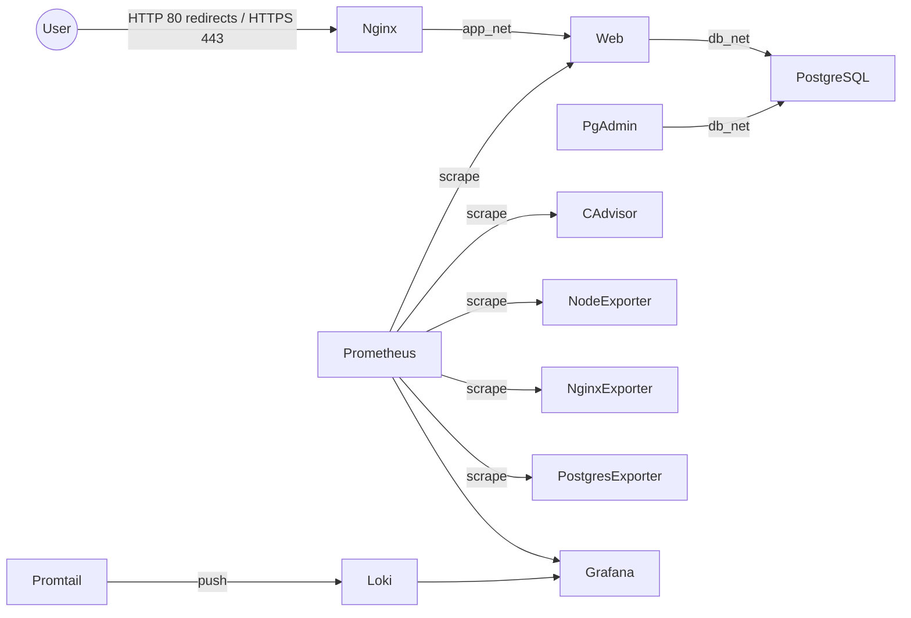

# Hệ thống Quản lý Hóa đơn / Billing

## Thông tin dự án

| Mục | Thông tin |
|---|---|
| Đề tài | Hệ thống Quản lý Hóa đơn / Billing |
| MSSV | DTC245200086 |
| Họ tên | Phạm Tiến Hà |
| Lớp | CNTT K23G |
| GVHD | Vũ Việt Dũng |
| GitHub username | `dtc245200086-svg` |
| Repository | `DTC245200086_PhamTienHa` |

## Mục tiêu và phạm vi

Đề 18 xây dựng hệ thống quản lý khách hàng, hóa đơn và thanh toán chạy bằng Docker Compose, dùng PostgreSQL làm dữ liệu nghiệp vụ và pgAdmin để kiểm tra dữ liệu. Phạm vi đã triển khai gồm ứng dụng Node.js/Express, Nginx HTTPS, monitoring Prometheus/Grafana, logging Loki/Promtail và hardening H1–H6. YC7 (báo cáo và diễn tập demo) chưa bắt đầu.

## Trạng thái

- CP0: **PASS**; prerequisite và compatibility probes được ghi trong [AI Execution History](docs/AI_EXECUTION_HISTORY.md).
- YC1a / CP1a: **PASS**, Commit 0a đã push lên `main`.
- YC2 / CP2: **PASS**, baseline `base-app` có ứng dụng, PostgreSQL và pgAdmin.
- YC3 / CP3: **PASS**; website qua Nginx HTTPS tự ký, redirect, security headers/CSP, rate limit và JSON access log đã được kiểm tra runtime.
- YC4 / CP4 technical: **PASS**; immutable Commit 2/tag `commit-2-monitoring`=`7502aa7f067f99f6b976bc553bdc021b79561f48`. Final evidence remains incomplete: RQ4-02, RQ4-03 and RQ4-04 are not captured.
- YC5 / CP5: **PASS**; Loki, Promtail, Grafana Loki datasource, LogQL Q2–Q4, persistence and YC2–YC4 quick regression verified. Immutable Commit 3/tag `commit-3-logging`=`3ff709cee127ce763ee45fa7477e3b8372d8318a` records YC5.
- YC6 / CP6: **PASS**; H1–H6 were runtime-verified. `scripts/verify-hardening.ps1` passes; `scripts/verify-hardening.sh` passes under Windows Git Bash. H6 uses `grep --` for patterns beginning with `-`. `.gitattributes` pins all five tracked shell scripts to LF. The `hardening` tag dereferences to Commit 4 (`94dc8f027f8ff0cfa524c8f6d88950cbc7e37d48`).
- Historical support commits: `5743031f9c39a3960a87d40e92cb7eef5d9e40eb` (after Commit 2), `25944eae9dd7546c31c2083f1e3b0400d43919f8` (before Commit 3), and `32555a660f874624c20817e34cab9e37f1b26859` (pre-CP6 docs sync).
- YC1 final / CP-Final: **PASS**; the clean-clone gate passed with generated credentials/certificate and isolated volumes. This documentation snapshot is recorded by Commit 5/tag `docs-final` after final review. YC7/CP7 has not started. WSL's missing Docker CLI is an environment limitation; Windows Git Bash is used for the Bash verifier. No push.

## Công nghệ

- Node.js 24, Express, `pg`, `express-session`, `connect-pg-simple` và `bcryptjs`.
- Frontend HTML/CSS/JavaScript thuần; Nginx unprivileged `1.30.5-alpine`.
- PostgreSQL 16.15, pgAdmin 4 và Docker Compose.
- Prometheus, Grafana, cAdvisor, node-exporter, nginx-exporter và postgres-exporter (YC4).
- Loki 3.7.8 và Promtail 3.6.11 (YC5); Promtail is EOL, retained because the assignment explicitly requires it.
- Thiết kế/roadmap đầy đủ ở [Design Freeze](FILEmd/billing_deployment_roadmap_2.md).

**Image policy:** 12 upstream/base images are pinned; `node:24.21.0-alpine` is the base image used to build the project-specific `web` image. Do not count `web` as a thirteenth upstream image. No service image uses `latest`.

## Kiến trúc và dịch vụ



| Service | Image / build | Host binding |
|---|---|---|
| `nginx` | `nginxinc/nginx-unprivileged:1.30.5-alpine` | Public `80`, `443` |
| `web` | Project-built from `node:24.21.0-alpine` | Not published |
| `postgres` | `postgres:16.15-trixie` | Not published |
| `pgadmin` | `dpage/pgadmin4:9.18.0` | `127.0.0.1:5050` |
| `prometheus` | `prom/prometheus:v3.15.0` | `127.0.0.1:9090` |
| `grafana` | `grafana/grafana:13.2.3` | `127.0.0.1:3000` |
| `cadvisor` | `ghcr.io/google/cadvisor:v0.60.6` | Not published |
| `node-exporter` | `prom/node-exporter:v1.12.1` | Not published |
| `nginx-exporter` | `nginx/nginx-prometheus-exporter:1.5.3` | Not published |
| `postgres-exporter` | `prometheuscommunity/postgres-exporter:v0.20.1` | Not published |
| `loki` | `grafana/loki:3.7.8` | Not published |
| `promtail` | `grafana/promtail:3.6.11` | Not published |

The five Docker networks are `edge_net` (Nginx), `admin_net` (pgAdmin/Prometheus/Grafana), `app_net` (Nginx/web/nginx-exporter), `db_net` (web/PostgreSQL/pgAdmin/postgres-exporter), and `monitoring_net` (web, monitoring/logging services and exporters). `app_net`, `db_net`, and `monitoring_net` are internal. PostgreSQL is not on `edge_net` or `admin_net`; `admin_net` is a separate non-internal network for loopback-published tools, not the primary security boundary.

## Database, auth và nghiệp vụ

PostgreSQL 16 dùng database `billing`. Init scripts tạo schema, roles và seed data khi named volume còn trống. `billing_app` phục vụ ứng dụng với quyền giới hạn; `billing_readonly` chỉ đọc bảng nghiệp vụ qua pgAdmin; `exporter` dùng quyền monitoring `pg_monitor`. `pgAdmin` nạp server `Billing PostgreSQL` từ [servers.json](pgadmin/servers.json); nhập mật khẩu DB khi kết nối và không lưu trong file này.

Ứng dụng dùng Express, `express-session`, `connect-pg-simple` và `bcryptjs` cost 12; session được lưu trong PostgreSQL. Cookie `billing.sid` có `HttpOnly`, `SameSite=Strict`, `Path=/`, thời hạn 8 giờ. `Secure` chỉ bật khi `SESSION_COOKIE_SECURE=true`; YC2 dùng HTTP `127.0.0.1:8000` với `false`, từ Commit 1 dùng HTTPS qua Nginx với `true`. Express cấu hình `trust proxy = 1` để nhận biết HTTPS qua `X-Forwarded-Proto` từ Nginx.

Số hóa đơn có dạng `INV-YYYY-NNNNNN`, là `UNIQUE`, được cấp khi phát hành từ PostgreSQL sequence. Số tăng dần nhưng có thể có khoảng trống khi transaction lỗi và sequence không reset theo năm. Hóa đơn đã phát hành không sửa; payment chỉ thêm; số tiền dùng PostgreSQL `NUMERIC` và kiểm tra trong transaction.

## Chạy cục bộ trên Windows

Cần Docker Desktop với Linux containers, Docker Compose v2+ và OpenSSL (Git for Windows có sẵn OpenSSL). PowerShell load-test không cần thêm package; Bash load-test cần `curl` và `jq`. Từ thư mục repository:

```powershell
Copy-Item .env.example .env
```

Sửa `.env`: thay mọi `CHANGE_ME` bằng credential riêng, mạnh; `SESSION_SECRET` phải có ít nhất 32 ký tự ngẫu nhiên. `SESSION_COOKIE_SECURE=true` là bắt buộc từ YC3. Không commit `.env`.

Tạo certificate self-signed có SAN `localhost` và `billing.local`, rồi khởi động:

```powershell
.\scripts\gen-cert.ps1
docker compose config --quiet
docker compose up -d
docker compose ps
```

Compose tự build image `web` nếu image chưa có. Dùng `docker compose up -d --build` sau khi thay đổi source cần build lại. Trên Linux/macOS có thể dùng `cp .env.example .env`, `bash scripts/gen-cert.sh`, rồi cùng các lệnh Compose trên.

- Website: https://localhost (HTTP chuyển hướng 301 sang HTTPS).
- pgAdmin: http://127.0.0.1:5050.
- Prometheus: http://127.0.0.1:9090; Grafana: http://127.0.0.1:3000.
- Nginx publish host ports 80/443; `web` không publish trực tiếp. PostgreSQL không publish cổng.
- Compose dùng năm network: `edge_net` (Nginx), `app_net` (Nginx/web/nginx-exporter), `db_net` (web/PostgreSQL/pgAdmin/postgres-exporter), `admin_net` (pgAdmin/Prometheus/Grafana) và `monitoring_net` (web, monitoring/logging services và exporters). Các network internal flags và membership chi tiết được chốt trong [Design Freeze](FILEmd/billing_deployment_roadmap_2.md); `internal: true` không tự chứng minh egress bị chặn.
- `/metrics` và `/stub_status` chỉ dùng nội bộ; Nginx public HTTPS trả 404 cho cả hai. Exporter/cAdvisor không publish host ports.
- App `/metrics` và Nginx `stub_status` chỉ được thêm ở YC4/Commit 2; Nginx vẫn chặn các endpoint này từ public HTTPS.
- Trình duyệt sẽ cảnh báo certificate self-signed; chỉ chấp nhận trong môi trường demo. Với curl dùng `curl.exe -k`.
- `/health` và `/metrics` trả 404 từ public HTTPS; `/nginx-health` dùng cho healthcheck Nginx trên HTTP.
- Dừng stack bằng `docker compose down`; named volumes được giữ lại. Không chạy `docker compose down -v` trừ khi chủ động chấp nhận xóa dữ liệu demo.
- Nếu đổi mật khẩu trong `.env` sau lần khởi tạo volume đầu tiên, PostgreSQL không tự chạy lại init scripts; cập nhật role trong DB theo quy trình vận hành hoặc chỉ xóa volume khi thực sự muốn reset dữ liệu.

Tài khoản ứng dụng `admin` và `staff` dùng `ADMIN_PASSWORD` và `STAFF_PASSWORD` từ `.env`. pgAdmin tự đăng ký `Billing PostgreSQL` từ [servers.json](pgadmin/servers.json); nhập `BILLING_READONLY_PASSWORD` tại prompt và để **Save Password** bỏ chọn. `billing_readonly` chỉ đọc các bảng nghiệp vụ.

Database seed và đổi mật khẩu: script trong `db/init` chỉ chạy khi volume PostgreSQL được tạo lần đầu. Thay mật khẩu trong `.env` không tự đổi credential đã lưu trong volume. `docker compose down` giữ dữ liệu; không dùng `docker compose down -v` nếu cần bảo toàn dữ liệu.

## Monitoring YC4 / CP4

Grafana dùng `GRAFANA_ADMIN_PASSWORD` trong `.env`; không dùng `admin/admin`. Dashboard `Billing Monitoring` và datasource Prometheus được provision từ file trong `monitoring/`. Sau khi stack lên, mở Prometheus **Status → Targets** và kiểm tra 6 job `prometheus`, `cadvisor`, `node`, `nginx`, `web`, `postgres` ở trạng thái UP.

Runtime verification gần nhất cho CP6 ghi nhận Prometheus 6/6 targets UP, Grafana health `ok`, và application/business metrics có series. cAdvisor/node-exporter phản ánh Docker Desktop Linux VM, không phải Windows host.

Tạo traffic nghiệp vụ thật để dashboard có dữ liệu:

```powershell
.\scripts\load-test.ps1
```

Hoặc trên Bash có `curl` và `jq`:

```bash
bash scripts/load-test.sh
```

Script tạo customer/invoice/payment với prefix `YC4 LOAD`, gửi login sai và 404; dữ liệu được giữ trong PostgreSQL, không tự xóa. Commit 2/tag `commit-2-monitoring` vẫn ở `7502aa7`; Commit 3/tag `commit-3-logging` vẫn trỏ tới `3ff709cee127ce763ee45fa7477e3b8372d8318a`. Các support commits là historical. Pre-Commit-5 baseline là HEAD/tag `hardening`=`94dc8f027f8ff0cfa524c8f6d88950cbc7e37d48`; Commit 5/tag `docs-final` records the YC1 final snapshot. Không push.

## Logging YC5 / CP5

Loki và Promtail chạy trong `monitoring_net`; Promtail chỉ giữ Docker targets có Compose project `billing`. Grafana datasource `Loki` được provision từ file. Mở Grafana → Explore → Loki và dùng các query đã kiểm chứng trong [logging/logql-queries.md](logging/logql-queries.md). Q2 (login failed), Q3 (Nginx 4xx/5xx) và Q4 (invoice/payment) đều trả log thật. Log labels cho stream mới là `service`, `container`, `stream`; Loki giữ lại một số log cũ có label `service_name` cho đến khi hết retention 72 giờ. Promtail 3.6.11 được dùng vì yêu cầu bài tập; upstream đã EOL từ 02/03/2026.

Sau khi Loki vừa khởi động/restart, `/ready` có thể tạm trả 503 trong cửa sổ ingester 15 giây; kiểm tra lại đến khi trả `200 ready`. Trạng thái 503 chuyển tiếp đã được quan sát và không được coi riêng lẻ là lỗi cấu hình.

## Hardening YC6 / CP6

Hệ thống đã đạt đủ H1–H6; PowerShell và Windows Git Bash verifiers đều PASS. H6 Bash dùng `grep -- '->'` để tránh coi pattern bắt đầu bằng dấu `-` là option. `.gitattributes` giữ cả năm shell scripts được track ở LF bằng các path-specific rules. Clean-clone test phát hiện `core.autocrlf=true` đã chuyển DB init scripts thành CRLF, làm Bash bỏ lỡ heredoc `SQL`; các exact-path LF rules giữ init, cert, load-test và hardening scripts portable mà không thay logic. WSL thiếu Docker CLI là giới hạn của môi trường WSL hiện tại, không phải lỗi của Billing project.

Các kiểm soát:
- **H1 (Non-root containers):** `web` chạy user `node` (UID 1000); PostgreSQL process chạy user `postgres` (UID 999); Nginx chạy user `nginx` (UID 101); Grafana UID 472; Prometheus UID 65534; Loki UID 10001; exporters non-root. Ngoại lệ được chấp nhận: cAdvisor (`privileged: true`) và Promtail (socket Docker) theo mục 3.16.
- **H2 (Network isolation):** 5 network độc lập; `app_net`, `db_net`, `monitoring_net` có `internal: true`. PostgreSQL chỉ nằm trong `db_net`; Nginx không thuộc `db_net`; `admin_net` tách biệt công cụ quản trị khỏi web và database.
- **H3 (Credentials & Secrets):** File `.env` không bị track trong Git, được ignore; `.env.example` chỉ chứa placeholder; mật khẩu mặc định `admin/admin` của Grafana và default password của database bị từ chối (401 / auth failed).
- **H4 (Least privilege DB):** Kiểm tra bằng `psql` trong `db_net`: `billing_app` bị cấm DDL và cấm UPDATE/DELETE bảng `payments` (bảo đảm append-only tài chính); `billing_readonly` chỉ được SELECT bảng nghiệp vụ, bị cấm INSERT/UPDATE/DELETE và cấm truy cập bảng `users`; `exporter` thuộc `pg_monitor`.
- **H5 (Security headers & TLS):** 6 security headers bắt buộc (`HSTS`, `nosniff`, `DENY`, `Referrer-Policy`, `Permissions-Policy`, `CSP`); `server_tokens off` ẩn phiên bản Nginx; hỗ trợ TLS 1.2 và 1.3.
- **H6 (Port exposure):** Chỉ Nginx mở `0.0.0.0:80/443`; công cụ quản trị (pgAdmin, Grafana, Prometheus) chỉ bind `127.0.0.1`; `web`, `postgres`, `loki`, `cadvisor`, exporters không publish cổng ra host.

Chạy script kiểm tra tự động:
```powershell
.\scripts\verify-hardening.ps1
```
Hoặc trên Linux:
```bash
bash scripts/verify-hardening.sh
```

Toàn bộ minh chứng runtime được lưu tại `docs/evidence/RQ6-01` đến `RQ6-06`.

## Git, tags và evidence

| Milestone | Tag | Commit |
|---|---|---|
| Base application | `base-app` | `aa0d39222eddec12c41e7379550952ee83085a5e` |
| Commit 1 — Nginx | `commit-1-nginx` | `d179090de811925ee6b505311edb5c956fea4b98` |
| Commit 2 — Monitoring | `commit-2-monitoring` | `7502aa7f067f99f6b976bc553bdc021b79561f48` |
| Support docs after Commit 2 | — | `5743031f9c39a3960a87d40e92cb7eef5d9e40eb` |
| Docs reconciliation before Commit 3 | — | `25944eae9dd7546c31c2083f1e3b0400d43919f8` |
| Commit 3 — Logging | `commit-3-logging` | `3ff709cee127ce763ee45fa7477e3b8372d8318a` |
| Docs support before Commit 4 | — | `32555a660f874624c20817e34cab9e37f1b26859` |
| Commit 4 — H1–H6 hardening, verifiers and evidence | `hardening` | `94dc8f027f8ff0cfa524c8f6d88950cbc7e37d48` |
| Commit 5 — YC1 final documentation | `docs-final` | This final documentation snapshot; exact target is recorded by the tag |

Runtime screenshots and their status are indexed in [docs/evidence/README.md](docs/evidence/README.md). RQ4-02, RQ4-03 and RQ4-04 remain **MISSING**; RQ4-07 is a separate Prometheus business-metric capture and does not replace those Grafana row screenshots. YC1 final's clean-clone gate passed; YC7 remains unstarted.

## Kiểm thử YC3/CP3

Với Node.js 24, đặt `ADMIN_PASSWORD` và `STAFF_PASSWORD` trong PowerShell theo giá trị trong `.env`, sau đó chạy suite qua HTTPS. Chứng chỉ self-signed được tin cậy riêng cho test process; TLS verification trong ứng dụng không bị tắt:

```powershell
$env:CP2_BASE_URL = 'https://localhost'
$env:CP2_EXPECT_SECURE_COOKIE = 'true'
$env:CP2_EXPECT_PUBLIC_HEALTH_BLOCKED = 'true'
$env:NODE_EXTRA_CA_CERTS = (Resolve-Path .\nginx\certs\server.crt).Path
npm run test:cp2 --prefix app
```

Smoke test kiểm tra auth/session, customer, invoice, payment, cancellation, dashboard, validation, quyền và p95 danh sách hóa đơn qua Nginx. Evidence runtime ở [docs/evidence](docs/evidence/README.md); execution details ở [AI Execution History](docs/AI_EXECUTION_HISTORY.md).
