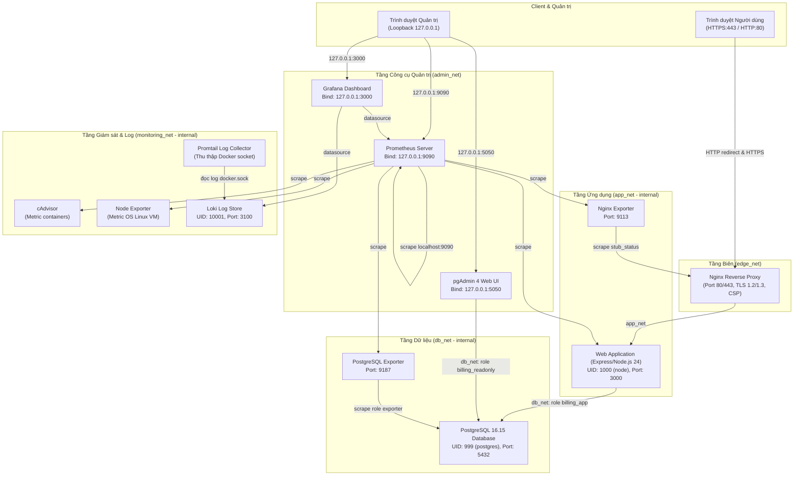

# Hướng dẫn Khởi động lại và Vận hành Hệ thống Billing Management

> **Tài liệu vận hành chính thức — Đồ án Triển khai và Quản trị Hệ thống Phần mềm**
> **Đề tài:** Hệ thống Quản lý Hóa đơn / Billing (Đề 18)
> **Sinh viên:** Phạm Tiến Hà — MSSV: DTC245200086 — Lớp: CNTT K23G
> **Giảng viên hướng dẫn:** Vũ Việt Dũng
> **Repository GitHub:** `https://github.com/dtc245200086-svg/DTC245200086_PhamTienHa.git`
> **Release:** `v1.0` (Milestone Commit: `fded947d98441446e8c424e657a51f88ea5edfbb`)

---

## 1. Thông tin Dự án

Hệ thống Quản lý Hóa đơn (Billing Management System) là ứng dụng hoàn chỉnh được container hóa toàn diện bằng **Docker Compose**. Hệ thống phục vụ nghiệp vụ tạo, quản lý khách hàng, lập hóa đơn, theo dõi trạng thái thanh toán và khóa giao dịch tài chính, tích hợp cổng bảo mật Nginx HTTPS, hệ thống giám sát Prometheus/Grafana, thu thập log tập trung Loki/Promtail và đạt 6 chuẩn an toàn hệ thống (H1–H6).

---

## 2. Kiến trúc Tổng thể Hệ thống

Hệ thống gồm **12 dịch vụ (containers)** phối hợp trên **5 Docker networks** độc lập:



---

## 3. Yêu cầu Môi trường

Để vận hành hệ thống trơn tru trên máy tính cá nhân hoặc máy chấm thi:
- **Hệ điều hành:** Windows 10/11 64-bit (hỗ trợ WSL2 backend) hoặc Linux / macOS.
- **Docker Desktop:** Phiên bản 4.25+ (khuyến nghị Docker Engine 24+, Compose v2+). Đảm bảo Docker Desktop ở chế độ **Linux Containers**.
- **Tài nguyên tối thiểu:** 4 Cores CPU, 8GB RAM (cấp phát tối thiểu 4GB RAM cho WSL2/Docker VM), 10GB dung lượng ổ đĩa trống.
- **Công cụ hỗ trợ:**
  - PowerShell 5.1+ hoặc PowerShell 7+.
  - Git for Windows (có kèm Git Bash và thư viện `openssl`).
  - Trình duyệt hiện đại: Google Chrome, Microsoft Edge, hoặc Firefox.

---

## 4. Cấu trúc Thư mục Dự án

```text
Billing_One/
├── app/                        # Mã nguồn ứng dụng Express/Node.js
│   ├── Dockerfile              # Multi-stage non-root build (node:24.21.0-alpine)
│   ├── package.json            # Dependencies: pg, express-session, connect-pg-simple, bcryptjs...
│   ├── server.js               # Entry point ứng dụng
│   ├── public/                 # Static frontend: HTML, CSS, client JS
│   └── src/                    # Controllers, models, routes, middleware
├── db/                         # Cấu hình và script cơ sở dữ liệu
│   └── init/                   # 01-init.sql, 02-seed.sql (tạo schema, roles, seed data)
├── nginx/                      # Cấu hình Nginx Reverse Proxy
│   ├── nginx.conf              # SSL, Security Headers, Rate limit, JSON access logs
│   └── certs/                  # Thư mục chứa chứng chỉ SSL tự ký (gitignore)
├── monitoring/                 # Cấu hình Prometheus và Grafana
│   ├── prometheus.yml          # Cấu hình 6 scrape targets
│   └── grafana/                # Provisioning datasource và dashboard Billing Monitoring
├── logging/                    # Cấu hình ghi log tập trung
│   ├── loki-config.yaml        # Cấu hình lưu trữ và retention 72h của Loki
│   ├── promtail-config.yaml    # Cấu hình thu thập log Docker container
│   └── logql-queries.md        # Danh mục các truy vấn LogQL mẫu
├── pgadmin/                    # Cấu hình pgAdmin 4
│   └── servers.json            # Tự động nạp kết nối server Billing PostgreSQL
├── scripts/                    # Scripts tự động hóa
│   ├── gen-cert.ps1 / .sh      # Tạo chứng chỉ SSL self-signed có SAN
│   ├── load-test.ps1 / .sh     # Tạo dữ liệu mẫu và tải nghiệp vụ
│   ├── verify-hardening.ps1    # Bộ kiểm thử tự động 6 chuẩn Hardening (PowerShell)
│   └── verify-hardening.sh     # Bộ kiểm thử tự động 6 chuẩn Hardening (Git Bash)
├── docs/                       # Tài liệu đồ án, báo cáo và bằng chứng
│   ├── evidence/               # Minh chứng ảnh runtime RQ1..RQ7
│   ├── report/                 # Báo cáo Word/PDF (18 trang), kịch bản demo, Q&A
│   ├── STARTUP_AND_OPERATIONS_GUIDE.md # (Tài liệu này)
│   └── ASSESSMENT_CRITERIA_ANALYSIS.md # Phân tích 7 tiêu chí đánh giá
├── docker-compose.yml          # Định nghĩa 12 dịch vụ, 5 network, 6 volumes
├── .env.example                # Mẫu khai báo biến môi trường (an toàn cho Git)
└── README.md                   # Tài liệu tổng quan dự án
```

---

## 5. Hướng dẫn Clone Repository

Mở PowerShell và di chuyển tới thư mục làm việc mong muốn:
```powershell
git clone https://github.com/dtc245200086-svg/DTC245200086_PhamTienHa.git
cd DTC245200086_PhamTienHa
```

---

## 6. Kiểm tra Branch và Release Tag

Xác minh mã nguồn đang ở đúng mốc release đã nghiệm thu:
```powershell
# Kiểm tra branch hiện tại
git branch --show-current

# Kiểm tra commit HEAD
git rev-parse HEAD

# Kiểm tra tag release v1.0
git rev-parse "v1.0^{}"

# Xem lịch sử các commit mốc
git log --graph --oneline --decorate -n 8
```
*Kết quả hợp lệ:* `branch` là `main`, tag `v1.0` dereference về `fded947d98441446e8c424e657a51f88ea5edfbb`.

---

## 7. Chuẩn bị File Cấu hình Môi trường `.env`

File `.env` chứa mật khẩu bảo mật và được **loại trừ tuyệt đối khỏi Git** (`.gitignore`).
Tạo file `.env` từ file mẫu:
```powershell
Copy-Item .env.example .env
```
Mở `.env` bằng Notepad hoặc VS Code để cấu hình:
1. Đổi tất cả các giá trị placeholder `CHANGE_ME_...` thành mật khẩu mạnh riêng của bạn.
2. `SESSION_SECRET`: Đặt chuỗi ngẫu nhiên có độ dài tối thiểu 32 ký tự.
3. `SESSION_COOKIE_SECURE`: Bắt buộc để `true` khi chạy qua Nginx HTTPS.
4. `ADMIN_PASSWORD` và `STAFF_PASSWORD`: Đặt mật khẩu đăng nhập ứng dụng web.

> [!WARNING]
> Mật khẩu cơ sở dữ liệu (`POSTGRES_PASSWORD`, `BILLING_APP_PASSWORD`, `BILLING_READONLY_PASSWORD`) chỉ được thiết lập trong lần khởi tạo volume PostgreSQL đầu tiên. Việc thay đổi mật khẩu trong `.env` sau khi volume đã tồn tại sẽ không tự đổi mật khẩu trong DB.

---

## 8. Kiểm tra Trạng thái Docker Daemon

Trước khi chạy bất kỳ lệnh Docker nào, hãy đảm bảo **Docker Desktop đã khởi động hoàn toàn**:
```powershell
docker info
```
Nếu lệnh trả về danh sách thông số `Server: Docker Desktop` mà không báo lỗi `error during connect: In the default daemon configuration on Windows...` nghĩa là Docker daemon đã sẵn sàng.

---

## 9. Khởi động Toàn bộ Hệ thống (Quy trình Chuẩn)

### Bước 9.1: Tạo Chứng chỉ SSL Self-signed
Nginx yêu cầu cặp chứng chỉ `server.crt` và khóa bí mật `server.key` có SAN (Subject Alternative Name) bao gồm `localhost` và `billing.local`:
```powershell
.\scripts\gen-cert.ps1
```
*Ghi chú:* Script sẽ tự động sinh file trong thư mục `nginx/certs/` nếu chưa có.

### Bước 9.2: Kiểm tra cú pháp Compose
```powershell
docker compose config --quiet
```
Nếu lệnh không xuất ra lỗi nào, cấu hình Compose hoàn toàn hợp lệ.

### Bước 9.3: Khởi động các Containers
```powershell
docker compose up -d
```
Docker Compose sẽ khởi tạo 5 network, nạp 6 named volume và khởi chạy 12 services theo đúng thứ tự phụ thuộc (`depends_on`).

---

## 10. Kiểm tra Trạng thái Dịch vụ (`docker compose ps`)

Chạy lệnh kiểm tra:
```powershell
docker compose ps
```
Bảng hiển thị chuẩn gồm 12 containers:
- `billing-cadvisor-1`: Up (healthy)
- `billing-grafana-1`: Up
- `billing-loki-1`: Up
- `billing-nginx-1`: Up (healthy)
- `billing-nginx-exporter-1`: Up
- `billing-node-exporter-1`: Up
- `billing-pgadmin-1`: Up
- `billing-postgres-1`: Up (healthy)
- `billing-postgres-exporter-1`: Up
- `billing-prometheus-1`: Up
- `billing-promtail-1`: Up
- `billing-web-1`: Up (healthy)

---

## 11. Bảng Dịch vụ và Ranh giới Mạng

| Dịch vụ | Docker Image | Vai trò chức năng | Networks tham gia |
|---|---|---|---|
| `nginx` | `nginxinc/nginx-unprivileged:1.30.5-alpine` | Cổng vào công khai duy nhất, SSL Termination, Headers, Rate limit | `edge_net`, `app_net` |
| `web` | `billing-web` (Node 24 Alpine) | Nghiệp vụ ứng dụng Billing, API, Session server-side | `app_net`, `db_net`, `monitoring_net` |
| `postgres` | `postgres:16.15-trixie` | Lưu trữ dữ liệu quan hệ, sequence, ràng buộc tài chính | `db_net` |
| `pgadmin` | `dpage/pgadmin4:9.18.0` | Giao diện Web quản trị cơ sở dữ liệu qua role read-only | `admin_net`, `db_net` |
| `prometheus` | `prom/prometheus:v3.15.0` | Thu thập metrics định kỳ từ 6 jobs exporter | `admin_net`, `monitoring_net` |
| `grafana` | `grafana/grafana:13.2.3` | Trực quan hóa metrics và logs qua dashboard tập trung | `admin_net`, `monitoring_net` |
| `cadvisor` | `ghcr.io/google/cadvisor:v0.60.6` | Thu thập tài nguyên CPU/RAM của từng container | `monitoring_net` |
| `node-exporter` | `prom/node-exporter:v1.12.1` | Thu thập tài nguyên hệ điều hành VM chạy Docker | `monitoring_net` |
| `nginx-exporter` | `nginx/nginx-prometheus-exporter:1.5.3` | Thu thập số liệu HTTP connections, request status từ Nginx | `app_net`, `monitoring_net` |
| `postgres-exporter`| `prometheuscommunity/postgres-exporter:v0.20.1` | Thu thập metrics kết nối, transaction, cache của PostgreSQL | `db_net`, `monitoring_net` |
| `loki` | `grafana/loki:3.7.8` | Hệ thống lưu trữ và đánh chỉ mục nhãn log tập trung | `monitoring_net` |
| `promtail` | `grafana/promtail:3.6.11` | Thu thập log container qua Docker socket, đẩy vào Loki | `monitoring_net` |

---

## 12. Danh mục Port và Ranh giới Bảo vệ (Host Binding)

| Cổng Host | Dịch vụ | Mục đích | Ranh giới truy cập |
|---|---|---|---|
| `80/tcp` (0.0.0.0) | `nginx` | HTTP chuyển hướng 301 sang HTTPS | Công khai (Public) |
| `443/tcp` (0.0.0.0) | `nginx` | HTTPS truy cập ứng dụng chính | Công khai (Public) |
| `5050/tcp` (127.0.0.1) | `pgadmin` | Giao diện quản trị pgAdmin | Chỉ máy cục bộ (Loopback only) |
| `9090/tcp` (127.0.0.1) | `prometheus` | Giao diện giám sát Prometheus | Chỉ máy cục bộ (Loopback only) |
| `3000/tcp` (127.0.0.1) | `grafana` | Giao diện trực quan Grafana | Chỉ máy cục bộ (Loopback only) |
| **Không mở cổng host** | `web`, `postgres`, `loki`, `cadvisor`, các exporters | Kết nối hoàn toàn nội bộ trong Docker networks | Bị chặn từ bên ngoài (Internal only) |

---

## 13. URL Truy cập Chính thức

- **Website Ứng dụng:** `https://localhost` (hoặc `http://localhost` sẽ tự động chuyển hướng sang HTTPS).
- **Trang Quản trị Database (pgAdmin):** `http://127.0.0.1:5050`
- **Giao diện Prometheus:** `http://127.0.0.1:9090`
- **Giao diện Grafana:** `http://127.0.0.1:3000`

---

## 14. Hướng dẫn Vượt qua Cảnh báo SSL Self-Signed trên Trình duyệt

Vì chứng chỉ SSL được tạo cục bộ (self-signed) cho môi trường kiểm thử và demo:
1. Mở trình duyệt truy cập: `https://localhost`
2. **Trên Google Chrome / Microsoft Edge:**
   - Trình duyệt sẽ hiện cảnh báo: `Kết nối của bạn không phải là kết nối riêng tư (NET::ERR_CERT_AUTHORITY_INVALID)`.
   - Nhấp vào nút **Nâng cao (Advanced)**.
   - Nhấp vào liên kết **Tiếp tục truy cập localhost (không an toàn) / Proceed to localhost (unsafe)**.
   - *(Mẹo trên Chrome/Edge nếu không có nút Tiếp tục):* Nhấp chuột vào khoảng trắng bất kỳ trên trang lỗi và gõ bằng bàn phím chuỗi ký tự: `thisisunsafe`. Trang web sẽ lập tức tải thành công.
3. **Trên Mozilla Firefox:**
   - Chọn **Nâng cao (Advanced)** -> Chọn **Chấp nhận rủi ro và tiếp tục (Accept the Risk and Continue)**.

---

## 15. Hướng dẫn Sử dụng Nghiệp vụ Ứng dụng Web

### 15.1. Đăng nhập hệ thống
- Mở `https://localhost`.
- Nhập tài khoản: `admin` hoặc `staff`.
- Mật khẩu: lấy giá trị tương ứng từ `ADMIN_PASSWORD` hoặc `STAFF_PASSWORD` trong file `.env`.
- Nhấp **Đăng nhập**. Session cookie `billing.sid` được cấp với thuộc tính `HttpOnly`, `SameSite=Strict`, `Secure`.

### 15.2. Quản lý Khách hàng (Customers)
- Điều hướng tới tab **Khách hàng (Customers)**.
- Nhấp **Thêm khách hàng (New Customer)**: Nhập tên, email, số điện thoại, địa chỉ -> Nhấp **Lưu**.
- Tìm kiếm khách hàng theo tên hoặc email trên thanh tìm kiếm.

### 15.3. Tạo và Lập Hóa đơn (Invoices)
- Chuyển sang tab **Hóa đơn (Invoices)** -> Nhấp **Tạo hóa đơn (New Invoice)**.
- Chọn khách hàng từ danh sách.
- Chọn ngày đến hạn thanh toán (Due date).
- Thêm các dòng dịch vụ (Line Items): Tên dịch vụ, số lượng, đơn giá. Hệ thống tự động tính toán Subtotal, Thuế (Tax 10%) và Tổng tiền (Total) bằng kiểu số học chính xác `NUMERIC` trên server.
- Hóa đơn ban đầu ở trạng thái **Bản nháp (DRAFT)**. Ở trạng thái này, hóa đơn có thể sửa hoặc xóa.

### 15.4. Phát hành Hóa đơn (Issue Invoice)
- Nhấp nút **Phát hành (Issue)** trên hóa đơn nháp.
- Hệ thống gọi sequence trong PostgreSQL để cấp mã số hóa đơn duy nhất có định dạng: `INV-YYYY-NNNNNN` (Ví dụ: `INV-2026-000001`).
- **Nguyên tắc bất biến:** Hóa đơn sau khi phát hành (`ISSUED`) không thể sửa đổi hay xóa, đảm bảo tính toàn vẹn kiểm toán.

### 15.5. Ghi nhận Thanh toán (Payments)
- Mở chi tiết hóa đơn đã phát hành -> Nhấp **Thanh toán (Add Payment)**.
- Nhập số tiền thanh toán và phương thức (Tiền mặt, Chuyển khoản, Thẻ).
- Nếu thanh toán một phần: Trạng thái hóa đơn chuyển thành `PARTIALLY_PAID`.
- Nếu thanh toán đủ toàn bộ số dư: Trạng thái chuyển thành `PAID`.
- **Cơ chế chống gian lận/double-payment:** Giao dịch thanh toán sử dụng khóa bi quan `SELECT ... FOR UPDATE` trong transaction của PostgreSQL. Mọi hành vi thanh toán vượt quá số dư còn lại (Overpayment) đều bị server từ chối với lỗi HTTP 409/400.

---

## 16. Hướng dẫn Sử dụng pgAdmin

1. Mở trình duyệt tới: `http://127.0.0.1:5050`.
2. Đăng nhập pgAdmin:
   - **Email:** Lấy từ `PGADMIN_DEFAULT_EMAIL` trong `.env` (ví dụ: `admin@billing.local`).
   - **Password:** Lấy từ `PGADMIN_DEFAULT_PASSWORD` trong `.env`.
3. Kết nối Cơ sở dữ liệu:
   - Trong cây thư mục bên trái, mở **Servers** -> Chọn **Billing PostgreSQL** (được cấu hình tự động từ `servers.json`).
   - Hộp thoại mật khẩu xuất hiện: Nhập mật khẩu của role `billing_readonly` (lấy từ `BILLING_READONLY_PASSWORD` trong `.env`).
   - **Lưu ý:** Bỏ chọn ô "Save Password" để tuân thủ nguyên tắc bảo mật.
4. Kiểm tra dữ liệu:
   - Mở rộng nhánh: `Databases` -> `billing` -> `Schemas` -> `public` -> `Tables`.
   - Chuột phải vào bảng `invoices` hoặc `customers` -> Chọn **View/Edit Data** -> **All Rows** để xem dữ liệu lưu trong PostgreSQL.
   - Thử chạy câu lệnh INSERT/DELETE để thấy role `billing_readonly` bị chặn quyền đúng như thiết kế least privilege (H4).

---

## 17. Hướng dẫn Kiểm tra Cơ sở dữ liệu qua CLI

Nếu muốn truy vấn nhanh trực tiếp từ dòng lệnh mà không cần mở trình duyệt:
```powershell
# Đăng nhập bằng quyền ứng dụng billing_app
docker compose exec -it postgres psql -U billing_app -d billing

# Hoặc kiểm tra số lượng bản ghi bằng user quản trị postgres
docker compose exec -T postgres psql -U postgres -d billing -c "SELECT count(*) FROM customers; SELECT count(*) FROM invoices; SELECT count(*) FROM payments;"
```

---

## 18. Hướng dẫn Sử dụng Prometheus

1. Mở trình duyệt: `http://127.0.0.1:9090`.
2. Kiểm tra các Scrape Targets:
   - Nhấp vào menu **Status** -> Chọn **Targets**.
   - Xác nhận có đủ **6 jobs** và tất cả đều hiển thị màu xanh **UP (1/1)**:
     - `cadvisor (1/1 up)`
     - `nginx (1/1 up)`
     - `node (1/1 up)`
     - `postgres (1/1 up)`
     - `prometheus (1/1 up)`
     - `web (1/1 up)`
3. Thử nghiệm một số câu lệnh PromQL:
   - `billing_invoices_created_total`: Tổng số hóa đơn đã được ứng dụng tạo ra.
   - `http_requests_total`: Tổng lượng HTTP requests vào ứng dụng.
   - `pg_stat_database_xact_commit`: Số lượng database transactions thành công.

---

## 19. Hướng dẫn Sử dụng Grafana Dashboard

1. Mở trình duyệt: `http://127.0.0.1:3000`.
2. Đăng nhập Grafana:
   - **Username:** `admin`
   - **Password:** Lấy từ `GRAFANA_ADMIN_PASSWORD` trong file `.env` (Mật khẩu mặc định `admin/admin` đã bị vô hiệu hóa).
3. Mở Dashboard giám sát:
   - Vào menu bên trái -> **Dashboards** -> Chọn dashboard **Billing Monitoring**.
4. Các khu vực giám sát (3 Rows):
   - **Row 1: Container Resources:** Biểu đồ sử dụng CPU, RAM của từng container thu thập bởi cAdvisor và Node Exporter.
   - **Row 2: Web & Proxy Application:** Tần suất request, độ trễ p95/p99, tỷ lệ mã lỗi HTTP (2xx, 3xx, 4xx, 5xx) từ Nginx và Web Express, metric nghiệp vụ số hóa đơn tạo thành công.
   - **Row 3: Database Metrics:** Số lượng kết nối PostgreSQL đang mở, tỷ lệ Cache Hit Ratio (>95%), tốc độ commit transaction, dung lượng database `billing`.

---

## 20. Hướng dẫn Sử dụng Loki và Truy vấn LogQL

1. Trong Grafana, nhấp vào menu bên trái -> Chọn **Explore** (biểu tượng la bàn).
2. Ở góc trên bên trái màn hình Explore, chọn Data source là **Loki**.
3. Chọn khoảng thời gian xem log (ở góc trên bên phải): Chọn **Last 1 hour** hoặc **Last 6 hours** (hoặc chọn khoảng thời gian vừa chạy load-test).
4. Thực thi 3 câu lệnh truy vấn mẫu bắt buộc theo tài liệu bài tập:

**Truy vấn Q2: Tìm log đăng nhập thất bại (Failed Logins)**
```logql
{service="web"} | json | msg="auth.login_failed"
```
*Kết quả:* Trả về các dòng log JSON ghi nhận sự kiện đăng nhập sai thông tin (kèm theo IP nguồn và username).

**Truy vấn Q3: Tìm log lỗi HTTP 4xx và 5xx từ Nginx**
```logql
{service="nginx"} | json | status >= 400
```
*Kết quả:* Trả về các dòng log truy cập Nginx phát sinh lỗi 401, 404 hoặc 429 do rate limit.

**Truy vấn Q4: Tìm log các sự kiện nghiệp vụ tạo hóa đơn và thanh toán**
```logql
{service="web"} | json | msg=~"invoice.created|payment.recorded"
```
*Kết quả:* Trả về chi tiết các dòng log khi nhân viên tạo hóa đơn mới hoặc ghi nhận thanh toán tiền.

---

## 21. Hướng dẫn Tạo Traffic Nghiệp vụ Thật (Load Test)

Để tạo ra luồng dữ liệu dồi dào phục vụ trực quan hóa trên Grafana và sinh log trong Loki:
```powershell
.\scripts\load-test.ps1
```
*Lưu ý:* Script sẽ tự động đăng nhập, tạo khách hàng có tiền tố `YC4 LOAD`, tạo hóa đơn nháp, phát hành hóa đơn, thực hiện thanh toán, gửi thử request login sai để sinh log lỗi và gửi request vào đường dẫn không tồn tại để sinh mã lỗi 404.

---

## 22. Hướng dẫn Chạy Bộ Kiểm tra An toàn Hệ thống (Hardening Verifier)

Chạy script kiểm tra tự động toàn diện 6 tiêu chuẩn H1–H6:

**Cách 1: Chạy bằng PowerShell trên Windows**
```powershell
powershell -ExecutionPolicy Bypass -File .\scripts\verify-hardening.ps1
```

**Cách 2: Chạy bằng Git Bash trên Windows**
```bash
& 'C:\Program Files\Git\bin\bash.exe' scripts/verify-hardening.sh
```

*Tiêu chí đạt:* Script kiểm tra từng hạng mục (H1: Non-root UID, H2: Network isolation, H3: Secrets & .env policy, H4: DB least privilege, H5: Security headers & TLS, H6: Port exposure) và kết thúc với dòng chữ:
`HARDENING VERIFICATION PASSED (All H1-H6 checks OK)` với exit code 0.

---

## 23. Các Lệnh Vận hành và Quản trị Container

### 23.1. Xem log container theo thời gian thực
```powershell
# Xem log của web application
docker compose logs -f web

# Xem 50 dòng log gần nhất của Nginx
docker compose logs --tail=50 nginx

# Xem log của Loki
docker compose logs loki
```

### 23.2. Khởi động lại một dịch vụ đơn lẻ
```powershell
# Khởi động lại web container khi cần nạp lại source
docker compose restart web

# Khởi động lại Nginx
docker compose restart nginx
```

### 23.3. Khởi động lại toàn bộ stack
```powershell
docker compose restart
```

### 23.4. Dừng hệ thống (Bảo toàn dữ liệu)
```powershell
docker compose down
```
Lệnh này dừng và gỡ các containers nhưng **GIỮ NGUYÊN TOÀN BỘ 6 NAMED VOLUMES**. Lần sau khi chạy `docker compose up -d`, toàn bộ dữ liệu hóa đơn, cấu hình Grafana và log đều còn nguyên.

---

## 24. Cảnh báo Lệnh Nguy hiểm (TUYỆT ĐỐI TRÁNH)

> [!CAUTION]
> **KHÔNG BAO GIỜ CHẠY LỆNH NÀY TRONG MÔI TRƯỜNG ĐỒ ÁN:**
> ```powershell
> docker compose down -v   # << CẢNH BÁO: LỆNH XÓA SẠCH DỮ LIỆU
> ```
> Cờ `-v` (`--volumes`) sẽ xóa vĩnh viễn toàn bộ cơ sở dữ liệu hóa đơn khách hàng (`billing_postgres_data`), dashboard Grafana và chứng chỉ SSL! Nếu muốn dừng hệ thống, chỉ dùng `docker compose down`.

---

## 25. Hướng dẫn Xử lý Sự cố Thường gặp (Troubleshooting)

### Sự cố 1: Lỗi "error during connect: In the default daemon configuration..."
- **Nguyên nhân:** Docker Desktop chưa được bật hoặc service Docker daemon bị dừng.
- **Cách khắc phục:** Mở ứng dụng **Docker Desktop** từ Start Menu, đợi biểu tượng cá voi ở góc khay hệ thống chuyển sang màu xanh (Docker Desktop is running), sau đó chạy lại lệnh.

### Sự cố 2: Lỗi cổng bị xung đột (Port already allocated)
- **Nguyên nhân:** Cổng 80, 443, 3000, 5050 hoặc 9090 đã bị một ứng dụng khác trên máy chiếm dụng (ví dụ: IIS, Skype, VMware, Grafana cài trực tiếp).
- **Cách kiểm tra:**
  ```powershell
  netstat -ano | findstr :80
  netstat -ano | findstr :443
  netstat -ano | findstr :3000
  ```
- **Cách khắc phục:** Dừng tiến trình xung đột (PID hiển thị ở cột cuối cùng trong Task Manager) hoặc tắt IIS service (`iisreset /stop`).

### Sự cố 3: Container `postgres` hoặc `web` ở trạng thái Unhealthy
- **Nguyên nhân:** Quá trình khởi tạo cơ sở dữ liệu cần 10-15 giây để hoàn tất các script khởi tạo trong `db/init`.
- **Cách khắc phục:** Đợi 10 giây và kiểm tra lại bằng `docker compose ps`. Nếu vẫn lỗi, kiểm tra log chi tiết:
  ```powershell
  docker compose logs postgres
  docker compose logs web
  ```

### Sự cố 4: Grafana Dashboard không hiển thị số liệu
- **Nguyên nhân:** Hệ thống vừa mới khởi động nên chưa có lưu lượng truy cập thực tế.
- **Cách khắc phục:** Chạy script tạo traffic:
  ```powershell
  .\scripts\load-test.ps1
  ```
  Sau đó tải lại trang Grafana và chọn khoảng thời gian hiển thị là `Last 15 minutes`.

### Sự cố 5: Loki /ready trả về lỗi 503 tạm thời
- **Nguyên nhân:** Khi Loki vừa khởi động, ingester cần cửa sổ 15 giây để sẵn sàng nhận log.
- **Cách khắc phục:** Đợi 15 giây rồi kiểm tra lại. Đây là hành vi khởi động bình thường của Loki.

---

## 26. Kịch bản Diễn tập Demo Nhanh (5–8 Phút Cho Giảng Viên)

Khi thuyết trình trước giảng viên, thực hiện tuần tự theo kịch bản ngắn gọn sau:

1. **Bước 1 (30s) — Giới thiệu Kiến trúc & Trạng thái Stack:**
   - Mở terminal chạy: `docker compose ps`.
   - Giới thiệu 12 containers chạy độc lập trên 5 networks, các cổng nội bộ (3000, 5432, 3100) được cô lập an toàn.
2. **Bước 2 (60s) — Demo Cổng vào Nginx HTTPS:**
   - Mở trình duyệt gõ: `http://localhost`. Chỉ ra trình duyệt tự nhảy sang `https://localhost` (Mã 301 Redirect).
   - Mở Developer Tools (F12) -> Tab Network: Chỉ ra các Security Headers (HSTS, CSP, X-Frame-Options DENY, nosniff, X-Request-Id).
3. **Bước 3 (120s) — Demo Nghiệp vụ Billing:**
   - Đăng nhập `admin`.
   - Tạo 1 khách hàng mới.
   - Tạo 1 hóa đơn nháp, thêm 2 dịch vụ, chỉ ra số tiền được tính bằng `NUMERIC` chính xác.
   - Nhấp **Issue**: Chỉ ra số hóa đơn được sinh tự động theo sequence `INV-YYYY-NNNNNN` và chuyển sang chế độ bất biến (không sửa/xóa được).
   - Ghi nhận 1 khoản thanh toán một phần (`PARTIALLY_PAID`).
4. **Bước 4 (60s) — Demo pgAdmin & Database Least Privilege:**
   - Mở `http://127.0.0.1:5050`, kết nối server `Billing PostgreSQL` bằng tài khoản `billing_readonly`.
   - Mở bảng `invoices`: Thấy hóa đơn vừa tạo xuất hiện ngay lập tức trong database.
5. **Bước 5 (90s) — Demo Giám sát Prometheus & Grafana:**
   - Mở `http://127.0.0.1:9090/targets`: Chỉ ra đủ 6/6 scrape targets đều UP.
   - Mở `http://127.0.0.1:3000`: Mở dashboard `Billing Monitoring`, chỉ ra 3 tầng Container, Web, Database đang có số liệu thực tế.
6. **Bước 6 (60s) — Demo Log Tập trung Loki & LogQL:**
   - Trong Grafana, vào **Explore** -> Chọn Loki.
   - Chạy câu lệnh Q4 (`{service="web"} | json | msg=~"invoice.created|payment.recorded"`): Chỉ ra dòng log vừa sinh ra khi thao tác ở Bước 3.
7. **Bước 7 (60s) — Demo Hardening Verifier:**
   - Quay lại terminal, chạy: `powershell -ExecutionPolicy Bypass -File .\scripts\verify-hardening.ps1`.
   - Chỉ ra tất cả 6 tiêu chuẩn H1–H6 đều PASS 100%.

---

## 27. Checklist Kiểm tra Sau khi Bật lại Máy (Cold Boot Checklist)

Mỗi khi mở lại máy tính vào buổi sáng hoặc trước khi mang máy đi bảo vệ đồ án:

- [ ] 1. Mở ứng dụng **Docker Desktop**, đợi biểu tượng cá voi chuyển sang màu xanh.
- [ ] 2. Mở PowerShell, di chuyển vào thư mục dự án: `cd DTC245200086_PhamTienHa`.
- [ ] 3. Kiểm tra file `.env` đã có sẵn trong thư mục hay chưa (`Test-Path .env`).
- [ ] 4. Khởi động hệ thống: `docker compose up -d`.
- [ ] 5. Kiểm tra trạng thái: `docker compose ps` (Đảm bảo 12/12 container UP).
- [ ] 6. Chạy load-test để nạp sẵn dữ liệu biểu đồ: `.\scripts\load-test.ps1`.
- [ ] 7. Mở sẵn 4 tab trên trình duyệt:
  - Tab 1: `https://localhost` (Đăng nhập sẵn tài khoản admin).
  - Tab 2: `http://127.0.0.1:5050` (pgAdmin).
  - Tab 3: `http://127.0.0.1:3000` (Grafana dashboard).
  - Tab 4: `http://127.0.0.1:9090/targets` (Prometheus).
- [ ] 8. Chạy thử script kiểm tra an toàn: `powershell -ExecutionPolicy Bypass -File .\scripts\verify-hardening.ps1` (Đảm bảo PASS 100%).

---

## 28. Hướng dẫn Sao lưu Dự phòng Dữ liệu (Backup Volume)

Nếu muốn sao lưu toàn bộ dữ liệu hóa đơn trước buổi bảo vệ đề phòng sự cố:
```powershell
# Tạo thư mục backup
New-Item -ItemType Directory -Force -Path .\backup

# Sao lưu dữ liệu PostgreSQL ra file nén
docker run --rm -v billing_postgres_data:/data -v ${PWD}\backup:/backup alpine tar czf /backup/postgres_data_backup.tar.gz -C /data .
```
Khi cần phục hồi dữ liệu từ bản sao lưu:
```powershell
docker run --rm -v billing_postgres_data:/data -v ${PWD}\backup:/backup alpine sh -c "cd /data && rm -rf * && tar xzf /backup/postgres_data_backup.tar.gz"
```
