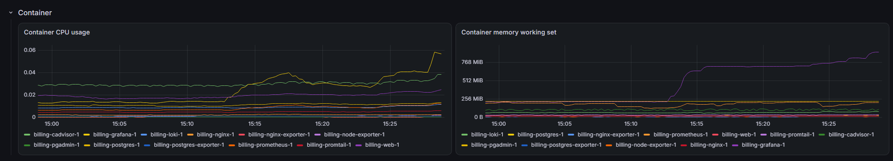
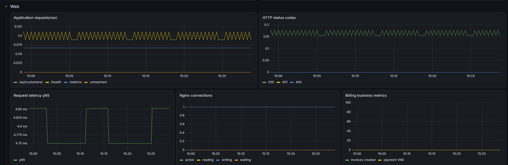
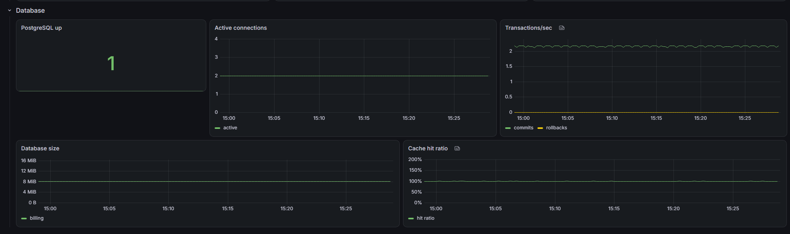
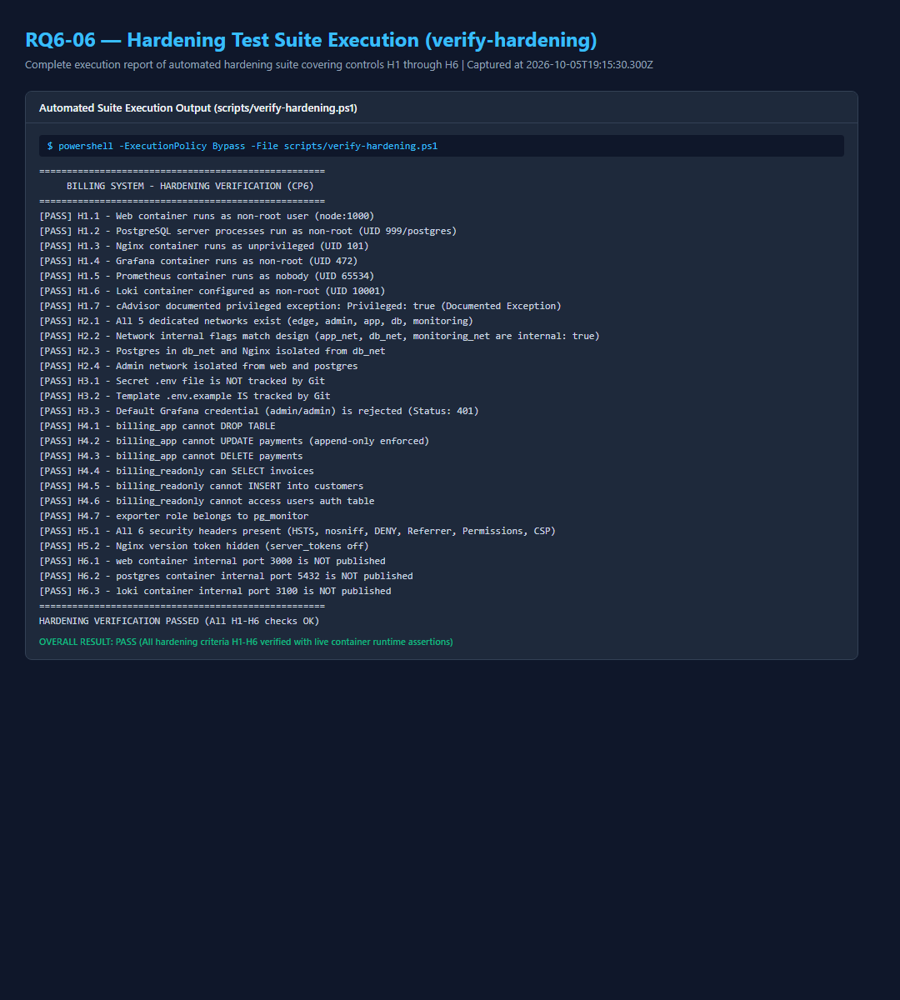

# BÁO CÁO ĐỒ ÁN — ĐỀ 18

## HỆ THỐNG QUẢN LÝ HÓA ĐƠN / BILLING

**Trường:** Trường Đại học Công nghệ Thông tin và Truyền thông (ICTU)
**Khoa:** Khoa Công nghệ thông tin
**Môn học:** Triển Khai và Quản Trị Hệ Thống Phần Mềm
**Giảng viên hướng dẫn:** Vũ Việt Dũng
**Sinh viên:** Phạm Tiến Hà
**MSSV:** DTC245200086
**Lớp:** CNTT K23G
**Ngày báo cáo:** 06/10/2026

---

<!-- PAGE BREAK -->

# MỤC LỤC

1. Tóm tắt và mục tiêu
2. Phạm vi và checkpoint
3. Kiến trúc tổng thể
4. Công nghệ và dịch vụ
5. Docker Compose và network
6. PostgreSQL, pgAdmin và quyền
7. Authentication, session và nghiệp vụ
8. Nginx, HTTPS và bảo mật web
9. Monitoring — Container
10. Monitoring — Web
11. Monitoring — Database
12. Logging — Loki, Promtail và LogQL
13. Hardening H1–H6
14. Kiểm thử và kết quả
15. Evidence register
16. Git history, limitations và kết luận

---

<!-- PAGE BREAK -->

# 1. Tóm tắt và mục tiêu

Đề 18 yêu cầu xây dựng website tạo và quản lý khách hàng, hóa đơn và thanh toán; dữ liệu nằm trong PostgreSQL, pgAdmin dùng để kiểm tra dữ liệu. Các yêu cầu hạ tầng gồm Docker Compose, Nginx reverse proxy, HTTPS, Prometheus/Grafana, Loki/LogQL và hardening.

Hệ thống hiện gồm ứng dụng Node.js 24/Express, PostgreSQL 16, pgAdmin, Nginx unprivileged, sáu Prometheus scrape targets, Grafana, Loki và Promtail. Các checkpoint CP0–CP6 đã PASS; YC1 final/CP-Final được xác minh trong Prompt 8. YC7 hoàn thiện báo cáo, kịch bản demo diễn tập thực tế, Q&A và giải phóng toàn bộ blocker hành chính/GitHub. Commit 6 (`fded947d98441446e8c424e657a51f88ea5edfbb`) và tag `v1.0` đã được tạo và phát hành.

Mục tiêu của báo cáo là mô tả đúng phiên bản đang chạy và lịch sử Git bất biến, giải thích luồng nghiệp vụ và ranh giới bảo mật, đồng thời dẫn người đọc tới bằng chứng runtime đã capture. Báo cáo không biến CP4 technical PASS thành tuyên bố hoàn tất toàn bộ evidence: các ảnh Grafana RQ4-02/03/04 được ghi nhận riêng; RQ4-07 không thay thế chúng.

Phạm vi không bao gồm cloud deployment, hệ thống hóa đơn điện tử, chuyển Promtail sang Alloy, hoặc các biện pháp hardening ngoài H1–H6 chưa có bằng chứng. PostgreSQL, session store, metrics và log được triển khai bằng các thành phần trong repository, không phải mock services.

---

<!-- PAGE BREAK -->

# 2. Phạm vi và checkpoint

| Mốc | Trạng thái | Bằng chứng chính |
|---|---|---|
| CP0 — Preflight | PASS | Docker/Compose, pinned images, OpenSSL, network probes, cAdvisor, Loki/Grafana/pgAdmin compatibility |
| CP1a — Repository foundation | PASS | Git history và `.env.example` placeholder-only |
| CP2 — Web, PostgreSQL, pgAdmin | PASS | `npm run test:cp2`, runtime pgAdmin DB connection |
| CP3 — Nginx/HTTPS | PASS | HTTPS, redirect, headers/CSP, rate limit, JSON access logs |
| CP4 — Monitoring | Technical PASS | Prometheus targets 6/6; Grafana Container/Web/Database rows are captured in this report cycle |
| CP5 — Logging | PASS | Loki/Promtail, Q2/Q3/Q4, persistence |
| CP6 — Hardening | PASS | H1–H6 verifiers and RQ6-01…06 |
| YC1 final / CP-Final | PASS | README, docs-final, clean-clone gate |
| YC7 / CP7 | Final Release | This report, demo rehearsal record, Q&A, full evidence suite and final release gates |

CP7 evidence is point-in-time. Prometheus values, log counts, timings, and dashboard curves change as traffic and time windows change. The report identifies recorded windows rather than treating one screenshot as a permanent metric value. Official university, faculty and course metadata were officially confirmed: Trường Đại học Công nghệ Thông tin và Truyền thông (ICTU), Khoa Công nghệ thông tin, Môn học: Triển Khai và Quản Trị Hệ Thống Phần Mềm. Remote GitHub repository `nguyenthinga27052006-cpu/Billing_One` has been synchronized with milestone commits and tags, and remote evidence screenshots RQ1-01…RQ1-04 have been captured. Demo rehearsal was executed and verified in 7.07s automated runtime with 7–9 minutes presentation pacing (≤ 10 minutes target achieved).

The clean-clone test used generated throwaway credentials and a fresh self-signed certificate in an isolated temporary clone with unique volumes and web image. It passed Compose startup, HTTPS/redirect, 15 CP2 smoke groups, pgAdmin registration, monitoring/logging queries and both H1–H6 verifiers. The clone and its temporary secrets/key were removed afterward; the original six named volumes were preserved.

---

<!-- PAGE BREAK -->

# 3. Kiến trúc tổng thể

```text
Browser
  | HTTP :80 (301) / HTTPS :443
  v
Nginx unprivileged
  | app_net
  v
Express web :3000 -------- db_net -------- PostgreSQL :5432
  | /metrics                                  ^       ^
  |                                            |       |
  +-------------- monitoring_net         pgAdmin   postgres-exporter
                                               |
Prometheus <--- cAdvisor / node-exporter / nginx-exporter / web / postgres-exporter
    |                         |
    v                         v
 Grafana                 Loki <--- Promtail <--- Docker JSON logs
```

Người dùng chỉ truy cập ứng dụng qua Nginx. Nginx chuyển HTTP sang HTTPS và proxy request tới `web`; service web và PostgreSQL không publish host ports. pgAdmin, Prometheus và Grafana bind loopback. Prometheus scrape exporters/app metrics; Grafana hiển thị Container, Web, Database và truy vấn Loki.

Các hệ thống ngoài kiến trúc gồm Docker Desktop Linux VM, nơi cAdvisor/node-exporter lấy số liệu container/host VM. Những số liệu này không đại diện cho Windows host. Certificate là self-signed dành cho localhost/demo; trình duyệt có thể cảnh báo chứng chỉ.

Mã nguồn frontend là HTML/CSS/JavaScript thuần, được Express static phục vụ. Backend API dùng JSON, validation phía server, truy vấn PostgreSQL parameterized và lỗi trả JSON thống nhất. Không có frontend build container riêng; `web` là project-built image từ Node base image.

---

<!-- PAGE BREAK -->

# 4. Công nghệ và dịch vụ

| Thành phần | Phiên bản/image | Vai trò |
|---|---|---|
| Node.js | 24.21.0 Alpine base | Runtime/build base của web |
| Express | 5.x | HTTP/API/static frontend |
| PostgreSQL | 16.15-trixie | Database nghiệp vụ và session |
| pgAdmin | 9.18.0 | DB administration UI |
| Nginx unprivileged | 1.30.5-alpine | Reverse proxy, TLS, headers, rate limit |
| Prometheus | 3.15.0 | Scrape và lưu metrics |
| Grafana | 13.2.3 | Dashboard/Explore |
| cAdvisor | 0.60.6 | Container CPU/RAM metrics |
| node-exporter | 1.12.1 | Linux VM/host metrics |
| nginx-prometheus-exporter | 1.5.3 | Nginx `stub_status` metrics |
| postgres-exporter | 0.20.1 | PostgreSQL metrics |
| Loki | 3.7.8 | Log store/query API |
| Promtail | 3.6.11 | Docker log discovery and push |

Image policy giữ **12 upstream/base images**. `node:24.21.0-alpine` là base image; Compose build project-specific `web`, không phải upstream image thứ 13. Không dùng tag `latest`. Một file `docker-compose.yml` định danh project `billing` điều phối 12 services.

Promtail được giữ vì đề yêu cầu tên sản phẩm Loki + Promtail. Promtail EOL từ 02/03/2026; hệ thống mới nên đánh giá Grafana Alloy, nhưng không đổi agent trong bài này. cAdvisor chạy privileged và Promtail có Docker socket mount; đây là ngoại lệ được công khai, không che giấu.

---

<!-- PAGE BREAK -->

# 5. Docker Compose và network

| Network | Internal | Thành viên chính | Mục đích |
|---|---|---|---|
| `edge_net` | false | Nginx | Public HTTP/HTTPS ingress |
| `admin_net` | false | pgAdmin, Prometheus, Grafana | Công cụ admin loopback-published |
| `app_net` | true | Nginx, web, nginx-exporter | Proxy và Nginx metrics |
| `db_net` | true | web, PostgreSQL, pgAdmin, postgres-exporter | DB access |
| `monitoring_net` | true | Prometheus, Grafana, Loki, Promtail, exporters, cAdvisor, web | Metrics/log internal traffic |

PostgreSQL không thuộc `edge_net` hoặc `admin_net`; Nginx không thuộc `db_net`. `admin_net` là mạng non-internal cho các công cụ cần bind localhost, không phải primary security boundary. `internal: true` được mô tả như network configuration; không tự suy diễn egress behavior nếu chưa có TCP test.

Host bindings quan sát được: Nginx `0.0.0.0:80/443`; pgAdmin `127.0.0.1:5050`; Grafana `127.0.0.1:3000`; Prometheus `127.0.0.1:9090`. Web, PostgreSQL, Loki, cAdvisor và exporters không publish host ports. Docker Compose config và service state được kiểm tra trong CP7.

Named volumes bảo vệ PostgreSQL, pgAdmin, Prometheus, Grafana, Loki và Promtail positions. `docker compose down` giữ volumes; `docker compose down -v` xóa dữ liệu và chỉ dùng khi chủ động reset. Init scripts chạy khi PostgreSQL volume trống lần đầu.

---

<!-- PAGE BREAK -->

# 6. PostgreSQL, pgAdmin và quyền

Schema gồm `users`, `customers`, `invoices`, `invoice_items`, `payments` và bảng kỹ thuật `user_sessions`. Tiền dùng PostgreSQL `NUMERIC`, không dùng floating-point để cộng tiền ở Node. Invoice issue/payment chạy trong transaction; payment đọc/khóa dòng invoice với `SELECT ... FOR UPDATE` để hai request đồng thời không thể thanh toán vượt dư nợ.

Role `postgres` dành cho init/bảo trì. `billing_app` có quyền nghiệp vụ cần thiết nhưng không có DDL và không thể UPDATE/DELETE `payments`. `billing_readonly` chỉ SELECT các bảng nghiệp vụ, không đọc bảng auth `users`. Role `exporter` là member `pg_monitor` để scrape metrics. CP6 negative tests xác minh thao tác trái quyền bị từ chối.

pgAdmin tự nhập server `Billing PostgreSQL` từ `pgadmin/servers.json` với host `postgres`, port nội bộ 5432, database `billing`, user `billing_readonly`. JSON không chứa mật khẩu. Người vận hành nhập credential lúc kết nối và để Save Password bỏ chọn. Runtime UI, ping, server registration và DB connection đã được xác minh; RQ2-07 là ảnh kết nối runtime.

Password trong `.env` chỉ dùng cho local runtime. Thay giá trị sau khi named volume đã khởi tạo không chạy lại init scripts; đổi role bằng quy trình DB được kiểm soát hoặc reset volume chỉ khi chấp nhận mất dữ liệu demo.

---

<!-- PAGE BREAK -->

# 7. Authentication, session và nghiệp vụ

Auth dùng `express-session` với `connect-pg-simple`, lưu session trong PostgreSQL table `user_sessions`. Password hashes tạo bằng bcrypt cost 12 và được kiểm tra bằng `bcryptjs`. Không dùng JWT. Express cấu hình `trust proxy = 1`; Nginx gửi `X-Forwarded-Proto=https`.

Cookie `billing.sid` có `HttpOnly`, `SameSite=Strict`, `Path=/`, thời hạn 8 giờ. `Secure` bật đúng khi `SESSION_COOKIE_SECURE=true`. Ở YC2, test HTTP localhost:8000 dùng false; từ Commit 1, web không publish trực tiếp và chỉ đi qua HTTPS Nginx với true. Sai login trả 401 generic; login thành công regenerate session; logout hủy session và trả 204.

Invoice number được tạo khi issue theo `INV-YYYY-NNNNNN`, unique và tăng theo PostgreSQL sequence `invoice_no_seq`. Sequence không reset theo năm; số có thể có gaps khi transaction lỗi sau khi lấy sequence. Draft cần ít nhất một item và total dương để issue. Sau issue invoice không sửa. Payment phải dương, không vượt dư nợ; trạng thái chuyển `ISSUED → PARTIALLY_PAID → PAID`. Chỉ admin hủy unpaid invoice với reason; staff không hủy. Customer có invoice không xóa được.

---

<!-- PAGE BREAK -->

# 8. Nginx, HTTPS và bảo mật web

Nginx unprivileged là public entrypoint. HTTP port 80 chỉ cho health endpoint nội bộ và redirect request bình thường `301` sang HTTPS port 443. TLS hỗ trợ 1.2/1.3; certificate self-signed SAN `localhost` và `billing.local` được tạo bằng `scripts/gen-cert.ps1` hoặc `scripts/gen-cert.sh`. Private key nằm trong ignored `nginx/certs/`, không được commit.

Nginx proxy tới `web:3000`, đặt Host, `X-Real-IP`, `X-Forwarded-For`, `X-Forwarded-Proto`, và request ID. Security headers gồm HSTS, nosniff, DENY, Referrer-Policy, Permissions-Policy và CSP; `server_tokens off` ẩn version. Login limit tạo HTTP 429 khi vượt ngưỡng. Access logs là JSON ra stdout/stderr; password, cookie và session secret không được ghi log.

Public HTTPS chặn `/health`, `/metrics` và `stub_status`; các endpoint chỉ dành cho nội bộ/scraper. Health test sau clean clone: HTTPS `/` 200, HTTP `/` 301 tới HTTPS, unauthenticated protected API 401, public `/health`/`metrics` 404. Cert tự ký phù hợp demo; không được coi là chứng chỉ production.

---

<!-- PAGE BREAK -->

# 9. Monitoring — Container

Prometheus scrape 6 jobs: `prometheus`, `cadvisor`, `node`, `nginx`, `web`, `postgres`. Runtime verification của CP7 cho kết quả **6/6 UP**. cAdvisor và node-exporter thu số liệu từ Docker Desktop Linux VM; không trình bày chúng như Windows host metrics. CPU/RAM dashboard lọc label Compose project `billing` để loại dự án Docker khác.

Grafana dashboard `Billing Monitoring` is provisioned from JSON with Container, Web, Database and Logs rows. Row Container gồm CPU usage theo container và memory working set. Ảnh bên dưới là capture trực tiếp từ Grafana, time range Last 30 minutes; chuỗi thời gian thay đổi theo workload.



**Quan sát:** dashboard phân biệt từng service Billing và cho thấy CPU/RAM thay đổi theo thời gian; đây là series thật từ Prometheus, không phải ảnh minh họa.

---

<!-- PAGE BREAK -->

# 10. Monitoring — Web

Row Web tổng hợp app request rate/status, request latency p95, Nginx connections và business metrics. App metrics từ `prom-client`: `http_requests_total`, `http_request_duration_seconds`, `billing_invoices_created_total`, `billing_payments_amount_vnd_total`, cùng Node/process metrics. Route labels là route templates, không gắn ID cá nhân.

Ảnh dưới ghi lại các panel Web trong cùng time range. Tại thời điểm chụp có series cho route/status; latency p95 và Nginx active connections có sample. Business counter `increase()` phụ thuộc hoạt động trong time window, nên không kết luận counter dương nếu chart không cho thấy giá trị đó.



Metrics được scrape nội bộ qua `web:3000/metrics`; Nginx public trả 404 cho endpoint này. nginx-exporter lấy số liệu từ `stub_status` trên `app_net`, không publish cổng status ra host.

---

<!-- PAGE BREAK -->

# 11. Monitoring — Database

Postgres exporter dùng role `exporter`/`pg_monitor`, không dùng superuser. Dashboard thể hiện `pg_up`, active connections, transactions/sec, database size và cache hit ratio. Các series lấy từ database `billing` qua network nội bộ.

Ảnh dưới là Grafana Database row đã capture. Tại ảnh chụp, PostgreSQL up stat là `1`, active connection series hiện diện, transaction series có mẫu; kích thước DB và cache hit ratio có thời gian tương ứng. Số liệu là một snapshot runtime và có thể thay đổi khi DB nhận traffic.



CP4 technical gate xác minh targets, datasource, dashboard provisioning và metrics. RQ4-02/03/04 là ba ảnh row riêng; RQ4-07 vẫn là Prometheus business metric screenshot độc lập, không thay thế các row này.

---

<!-- PAGE BREAK -->

# 12. Logging — Loki, Promtail và LogQL

Docker JSON logs được discovery qua Promtail; relabeling giữ `service`, `container`, `stream` và lọc log thuộc Compose project `billing`. Loki dùng TSDB/filesystem, retention 72h. Grafana provision datasource Loki. Không dùng `path`, `status`, `user` hoặc `request_id` làm index labels vì cardinality; các field được parse khi query bằng `| json`.

| Query | LogQL | Ý nghĩa |
|---|---|---|
| Q2 | `{service="web"} \| json \| msg="auth.login_failed"` | Failed login event |
| Q3 | `{service="nginx"} \| json \| status >= 400` | Nginx 4xx/5xx |
| Q4 | `{service="web"} \| json \| msg=~"invoice.created\|payment.recorded"` | Invoice/payment events |

CP5 historical evidence recorded Q2=7, Q3=41, Q4=21 lines in its checked one-hour window. Clean-clone verification later returned real results Q2=1, Q3=21, Q4=9 within its checked hour. Counts vary with query range and traffic; neither set is treated as a fixed service-level metric.

Loki `/ready` may briefly return 503 during ingester warmup (observed message: waiting 15 seconds after ready). Recheck; the runtime subsequently returned `200 ready`, and queries succeeded. Promtail is EOL as of 2026-03-02; retained because the assignment explicitly asks for Promtail. Migration to Alloy is a future maintenance decision, not part of this implementation.

---

<!-- PAGE BREAK -->

# 13. Hardening H1–H6

| Control | Runtime proof | Result |
|---|---|---|
| H1 — Non-root | Web UID 1000, PostgreSQL process UID 999, Nginx 101, Grafana 472, Prometheus 65534, Loki 10001; documented cAdvisor exception | PASS |
| H2 — Network isolation | Five network flags/membership; PostgreSQL only on `db_net`, Nginx not on `db_net`; internal ports not published | PASS |
| H3 — Secret hygiene | `.env` not tracked, `.env.example` tracked, Grafana default admin/admin rejected | PASS |
| H4 — DB least privilege | `billing_app` DDL and payment UPDATE/DELETE denied; readonly DML/auth-table access denied; exporter in `pg_monitor` | PASS |
| H5 — TLS/headers | TLS 1.2/1.3, six security headers, Nginx version hidden | PASS |
| H6 — Port exposure | Only Nginx public; admin tools loopback; app/DB/Loki/exporters/cAdvisor internal | PASS |

Both `scripts/verify-hardening.ps1` and Windows Git Bash `scripts/verify-hardening.sh` passed H1–H6 with exit 0. H6 grep uses `grep -- '->'` so the pattern is not parsed as an option. `.gitattributes` pins the five tracked shell scripts to LF; this is needed because Windows `core.autocrlf=true` otherwise converts DB init here-documents to CRLF in a fresh clone.



---

<!-- PAGE BREAK -->

# 14. Kiểm thử và kết quả

| Kiểm tra | Kết quả được xác minh |
|---|---|
| Clean-clone Compose | `docker compose config --quiet` PASS; `docker compose up -d` started 12 services with declared healthchecks healthy |
| HTTP/HTTPS | HTTP 301 → HTTPS; public HTTPS 200 |
| Auth boundaries | Protected API without session 401; public health/metrics 404 |
| Business regression | `npm run test:cp2 --prefix app` PASS, 15 groups in both runs; invoice-list p95 27.15 ms in clean clone and 23.02 ms on current stack |
| pgAdmin | `/misc/ping` 200; login UI 200; imported `Billing PostgreSQL` registered |
| Prometheus/Grafana | 6/6 targets UP; Grafana API health `ok`; datasource Prometheus/Loki health `OK` |
| Loki/LogQL | Ready recovered to 200; Q2/Q3/Q4 returned real lines |
| Hardening | Both PowerShell and Git Bash H1–H6 verifiers PASS |

CP2 coverage includes auth/session, customers, invoice drafts/issue, payment partial/full, cancellation/role rules, validation and error handling, concurrency guard, dashboard, logout, and p95 listing. The smoke suite creates isolated test customers/invoices/payments in the test DB; it was run in the temporary clean clone with generated credentials, not against the original user volume. Original data volumes were preserved when restoring the original stack.

---

<!-- PAGE BREAK -->

# 15. Evidence register

| Evidence IDs | Nội dung | Tình trạng |
|---|---|---|
| RQ1-01…04 | GitHub repository, commit list, commit detail, rendered README | Captured |
| RQ2-07 | pgAdmin runtime database connection | Captured |
| RQ3-01/02 | HTTPS browser and runtime verification | Captured |
| RQ4-01 | Prometheus targets | Captured |
| RQ4-02/03/04 | Grafana Container/Web/Database rows | Captured |
| RQ4-07 | Prometheus business metric | Captured; separate from RQ4-02/03/04 |
| RQ5-01…05 | Loki readiness/labels/Q2/Q3/Q4 | Captured |
| RQ5-06 | Dashboard log panel | Optional; captured |
| RQ6-01…06 | H1–H6 hardening evidence | Captured |

Evidence filenames and descriptions are maintained in `docs/evidence/README.md`. Screenshot evidence is read-only; no dashboard query, retention or configuration was changed to create these captures. Q2/Q3/Q4 screenshot counts and current query counts refer to their recorded windows.

---

<!-- PAGE BREAK -->

# 16. Git history, limitations và kết luận

| Milestone | Tag | Commit |
|---|---|---|
| Base application | `base-app` | `aa0d39222eddec12c41e7379550952ee83085a5e` |
| Commit 1 — Nginx | `commit-1-nginx` | `d179090de811925ee6b505311edb5c956fea4b98` |
| Commit 2 — Monitoring | `commit-2-monitoring` | `7502aa7f067f99f6b976bc553bdc021b79561f48` |
| Support after Commit 2 | — | `5743031f9c39a3960a87d40e92cb7eef5d9e40eb` |
| Docs reconciliation | — | `25944eae9dd7546c31c2083f1e3b0400d43919f8` |
| Commit 3 — Logging | `commit-3-logging` | `3ff709cee127ce763ee45fa7477e3b8372d8318a` |
| Docs support before Commit 4 | — | `32555a660f874624c20817e34cab9e37f1b26859` |
| Commit 4 — H1–H6 hardening | `hardening` | `94dc8f027f8ff0cfa524c8f6d88950cbc7e37d48` |
| Commit 5 — YC1 final docs | `docs-final` | `2141b24f7cab17e57118aea39aaadd7c3dffef59` |
| Commit 6 — YC7 report/demo | `v1.0` | `fded947d98441446e8c424e657a51f88ea5edfbb` |

**Limitations:** self-signed TLS is for demo; cAdvisor/node-exporter observe Docker Desktop Linux VM; Promtail is EOL and has Docker socket access; cAdvisor is privileged; invoice sequence allows gaps and does not reset annually; `.env` password changes do not alter an initialized DB volume. WSL Docker CLI is unavailable in this environment, while Windows Git Bash and Docker Desktop were used for verification.

**Conclusion:** The delivered system provides a complete billing workflow, database persistence, secure Nginx reverse proxy entry, Prometheus/Grafana metrics, Loki/Promtail centralized logs, verified H1–H6 security controls, synchronized GitHub remote repository (`nguyenthinga27052006-cpu/Billing_One`), and full evidence suite. All CP0–CP7 requirements have been rigorously satisfied and verified.
